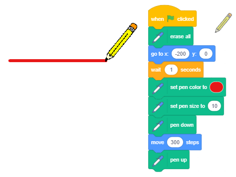

Le të vizatojmë - Grafik
============================

.. include:: blocks.txt

.. include:: icons.txt

.. infonote::

 |intro4|

Në mësimet e mëparshme, mësuam se si mund të lëvizim sprite duke përdorur miun dhe tastierën tonë. Tani, ne do të mësojmë se si mund ta bëjmë sprite tonë të lërë një shenjë ndërsa lëviz. Ne do të përdorim shembuj të ndryshëm për të eksploruar funksionet e blloqeve nga grupi i quajtur *Pen*, të cilat lejojnë që sprite të lërë një shenjë në skenë kur lëviz. Ky lloj vizatimi quhet grafika e breshkave. Ne kemi mësuar gjithashtu se si mund të sinkronizojmë sjelljen e sprites tonë duke shtuar blloqe pritjeje në shkrimet e tyre. Në këtë mësim do të tregojmë një mënyrë më efikase për ta bërë këtë - sinkronizimi i sprites duke shkëmbyer mesazhe.  

.. topic:: Grafik breshke

Scratch është një nga gjuhët moderne të programimit që përfshin opsionet e grafikës së breshkave, e futur për herë të parë në gjuhën *Logo* rreth pesëdhjetë vjet më parë.

 *Logo* mundësoi kontrollin e një pajisjeje breshke, një lloj roboti, i cili ishte i lidhur me kompjuterin. Breshka mund të lëvizë në një sipërfaqe horizontale mbrapa dhe me radhë dhe të ndryshojë drejtimin dhe orientimin e saj. Nëse një copë letër ishte vendosur nën breshkë, ajo mund të linte një shenjë, duke formuar kështu grafika të quajtura *grafika e breshkës*.
  
 Kjo mënyrë e vendosjes së një imazhi si koleksion figurash, së bashku me të dhënat e tyre (parametrat), të cilat përcaktojnë se si do të vizatohet figura dhe ku do të vendoset quhet **grafika vektoriale**.

 Për dallim nga grafika vektoriale, në grafikën **raster** imazhi ruhet si një rrjet drejtkëndëshe pikash - bitmaps. Bitmaps karakterizohen teknikisht nga gjerësia dhe lartësia e figurës në pixel, dhe numri i biteve të nevojshme për të ruajtur ngjyrën e pikselave. Për shembull, nëse ka vetëm 16 ngjyra, ju nevojiten 4 bit për pixel për të ruajtur ngjyrën. Grafikat e rasterit varen nga rezolucioni. Ato nuk mund të zmadhohen pa humbjen e cilësisë së figurës.

 Në Scratch, çdo sprite ka mundësinë që të sillet si breshka Logo: ju mund të përcaktoni pozicionin e tyre, drejtimin dhe orientimin e lëvizjes, dhe ata mund të lënë një shenjë kur lëvizin. Madhësia, forma dhe ngjyra e sprite nuk ndikojnë në shenjën që ata lënë, sepse sprites po vizatojnë me një stilolaps. Sprite gjithashtu mund të jetë e padukshme ose e përbërë nga vetëm një pikë, dhe kjo nuk ndikon në vizatimin e saj.  
 
   

.. topic:: Funksionet e blloqeve *Pen*

Grupi *pen* i blloqeve, të cilat bënë të mundur që sprites të lënë një shenjë kur lëvizin, d.m.th. për të mbështetur grafikët e breshkave, janë të vendosura midis shtesave.

  Për të përdorur blloqe nga ky grup, duhet të:

  1. Klikoni në ikonat |extensions| në këndin e poshtëm të majtë të paletës së blloqeve.

  2. Zgjidhni shtesën *Pen* nga galeria e hapur.

  3. Ikona dhe blloqet do të shfaqen në paletën e blloqeve.
  
 .. image:: ../_images/4/fig4_1.png
     :width: 740px   
     :align: center

Grupi *Pen* përfshin blloqet e mëposhtme:
 
 .. hlist::
    :columns: 2

     * |erase_all| - fshin të gjitha shenjat e bëra nga stilolapsi
     * |stamp| - vulos imazhin e sprite në skenë
     * |pen_up| - heq stilolapsin lart
     * |pen_down| - e ul penën
     * |set_color| - vendos ngjyrën e lapsit
     * |set_pen| - vendos parametrat e vizatimit
     * |change_pen| - ndryshon parametrat e vizatimit
     * |set_pen_size| - përcakton madhësinë (trashësinë) e shenjës së stilolapsit
     * |change_pen_size| - ndryshon madhësinë (trashësinë) e shenjës së stilolapsit

Nëse shtoni |pen_down| bllokoni në Sprite tuaj, që nga atëherë, Sprite do të lërë një shenjë në skenë sa herë që lëviz. Kur shtoni bllokun |pen_up|, ajo do të ndalojë të lërë shenjën derisa të shtoni |pen_down| bllokohet përsëri. Pamja e shenjës përcaktohet nga parametrat e vizatimit. Parametrat e vizatimit përfshijnë madhësinë (trashësinë), ngjyrën, ngopjen, shkëlqimin dhe transparencën e shenjës së lënë nga stilolapsi.
 
  Shënim. |Erase_all| |! = | |Fshi|. Blloku i parë i referohet vizatimeve dhe i dyti sprites.

.. topic:: Përdor mesazhe për sinkronizim

 Sjellja nxitet gjithmonë nga një ngjarje, e cila mund të jetë një veprim ose marrje e një mesazhi. Në mësimet dhe projektet e mëparshme, ne përdorëm bllokun ``wait`` kur donim të sinkronizon sjelljen e sprites tonë. Në projektin "Llogaritja" kemi mundësuar që vajzat dhe djemtë tanë të kenë një bisedë të sinkronizuar - kur vajza po fliste, djali po dëgjonte dhe anasjelltas.
 
  Tani do të tregojmë se si mund të koordinohen veprimet e sprites (dhe skena), në varësi të faktit nëse ka ndodhur një ngjarje e mesazhit të transmetuar.
  Ju vini re që ne nuk kemi thënë që ne dërgojmë **një mesazh, por që ne e transmetojmë**. Kjo pasi, në Scratch, mesazhi u drejtohet të gjitha objekteve, dhe jo vetëm një. Transmetimi dhe marrja e mesazheve në Scratch arrihet me blloqet e mëposhtme |Transmition|, |transmision_wait| dhe |when_receive| nga grupi *Events*.

|study| Studioni shembujt e mëposhtëm
----------------------------------------

Shembulli 1 - Projekt "Vizato një vijë" 
~~~~~~~~~~~~~~~~~~~~~~~~~~~~~~~~~~~~~~~~~

Do të krijojmë një projekt në të cilin do të vizatojmë një rresht që është 10 pixel i gjerë dhe 300 pixel i gjatë. Ne do të zgjedhim sprite Pencil nga biblioteka e sprites, dhe ne do të fshijmë spërkatjen e maceve. Meqenëse duam që shenja të pozicionohet përgjatë majës së sprite të Lapsit, ne do ta lëvizim qendrën e kostumit në majë. Ne mund ta bëjmë këtë duke hapur skedën *Costum*. Mjetet e disponueshme do të shfaqen në anën e majtë të ekranit të vizatimit; në rastin tonë, këto do të jenë mjete vektoriale sepse kemi zgjedhur një sprite vektoriale (1). Përdorni |v_select| për të zgjedhur tërë sprite (2), dhe pastaj tërhiqeni sprite në mënyrë që maja e lapsit të jetë mbi shenjën |center| që tregon qendrën e ekranit (3).

.. image:: ../_images/4/fig4_2.png
   :width: 900px   
   :align: center

Së pari, duhet të fshini gjithçka që është tërhequr më parë duke përdorur bllokun |erase_all|, vendoseni lapsin në pozicionin fillestar nga i cili do të fillojë vizatimi, vendosni ngjyrën dhe madhësinë e lapsit, dhe më pas përdorni bllokun ``stil poshtë`` për të lejuar që sprite e lapsit të lërë një shenjë kur lëviz . Ju duhet të shtoni bllokun ``lart lart`` në fund për të ndaluar që sprite të mos lërë një shenjë në procesin e kthimit në pozicionin fillestar, sa herë që programi funksionon.

Ekzistojnë dy mënyra për të vendosur ngjyrën e lapsit:

- duke përdorur bllokun |set_color|, ku mund të zgjidhni një ngjyrë duke klikuar në fushën e hyrjes

- duke përdorur bllokun |set_pen|, ku mund të zgjidhni një ngjyrë duke futur një numër në fushën e dytë të hyrjes.

Në këtë projekt, ne do të përdorim opsionin e parë.

.. image:: ../_images/4/fig4_3.png
   :width: 750px   
   :align: center

Duke klikuar në fushën hyrëse të bllokut për vendosjen e ngjyrës së stilolapsit, ne hapim menunë rënëse, ku do të gjejmë rrëshqitje me përbërës të ngjyrave: numër i bashkangjitur me ngjyrën, ngopjen dhe shkëlqimin, dhe në fund do të shohim një mjet - një pipetë për mbledhjen e mostrave me ngjyra (1). Ngjyra e dëshiruar mund të vendoset duke lëvizur rrëshqitësit ose duke klikuar në pipetë. Nëse klikoni në pipetë, një fazë me një zmadhues në të që ka një rreth në qendër do të ndizet (2). Për të zgjedhur një ngjyrë, duhet të vendosim qendrën e rrethit sipër pjesës së fazës ku ndodhet ajo ngjyrë dhe pastaj të klikojmë në të. Do të marrim të njëjtin rezultat, siç tregohet në figurën (3).

Shënim. Mund të gjeni më shumë informacion mbi mënyrën e ngjyrave HSB, e cila përdor përbërësit: ngjyrim, ngopje dhe shkëlqim, në pjesën *Shtojca*.

Rezultati i ekzekutimit të skenarit dhe vetë skenarit janë paraqitur në figurën më poshtë.

......

Shembull 2 - Projekti "Vizatim i lirë" 
~~~~~~~~~~~~~~~~~~~~~~~~~~~~~~~~~~~~~~~~~~~~

.. level:: 1

Ky projekt duhet të ilustrojë se si ne përdorim komandat e vizatimit dhe të tregojmë se shenja nuk varet nga madhësia e sprite, as nga fakti nëse sprite është e dukshme ose e fshehur. Pena po e bën vizatimin, kështu që nuk ka rëndësi se cila sprite po e mban atë. Këtë herë ne do të zgjedhim burimin *Ladybug 1* nga libraria e sprites.

Skenari, i cili aktivizohet duke klikuar në flamurin e gjelbër, lejon që ladybug të ndjekë treguesin e miut për kohëzgjatjen e funksionimit. Në fillim të skenarit, të gjitha vizatimet nga ekzekutimi i mëparshëm i projektit do të fshihen nga skena, dhe stilolapsi do të ngrihet. Komanda ``pen down`` do t'i shtohet kur të shtypet shigjeta poshtë Ky projekt duhet të ilustrojë se si ne përdorim komandat e vizatimit dhe të tregojmë se shenja nuk varet nga madhësia e sprite, as nga fakti nëse sprite është e dukshme ose e fshehur. Pena po e bën vizatimin, kështu që nuk ka rëndësi se cila sprite po e mban atë. Këtë herë ne do të zgjedhim burimin *Ladybug 1* nga libraria e sprites.

Shkrimet e shtuara në zonjën e parave janë paraqitur në figurën më poshtë. Vizatimi do të kryhej në të njëjtën mënyrë edhe nëse blloku |hide| do futej aty ku tregon shigjetën e kuqe në figurë, por atëherë sprite nuk do të ishte e dukshme, dhe do të duket se vizatimi po bëhet nga bllokut të ngjarjes të miut, dhe komanda ``pen up`` do t'i shtohet kur të shtypet blloku i ngjarjes shigjeta *up* . Në këtë mënyrë do të sigurohemi që sprite nuk do të lërë asnjë shenjë kur lëviz derisa të shtypim tastin *down arrow*. Sprite do të ndalojë së lëni shenja kur shtypim tastin *up*.
 

.. image:: ../_images/4/fig4_5.png
   :width: 380px   
   :align: center

Sigurisht, do të ishte më e natyrshme nëse nuk do të na duhej të shtypnim çelësat e tastierës për të ulur dhe ngritur stilolapsin, por thjesht vizatoni ndërsa mbani të shtypur butonin e mouse, dhe pastaj ndaloni të vizatoni duke ngritur gishtin. Ky lloj vizatimi arrihet me skenarin vijues. 

.. image:: ../_images/4/fig4_6.png
   :width: 195px   
   :align: center

Efektet e komandës ``if else then`` do të shtjellohen në mësimin numër 6 të këtij manuali. Tani për tani, le të themi vetëm që skripti në këtë E-bllok ose do të ekzekutojë |goto| dhe komanda ``pen``  ga foleja e sipërme ose ``pen up`` nga foleja e poshtme. Cila komandë është duke u ekzekutuar do të varet nga fakti nëse shtypet butoni i miut ose jo, i cili përcaktohet nga vlera e vendosur në bllokun |mouse_down|. Ky bllok i përket grupit *Sensing* dhe raporton nëse vlera është e vërtetë apo e rremë. Blloqet e funksionit gjashtëkëndor që raportojnë vetëm vlerat *true* ose *false* quhen **blloqe boolean**.

.......

Shembulli 3 - Projekzzi "Ndiq gjurmët"
~~~~~~~~~~~~~~~~~~~~~~~~~~~~~~~~~~~~~~~

.. level:: 1

Në këtë projekt, lëvizja e ladybug udhëhiqet nga përdorimi i tasteve shigjetë, si në shembullin 3, të mësimit *Koordinatat e fazës*. Shenja e lënë nga ladybug është një vijë e thyer e bërë nga linja horizontale dhe vertikale. Figura e mëposhtme përfshin skriptet e projektit dhe pamjen e fazës pas një ekzekutimi të projektit.
.

.. image:: ../_images/4/fig4_7.png
   :width: 415px   
   :align: center

.. sidebar:: Kodimi i ngjyrave me numra

  Çdo numër i plotë nga intervali [0,199] korrespondon me një ngjyrë të veçantë. Për shembull, 0 është e kuqe, 30 është e verdhë, 70 jeshile, 130 blu dhe 170 magjen. Numrimi i ngjyrave në Scratch bazohet në rendin e ngjyrave në spektër.

  |krug_boje|

.. |krug_boje| image:: ../_images/4/fig4_8.png

**Përditësimi i projektit**

Ne do ta ndryshojmë projektin në mënyrë që dega që do të përdorim për vizatim të lëvizë më lirshëm, si në shembullin 4 të mësimit *Koordinatat e fazës*. Do të shtojmë vendosjen e cila do të lejojë që ngjyra dhe madhësia e lapsit të ndryshojë në mënyrë të rastësishme çdo 5 sekonda, në këtë mënyrë do të krijojmë një shenjë më tërheqëse. Për të vendosur ngjyrën e stilolapsit në mënyrë të rastësishme, do të duhet të përdorim një komandë të ndryshme me atë që kemi përdorur në shembullin e mëparshëm. Këtë herë do të përdorim |set_pen| bllok, ku ngjyra vendoset nga një numër.

Shifra e mëposhtme paraqet një skenar që përcakton vlerat fillestare dhe pamjen e skenës pasi projekti i modifikuar përfunduar në ekzekutim (skripti aktivizohet duke klikuar në flamurin e gjelbër). Blloku ``repeat forever`` përmban komanda që vendosin ngjyrën dhe madhësinë e lapsit në një mënyrë "të rastësishme".
.

.. image:: ../_images/4/fig4_9.png
   :width: 265px   
   :align: center

.......

Shembulli i mëposhtëm tregon se si mund të vizatojmë stile të ndryshme të linjave për nënvizim, duke përdorur komandën përsëritëse për të specifikuar numrin e herë që përsëritet një veprim, të cilin do t'i prezantojmë në mësimin tjetër.

Shembulli 4 - Projekti "Linjat"
~~~~~~~~~~~~~~~~~~~~~~~~~~~~~~~~

.. level:: 2

Në projektin *Lines* do të vizatojmë një vijë vjollcë, 400 piksele të gjata dhe 2 pixel të gjerë, duke filluar nga pika (-200,0) në pesë stile të ndryshme.

.. image:: ../_images/4/fig4_10.png
   :width: 150px   
   :align: center

Sprite që vizaton vijën është e padukshme. Do të shfaqet në këndin e sipërm të majtë të skenës, vetëm kur të përfundojë vizatimin e rreshtit, dhe do të thotë se si u vizatua linja.
Vizatimi aktivizohet nga blloku ngjarjes |clicked_key| , skripti për stilin e parë aktivizohet duke shtypur numrin 1 në tastierë, stilin e dytë duke shtypur 2, etj.

Duke klikuar mbi flamurin e gjelbër fshin gjithçka që më parë ishte në skenë, vendos vlera për ngjyrën dhe madhësinë e lapsit, shfaqet sprite dhe jep udhëzime se si të fillohet projekti.

Secila nga skriptet e lidhur me çelësat 1-5 në tastierë së pari fshin gjithçka që ishte vizatuar më parë në skenë, fsheh sprite, vizaton rreshtin në stilin e dhënë, dhe pastaj tregon sprite në këndin e sipërm të majtë të skenës, që na tregon se si u vizatua linja.

Stili i parë është një vijë e drejtë e vazhdueshme. Kjo mund të bëhet menjëherë, duke dhënë vetëm një urdhër "shkoni 400 hapa", por për ta bërë këtë të fundit pothuajse për sa kohë që shkrimet e tjera kemi shtuar komandën përsëritëse, kështu që sprite do të lëvizte 10 hapa 40 herë.

Stili i dytë - sprite përsërit të njëjtin model 100 herë: lëviz 1 hap me stilolaps poshtë dhe 3 me stilolaps lart.

Stili i tretë - sprite përsërit të njëjtin model 50 herë: lëviz 3 hapa me stilolaps poshtë dhe, dhe 5 me stilolaps lart.

Stili i katërt - sprite përsërit të njëjtin model 40 herë: lëviz 6 hapa me stilolaps poshtë dhe, dhe 4 me stilolaps lart.

Stili i pestë - sprite përsërit të njëjtin model 25 herë: lëviz 6 hapa me stilolaps poshtë dhe, dhe 4 me stilolaps lart, 2 hapa me stilolapsin poshtë dhe 4 me stilolaps lart.

Në figurën më poshtë do të gjeni skriptet për ngjarjet *kur të klikohet flamuri jeshil*, *kur shtypet 1 çelës*, dhe *kur shtypet 2 tasti*. 

.. image:: ../_images/4/fig4_11.png
   :width: 470px   
   :align: center

Vini re se komandat e përsëritjes nuk e shkurtojnë kohën e funksionimit të programit, por vetëm lejojnë programuesin të shkruaj programe më qartë dhe koncize.

.......

Shembulli 5 - Projekti "Familja"
~~~~~~~~~~~~~~~~~~~~~~~~~~~~~~~~~~

.. level:: 2

Në këtë projekt, një pulë po prezanton familjen e saj: pulë nënë, gjeli i babait, vëllai dhe motra. Në fillim shohim vetëm një pulë që kemi quajtur Lisa, dhe pjesa tjetër e sprites janë të fshehura. Së pari, Lisa prezanton nënën e saj, Marge. Kur ajo thotë emrin e saj, nëna do të shfaqet dhe do të transmetojë se është atje. Pastaj, Lisa prezanton babanë e saj, Homerin. Homeri gjithashtu paraqitet kur ai "dëgjon" emrin e tij, dhe pastaj "përgjigjet" me një mesazh që përmban emrin e tij. Vëllai i saj Bart dhe motra e saj Maggie janë prezantuar në skenë në një mënyrë të ngjashme. Sinkronizimi i paraqitjeve dhe transmetimeve të sprejit arrihet me mesazhe. Kur Lisa prezanton dikë, ajo transmeton mesazhin. Sprites po "dëgjojnë", dhe kur marrin mesazhin e duhur, ata shfaqen dhe transmetojnë një mesazh që njofton emrin e tyre. Kur Lisa merr atë mesazh - përgjigje, ajo vazhdon me prezantimin e anëtarit tjetër të familjes.

Figura e mëposhtme tregon se si paraqitjet e sprites janë sinkronizuar me mesazhe.

.. image:: ../_images/4/fig4_12.png
   :width: 600px   
   :align: center

**Përgatitja e Sprite**

.. sidebar:: Shtresat e Sprites në skenë
    
 .. image:: ../_images/4/fig4_13.png
   :width: 400px   
   :align: center
  
|1| Për këtë prezantim tjetër do t'ju duhet personazhet e mëposhtëm: Lisa, Marge, Homer, Bart dhe Maggie. Për Lisa, Bart dhe Maggie do të përdorim sprite *Chick*, për nënën do të përdorim sprite *Hen* dhe për babanë do të përdorim spërkatjen *Rooster* nga libraria e sprites. Pasi të keni shtuar sprites, ndryshoni emrat e tyre në mënyrë që ata të korrespondojnë me projektin tonë.

.. image:: ../_images/4/fig4_14.png
   :width: 400px   
   :align: center

|2| Zgjidhni librarinë *Farm* nga libraria e sfondit.

|3| Vendoseni sprite Lisa në mes në pjesën e sipërme të fazës.

|4| Vendoseni sprite Marge në pjesën e poshtme të majtë dhe vendosni Maggie, të cilën ju duhet ta bëni më të vogël, pranë saj.

|5| Vendoseni Homerin sprite në pjesën e poshtme të djathtë të skenës dhe kthejeni atë në mënyrë që ai të përballet në të majtë. Bëni Bart sprite më të madh dhe vendoseni midis Maggie dhe babait të tij, dhe kthejeni atë në mënyrë që ai të përballet në të majtë.

Shkrimet e shtuara në sprites janë paraqitur në figurën vijuese.

.. image:: ../_images/4/fig4_15.png
   :width: 850px   
   :align: center

|ask| E kuptuat?
-------------------------

Pyetja 1
~~~~~~~~~~

.. level:: 1

.. mchoice:: turtle1
   :answer_a: po
   :answer_b: jo
   :correct: b
   :feedback_a: Gjuha e programimit Logo prezantoi grafikat e breshkës.
   :feedback_b: Saktë.
   
   Scratch është gjuha e parë programuese që prezanton opsionet e grafikës së breshkave. 

Pyetja 2
~~~~~~~~~~

.. level:: 1

.. mchoice:: turtle2
   :answer_a: po
   :answer_b: jo
   :correct: b
   :feedback_a: Jo, i pari i referohet vizatimeve, dhe i dyti sprites.
   :feedback_b: Saktë.

   Blloku ``erase all`` nga grupi *Pen* ka të njëjtin funksion si blloku ``fshih`` nga grupi *Show*. 
   
   
Pyetja 3
~~~~~~~~~~

.. level:: 1

.. mchoice:: turtle3
   :answer_a: po
   :answer_b: jo
   :correct: a
   :feedback_a: Saktë. 
   :feedback_b: 
   
   Nëse shtoni bllokun ``pen down`` në një skenar të një sprite të veçantë, do të vazhdojë të lërë një shenjë kur lëviz.
   

Pyetja 4
~~~~~~~~~~

.. level:: 1

.. mchoice:: commands_pen1
   :multiple_answers:
   :answer_a: 
   :answer_b: 
   :answer_c: 
   :answer_d: 
   :correct: c,d
   :feedback_a: 
   :feedback_b: 
   :feedback_c: 
   :feedback_d: 

   Cila prej blloqeve i përket grupit *Pen* të blloqeve?
    (Zgjidhni të gjitha përgjigjet e sakta)

   .. image:: ../_images/4/q4_4.png
      :width: 600px   
      :align: center

Pyetja 5
~~~~~~~~~~
      
.. level:: 1

.. mchoice:: commands_pen2
   :multiple_answers:
   :answer_a: 
   :answer_b: 
   :answer_c: 
   :answer_d: 
   :correct: a,c
   :feedback_a: 
   :feedback_b:
   :feedback_c: 
   :feedback_d: 

   Secili prej këtyre blloqeve ndryshon diçka. Cila do të ndryshojë shenjën e lënë nga lapsa gjatë vizatimit?
    (Zgjidhni të gjitha përgjigjet e sakta)

   .. image:: ../_images/4/q4_5.png
      :width: 705px   
      :align: center

Pyetja 6
~~~~~~~~~~

.. level:: 1

.. mchoice:: pen1
   :multiple_answers:
   :answer_a: blloku i penës poshtë nuk aktivizohet
   :answer_b: blloku i penës lart aktivizohet
   :answer_c: sprite fshihet 
   :answer_d: fshirja e bllokut aktivizohet e gjitha
   :correct: a, b
   :feedback_a:  
   :feedback_b: 
   :feedback_c: 
   :feedback_d: 

   Në disa programe sprite nuk lë shenjë kur lëviz? Pse ndodh kjo?
    (Zgjidhni të gjitha përgjigjet e sakta) 

   
Pyetja 7
~~~~~~~~~~
   
.. level:: 1

.. dragndrop:: pen2
    :feedback: Try again
    :match_1: hide|||Looks
    :match_2: erase all|||Pen
    :match_3: ask_and wait|||Sensing
    :match_4: point towards|||Motion
    
    Duke tërhequr drejtkëndësat, çiftoni blloqet me grupet që i përkasin.

Pyetja 8
~~~~~~~~~~
   
.. level:: 2

.. dragndrop:: pen3
    :feedback: Try again
    :match_1: red|||0
    :match_2: yellow|||30
    :match_3: green|||70
    :match_4: blue|||130
    
    Çdo numër i tërë në intervalin [0,199] korrespondon me një ngjyrë.
     Duke tërhequr drejtkëndësat, çiftoni ngjyrat me numrin e tyre të kodit.

|try| Provoje!
-------------

Ushtrimi 1
~~~~~~~~~~

.. level:: 1

.. infonote::

  Çfarë vizaton programi?
 
  .. image:: ../_images/4/ex4_1.png
     :width: 390px   
     :align: center

.. reveal:: answer1
     :showtitle: Trego përgjigjen
     :hidetitle: Fshih përgjigjen
 
     **Pëgjigja:**

     .. image:: ../_images/4/ans4_1.png
        :width: 300px   
        :align: center

.......

Ushtrimi 2
~~~~~~~~~~

.. level:: 2

.. infonote::

  Krijoni një skenar i cili do të mundësojë vizatimin e mëposhtëm.

   Zhvendoseni sprite në pozicionin (-50,30), vendoseni lapsin poshtë, se sa të shtoni blloqe që mundësojnë lëvizjet e mëposhtme relative:

  1 |right|, 1 |down|, 2 |right|, 1 |up|, 1 |right|, 2 |down|, 4 |left|, 2 |up|.

  Hyrja 5 |right| do të thotë që sprite duhet të lëvizë 10 hapa në të djathtë 5 herë, dhe hyrja 1 |up| që sprite duhet të lëvizë 10 hapa 1 herë.
   Për shtimin e komandave lëvizëse, do të përdorim edhe shenjat |left| dhe |down |.

.......

Ushtrimi 3
~~~~~~~~~~~

.. level:: 2

.. infonote::

  Krijoni një skenar, i cili do të përdorë vetëm komandat e lëvizjes absolute (dhe urdhërat pen poshtë) për të vizatuar të njëjtën imazh si në programin e ushtrimit 2. 

.......

Ushtrimi 4
~~~~~~~~~~~

.. level:: 2

.. infonote::
  
  **Diktimi Grafik 1**

   Kjo është e para nga ushtrimet *e diktimit grafik*. Së pari, do të duhet të bëni pak programim dhe të futni shumë të dhëna nga tastiera.
   Më vonë, kjo lloj detyre do të kërkojë më shumë programim, dhe shumë më pak hyrje të të dhënave.
  
   Krijoni një projekt, i cili ju lejon të drejtoni sprite me çelësat e shigjetave në tastierën tuaj, si në shembullin 3 të këtij mësimi:

   - shigjeta e djathtë zhvendos sprite 10 hapa në të djathtë,
  
   - shigjeta e majtë lëviz sprite 10 hapa në të majtë,
  
   - shigjeta lart lëviz 10 vrima lart,
  
   - shigjeta poshtë zhvendos sprite 10 hapa poshtë.
  
   Sigurohuni që sprite është e fshehur dhe faza të pastrohet.

 
   Zhvendoseni sprite në pozicionin (-50,30), kjo do të jetë pika fillestare, vendoseni stilolapsin poshtë, pastaj shtypni serinë e mëposhtme të shigjetave:

  1 |right|, 1 |down|, 2 |right|, 1 |up|, 1 |right|, 2 |down|, 5 |right|, 2 |up|, 1 |left|, 1 |up|,

  2 |right|, 8 |down|, 1 |left|, 2 |up|, 1 |left|, 2 |down|, 1 |left|, 2 |up|, 3 |left|, 2 |down|,
  
  1 |left|, 2 |up|, 1 |left|, 2 |down|, 1 |left|, 3 |up|, 1 |left|, 4 |up|.

   Nëse i keni ndjekur mirë udhëzimet, duhet të ktheheni në pikën fillestare.
  
   Çfarë vizatove?

  .. reveal:: answer4
     :showtitle: Trego përgjigjen
     :hidetitle: Fshih përgjigjen
 
     **Pëgjigja:**

     .. image:: ../_images/4/ans4_4.png
        :width: 130px   
        :align: center

.. |left| unicode:: 0x2190
   
.. |up| unicode:: 0x2191

.. |right| unicode:: 0x2192

.. |down| unicode:: 0x2193

.........

Ushtrimi 5
~~~~~~~~~~

.. level:: 2

.. infonote::
  
 **Diktimi Grafik 2**

  Të gjitha cilësimet nga Diktimi Grafik 1 ende zbatohen, por algoritmi për vizatim është si vijon:

  Zhvendoseni sprite në pikën fillestare (-60,40), vendoseni lapsin poshtë dhe vizatoni:

 3 |right|, 1 |up|, 1 |right|, 4 |down|, 6 |right|, 1 |up|, 1 |right|, 1 |down|, 1 |left|, 
  
 7 |down|, 1 |left|, 3 |up|, 5 |left|, 3 |down|, 1 |left|, 7 |up|, 3 |left|, 3 |up|.

  Nëse i keni ndjekur mirë udhëzimet, duhet të ktheheni në pikën fillestare.
  
  Çfarë vizatove?

  .. reveal:: answer5
     :showtitle: Trego përgjigjen
     :hidetitle: Fshih përgjigjen
 
     **Pëgjigja:**

     .. image:: ../_images/4/ans4_5.png
        :width: 135px   
        :align: center

|bug| Debug 
---------------

Bug 1
~~~~~~~~

.. level:: 1

:Question:
   Nxënësi ka shkruar një program i cili supozohet të vizatojë një rresht 300 pixel të gjatë, ku 100 pikselat e parë janë të kuq, 100 pikselët e dytë janë jeshilë, dhe 100 pikselat e fundit janë blu.
 
    Kur ai e drejtoi skenarin asgjë nuk ndodhi. Cili është problemi?

.. image:: ../_images/4/bug4_1.png
   :width: 190px   
   :align: center

.. reveal:: hiding21
   :showtitle: Trego përgjigjen
   :hidetitle: Fshih përgjigjen
 
   **Pëgjigja:**
     
   Blloku |pen_down| nuk ishte vendosur.

Bug 2
~~~~~~~~

.. level:: 1

:Question:
   Nxënësi ka shkruar një program i cili supozohet të vizatojë një vijë blu të gjatë 300 pixel, ku 100 pikselat e parë janë 10 pixel të gjerë, 100 pikselat e dytë janë 20 pixel të gjerë, dhe 100 të fundit janë 30 pixel të gjerë.
    Kur ai drejtoi për herë të parë programi gjithçka ishte në rregull, por çdo herë pas kësaj kur ai do të drejtonte programin linja ishte gjithnjë e gjerë 30 pixel. Cili është problemi?

.. image:: ../_images/4/bug4_2.png
   :width: 205px   
   :align: center

.. reveal:: hiding22
   :showtitle: Trego përgjigjen
   :hidetitle: Fshih përgjigjen
 
   **Pëgjigja:**
     
   Në fund të vrapimit të parë, madhësia e lapsit është vendosur në 30, stilolapsi është vendosur në fund të rreshtit në vend (200,0), dhe nuk është lart.
    Prandaj, kur programi shkon për herë të dytë, stilolapsi do të kthehet në pozicionin e fillimit me madhësinë e stilolapsit të vendosur në 30 pixel, kështu që nëse tërheq mbi të njëjtën shenjë me një madhësi më të vogël të penës, shenja e re nuk do të jetë e dukshme .
    Gabimi do të korrigjohet nëse lapsi ngrihet përpara se të kthehet në pozicionin e saj fillestar.
 
   
Bug 3
~~~~~~~~

.. level:: 2

:Question:
   Nxënësi ka shkruar një program i cili supozohet të vizatojë një vijë blu të gjatë 300 pixel, ku 100 pikselat e parë janë 10 pixel të gjerë, 100 pikselat e dytë janë 20 pixel të gjerë, dhe 100 të fundit janë 30 pixel të gjerë. Sa herë që ai / ajo drejtonte programin, marka ishte e njëjtë, jo me ndryshimet e madhësisë së kërkuar, por shumë më e madhe. Cili është problemi?
  
.. image:: ../_images/4/bug4_3.png
   :width: 205px   
   :align: center

.. reveal:: hiding23
   :showtitle: Trego përgjigjen
   :hidetitle: Fshih përgjigjen
 
   **Pëgjigja:**
    
   |change_pen_size| nuk duhej të ishte përdorur me parametrat 20 dhe 30, por me rritjen e madhësisë me 10, ose në vend të asaj komande të përdorni bllokun|set_pen_size| me parametrat 20 dhe 30.

  
|book| Përmbledhje
--------------------

Në këtë mësim, ne prezantuam grafikat e breshkave, të cilat paraqesin një shembull të grafikës vektoriale. Në Scratch, çdo sprite ka një stilolaps me të cilin mund të vizatohet ndërsa lëviz në skenë. Kjo stilolaps virtual ka formën e një furçe të rrumbullakët, dhe ne mund të ndryshojmë madhësinë e saj, ngjyrën, ngopjen, shkëlqimin dhe transparencën. Me shembuj dhe ushtrime të ndryshme mësuam se si të përdorim dhe të lidhim blloqet *Motion* dhe *Pen* për të krijuar vizatime të ndryshme. Ne kemi mësuar gjithashtu se si të përdorim komanda për përsëritje për të krijuar skriptet që janë më të shkurtër dhe më të efektshëm. Komandat për përsëritje do të shtjellohen më tej në mësimin tjetër. Në shembullin e fundit, ne treguam se si mund të sinkronizon sjelljen e sprites duke shkëmbyer mesazhe. Mekanizmi i shkëmbimit të mesazheve mund të përdoret gjithashtu për realizimin e procedurave, të cilat do të shpjegohen në mësimin tjetër.

**Projekte Scratch**: 4Studio_

.. _4Studio: https://scratch.mit.edu/studios/25119442/

**Koncepte të reja**:  turtle graphics, vector and raster graphics, color coding, broadcasting and receiving messages.

**KomandaScratch**: |pen_extension| - |erase_all|, |pen_up|, |pen_down|, |set_color|, |change_pen|, |set_pen|, |change_pen_size|,| |set_pen_size|; |sensing_blocks| - |*| |mouse_down|; 

|looks_blocks| - |hide|, |show|; |events_blocks| - |when_receive|, |broadcast|, |broadcast_wait|;

|control_blocks| - |*| |if_then_else|, |*| |repeat|.

Shënim. Blloqe të shënuara me | * | shenja do të diskutohet në mësimet që vijojnë.

|project| Krijo projekte
---------------------------

Projekti 1 - "Drita"
~~~~~~~~~~~~~~~~~~~~~~~~~

Krijoni një projekt ku Sprite *Rrufeja* do të tërheqë me majën e saj. Pasi të keni shtuar burimin nga biblioteka e sprites, vendosni që qendra e kostumit të saj të jetë në majë. Shtoni skriptet që përcaktojnë se si duhet të lëvizë dhe vendosni parametrat e vizatimit.

Projekti 2 - "Bota bardhe zi"
~~~~~~~~~~~~~~~~~~~~~~~~~~~~~~~~~~~~

Krijoni një projekt bazuar në projektin "Vizatim i dorës së Lirë". Skena duhet të ketë një sfond të zi. Ju mund ta bëni sfondin të zi duke përdorur |r_fill| në mënyrën raster të redaktorit të bojës për të hedhur bojë të zezë në sfondin e dëshiruar. Sprite që bën vizatimin duhet të fshihet, dhe ngjyra e lapsit të jetë e bardhë.

Projekti 3 - "Familja ime"
~~~~~~~~~~~~~~~~~~~~~~~~~~~~

.. level:: 2

Filloni një projekt të ri të cilin do ta quani *Familja ime*. Kjo duhet të jetë një animacion që prezanton anëtarët e familjes tuaj. Për këtë prezantim, do t'ju duhet sprites e mëposhtme: prezantuesja (ju), mamaja, babai, vëllai, motra (në varësi të anëtarëve aktualë të familjes tuaj). Përdorni fotografi ose zgjidhni imazhe të sprites, të cilat do të përfaqësojnë anëtarët e familjes tuaj dhe do t'i përshtatni ato për t'iu përshtatur projektit (t'i bëni ato më të vegjël ose më të mëdhenj, rregulloni ato rreth skenës dhe ktheni ato, nëse është e nevojshme). Të gjitha sprites duhet të fshihen kur klikohet flamuri i gjelbër dhe të presë derisa ato të prezantohen nga prezantuesi dhe më pas të paraqiten në skenë në pozicionin e vendosur më parë. Sinkronizoni pamjen e sprites duke përdorur mesazhe, siç tregohet në shembullin "Familja". Prezantuesja është e vetmja sprite që shfaqet në skenë gjatë gjithë kohës. Ai / ajo do të thotë së pari emrin e tij / saj, dhe pastaj do të prezantojë pjesën tjetër të familjes.
