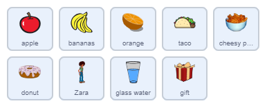
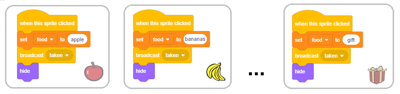
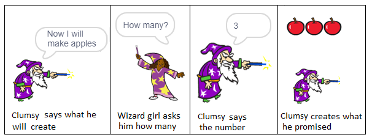
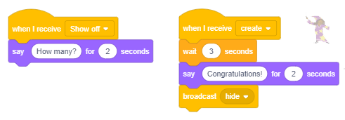
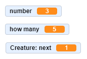
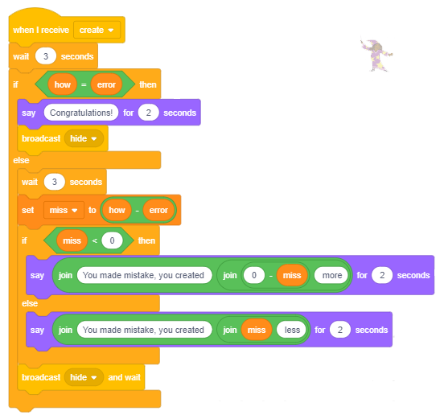

Listat 
======

.. include:: blocks.txt

.. include:: icons.txt

.. infonote::

 |intro9|

Në programet që kemi krijuar në mësimet e mëparshme, kemi përdorur vetëm lloje të thjeshta të të dhënave - secili variabël ruante vlerën e një pjese të të dhënave. Sidoqoftë, shpesh na duhet të ruajmë një seri të tërë të të dhënave nën një emër, për shembull, një grup numrash. Nëse duam të ruajmë numrat e telefonit prej 10 miqve tanë, do të na duhet të krijojmë 10 variabël, gjë që nuk është e lehtë për tu mirëmbajtur, kështu që do të përdorim një lloj kompleks të dhënash, i cili në Scratch quhet një **listë**.

.. infonote::

 **Çfarë është një listë?**

  Një listë është një variabël komplekse që përbëhet nga elementë të shumtë - variabla të shumëfishta. Këto mund të jenë lloje të ndryshme të të dhënave; në këtë shembull ato janë vargje. Krijohet në mënyrë të ngjashme me atë se si krijohen variabla të zakonshëm.
   
  (1) Në grupin *Variables*  klikoni në butonin *Make a list*.

  (2) Do të shfaqet një dritare dialogu ku duhet të shkruani emrin e listës dhe të konfirmoni duke klikuar butonin *OK*.

 .. image:: ../_images/9/fig9_1.png
     :width: 575px   
     :align: center

 (3) Në skenë do të shfaqet një monitor i zbrazët i listës, dhe në fund të këtij monitori do të ketë gjatësinë aktuale të listës të shkruar në të, e cila do të jetë 0.
   
  (4) Duke klikuar në shenjën "+", e vendosur në këndin e poshtëm të djathtë, do të hapni fushën ku mund të futni elementin tuaj të parë, dhe gjatësia e listës do të rritet me 1.

  (5) Elementi i parë i listës duhet të futet në fushën bosh.

 .. image:: ../_images/9/fig9_2.png
     :width: 370px   
     :align: center
   
 Duke përsëritur këtë proces, numri i dëshiruar i elementëve të listës mund të futet.

  Në të njëjtën kohë, një bllok i lidhur me listën dhe 11 blloqe të tjera që lejojnë listën dhe elementët e tij të përdoren në program, do të shfaqet në paleta e bllokut.

 .. image:: ../_images/9/fig9_3.png
     :width: 420px   
     :align: center

|study| Studio shembujt e mëposhtëm
----------------------------------------

Në projektin e quajtur "Quiz", ekziston një listë e pyetjeve dhe një listë me përgjigje të sakta. Pyetjet dhe përgjigjet mund të futen paraprakisht, ose ato mund të ngarkohen nga një bazë e të dhënave tekstuale. Programi shtron pyetjet rastësisht dhe më pas kontrollon nëse përgjigja e dhënë nga përdoruesi është e saktë. Nëse përgjigja është e saktë, përdoruesi do të marrë një pikë, dhe nëse jo, programi do të transmetojë përgjigjen e saktë. Në fund, bazuar në numrin e përgjigjeve të sakta, përdoruesi merr një notë.

Shembulli 1 - Projekti "Quiz"
~~~~~~~~~~~~~~~~~~~~~~~~~~~~~~~

.. level:: 1

Në projektin e quajtur "Quiz", ekziston një listë e pyetjeve dhe një listë me përgjigje të sakta. Pyetjet dhe përgjigjet mund të futen paraprakisht, ose ato mund të ngarkohen nga një bazë e të dhënave tekstuale. Programi shtron pyetjet rastësisht dhe më pas kontrollon nëse përgjigja e dhënë nga përdoruesi është e saktë. Nëse përgjigja është e saktë, përdoruesi do të marrë një pikë, dhe nëse jo, programi do të transmetojë përgjigjen e saktë. Në fund, bazuar në numrin e përgjigjeve të sakta, përdoruesi merr një notë....

.. image:: ../_images/9/fig9_4.png
     :width: 440px   
     :align: center

Skenari për këtë projekt mund të shihet më poshtë.

.. image:: ../_images/9/fig9_5.png
     :width: 565px   
     :align: center

Projekti i mëposhtëm ilustron se si elementët e listës mund të zgjidhen rastësisht. Ne do të përdorim bllokun e reporterit, i cili do të kthejë vlerën e elementit të listës, numri rendor i të cilit është shkruar në fushën e duhur të hyrjes. Në këtë mënyrë, nëse gjenerojmë rastësisht ndryshoren *numrin*, duke e futur atë numër në fushën e hyrjes së numrit të sekuencës, do të marrim elementin, i cili është në atë pozicion në listë. Projekti ilustron gjithashtu se si mund të përdoren numrat e gjeneruar në mënyrë të rastësishme për transmetimin e mesazheve të ndryshme.

.......

Shembulli 2 - Projekti "Uria"
~~~~~~~~~~~~~~~~~~~~~~~~~~~~~~~~~~

.. level:: 2

Ka 10 sprites që marrin pjesë në këtë projekt - macja e uritur dhe 9 lloje të ushqimit që mace po fantazon.

.. image:: ../_images/9/fig9_6.png
     :width: 460px   
     :align: center

Macja po ecën majtas dhe djathtas dhe "po mendon" për 3 sekonda një nga 11 fjalitë, të zgjedhura rastësisht, nga lista e fjalive të quajtura *food*. 

.. image:: ../_images/9/fig9_7.png
     :width: 220px   
     :align: center

Gjatë kohës që reja është e dukshme në skenë |think_sec|, imazhi i ushqimit për të cilin po mendon macja shfaqet në renë e bardhë të vendosur në qendër të skenës.

.. image:: ../_images/9/fig9_8.png
     :width: 960px   
     :align: center

Sinkronizimi i pamjes së ushqimit dhe mendimit të maceve për atë ushqim të veçantë do të arrihet me transmetimin e mesazheve.

Variabli *number*, i cili gjenerohet rastësisht, përdoret si për zgjedhjen e fjalisë nga lista *food* ashtu edhe për gjenerimin e mesazhit nga "1" në "11". Askush nuk reagon ndaj mesazheve "1" dhe "11", ndërsa sprites, emrat e të cilëve janë numra midis 2 dhe 9 do të reagojnë ndaj mesazheve nga "2" në "9".

Për shembull, mouse që është sprite "2" do të reagojë në mesazhin "2", zogu që është sprite "3", do të reagojë në mesazhin "3", etj.

.. image:: ../_images/9/fig9_9.png
     :width: 660px   
     :align: center

Reagimi i secilës sprite është i njëjtë: ato shfaqen për 2 sekonda, ndërsa reja e të menduarit për mace është e dukshme, dhe më pas ato fshihen përsëri. Kur klikohet flamuri i gjelbër, të gjitha sprites (përveç mace) shkojnë në pozicionin (0,110), që është qendra e re e bardhë, dhe ato fshihen.

Shifra e mëposhtme përmban të gjitha skriptet e shtuara në rrjedhën kryesore të këtij projekti.

.. image:: ../_images/9/fig9_10.png
     :width: 385px   
     :align: center

.......

Projekti i mëposhtëm ilustron se si mund t'i ndajmë të gjitha objektet në grupe të dëshirueshme, të padëshirueshme dhe asnjanëse. Regjistrimi i objekteve të dëshirueshme ruhet në një listë, dhe të objekteve të padëshirueshme në një listë tjetër. Kur zgjidhet objekti, programi së pari kontrollon se cilit grup i përket: nëse është e dëshirueshme, do të merren pikë pozitive, dhe nëse është e padëshirueshme, do të merren pikë negative; nëse është neutrale, numri i pikëve nuk do të ndryshojë. Për shembull, kjo mund të jetë strategjia nëse po bëni një lojë për fëmijë, ku ata duhet të mbledhin sa më shumë sende të dobishme dhe të shmangin sendet e rrezikshme (shiko detyrat e projektit).

Shembulli 3 - Projekti "Ushqimi"
~~~~~~~~~~~~~~~~~~~~~~~~~~~~~~~~~

.. level:: 2

**Skenari i projektit**

Rruga kryesore e këtij projekti është një vajzë e quajtur Zara. Gjatë pushimit të shkollës, ajo mund të hajë diçka, të pijë ujë ose të marrë një dhuratë. Ju zgjidhni atë që Zara do të marrë duke klikuar në objektet që shfaqen në skenë. Nëse zgjidhni ushqim që shëndoshi n - një sanduiç, patate të skuqura ose një donut, do të merrni pikë negative. Nëse në vend të kësaj zgjidhni fruta - një portokall, një banane ose një mollë, do të merrni pikë pozitive. Nëse vendosni të merrni ujë ose dhuratë, pikët do të mbeten të pandryshuara.

Emrat e artikujve që fitojnë pikë pozitive janë në njërën listë (në rastin tonë "frutat"), dhe ato që fitojnë pikë negative në tjetrën (në rastin tonë "jo të shëndetshëm").

**Sjellja e sprites**

Të gjithë artikujt kanë të njëjtën sjellje. Kur klikohet flamuri i gjelbër, ato shfaqen në pozicionin e zgjedhur rastësisht në anën e djathtë të skenës. Kur përdoruesi klikon mbi ta, ata caktojnë emrin e tyre në variablin *food*, transmetojnë mesazhin *taken* dhe fshihen.

Shkrimet e shtuara në Zara gjithashtu lejojnë që programi të llogarisë numrin e pikave në varësi të cilës ushqim u zgjodh.

.. image:: ../_images/9/fig9_13.png
     :width: 495px   
     :align: center

.......

Shembulli 4 - Projekti "Magjistar i ngathët"
~~~~~~~~~~~~~~~~~~~~~~~~~~~~~~~~~~~~~~~~~~~~~

.. level:: 3

Sprite kryesore e kësaj loje është Clumsy Wizard. Ai mund të përdorë shkopin e tij magjik për të bërë kopje të shumta të së njëjtës gjë, por shpesh ai ngatërrohet dhe harron saktësisht sa premtoi, kështu që ai bën shumë sende ose jo sa duhet.

Ekziston edhe ndihmësi i tij, Wizard Girl, i cili mban me vëmendje ato që i ka premtuar Clumsy Wizard dhe sa kopje ka bërë, duke e kujtuar nëse bën një gabim.

**Si magjistari i ngathët premton gjëra të ndryshme**

Për të lejuar që Magjistari i ngathët të premtojë të bëjë gjëra të ndryshme, duhet të krijojmë një spërkatje me ato gjëra si kostumet e saj. Përveç kësaj, duhet të bëjmë një listë me emrat e atyre gjërave. Në projektin tonë, ne do të krijojmë një sprite të quajtur *Creature*, e cila mund të shfaqet në 5 kostume të ndryshme.

.. image:: ../_images/9/fig9_15.png
     :width: 630px   
     :align: center

Në mënyrë që Wagard Clumsy të jetë në gjendje të thotë emrat e kostumeve, ne kemi prezantuar një listë të quajtur *things* dhe në të, kemi futur 5 emra të kostumeve. Një numër midis 1 dhe 5 gjenerohet rastësisht dhe më pas Clumsy Wizard thotë një fjali në të cilën teksti "Tani do të bëj" është bashkuar me elementin përkatës nga kjo listë. Për shembull, nëse gjenerohet numri 2, Magjistari i ngathët do të thotë "Tani do të bëj mollë", dhe nëse gjenerohet numri 4, ai do të thotë "Tani do të bëj flutura".

Shifra e mëposhtme tregon sjelljen e sprite magjistarit kur përdoruesi klikon mbi të. Së pari, vlera e variablit *number* do të gjenerohet rastësisht nga intervali [1,5]. Pastaj, magjistari thotë se ai do të bëjë një nga kostumet e sprite *Creature*, më saktë atë që numri rendor i të cilit në listë është i njëjtë me numrin e gjeneruar. Pastaj, ai transmeton mesazhin *Show* të cilit do të reagojë Vajza Magjistare duke pyetur Magjistarin e ngathët se sa kopje të krijesës që ai synon të bëjë, pyetja e saj do të zgjasë 2 sekonda. Kjo është arsyeja pse ekziston një bllok i shtuar magjistarit, i cili i lejon atij të presë 2 sekonda. Pas kësaj pauze, magjistari do të gjenerojë vlerën e variablit *how* nga intervali [1,10].
Meqenëse dimensionet e kostumit të sprite *Creature* janë vendosur në rreth 50x50 pixel, vendosëm që numri maksimal i krijesave që mund të "krijohen" nga Wagard Clumsy duhet të jetë 10. Në këtë mënyrë, të gjitha kopjet do të jenë të dukshme në skena. Clumsy Wizard thotë se sa kopje ai do të krijojë dhe transmetojë mesazhin *Create*.

.. image:: ../_images/9/fig9_16.png
     :width: 460px   
     :align: center

Shifra e mëposhtme paraqet skriptet, të cilat përshkruajnë sjelljen e Girl Wizard. Ajo reagon ndaj të dy porosive të transmetuara nga magjistari dhe ajo transmeton mesazhin e vet *hide* 4 sekonda pasi të marrë mesazhin *create*. Mesazhi *fide* është sinjali që krijesa sprite të largojë klonët e saj dhe vetë nga skena.

Figura e mëposhtme paraqet skriptet, të cilat përshkruajnë sjelljen e sprite *Creature*. Kjo sprint reagon ndaj 4 ngjarjeve të ndryshme: duke klikuar mbi flamurin e gjelbër, duke transmetuar mesazhet *create* dhe *hide*, dhe ngjarjen e klonimit. Kur klikohet flamuri jeshil, krijesa fshihet, dhe kur merr mesazhin *hide*, ajo ndryshon vlerën e variablit *other*. Ky variabël, ndryshe nga variablat globale *number* dhe *how*, të cilat mund të përdoren nga të gjitha sprites, është krijuar vetëm për t’u përdorur nga sprite *Create*, pra është një variabël lokal. Karakteristika kryesore e variablave lokale është se ato mund të përdoren vetëm nga sprite për të cilat janë krijuar. Sprites të tjerë mund të shohin vlerat e tyre, por ato nuk mund t'i ndryshojnë ato. Variabli *other* përdoret si shkas. Kur vlera e tij ndryshon nga 0 (vlera fillestare që është vendosur në fillim të reagimit ndaj mesazhit *Create*) në 1, fillon shkatërrimi i kloneve (kopjet) dhe spërkatja fshihet.

**Si e shfaq Clumsy Wizard numrin e ndryshëm të kopjeve (kloneve) të sprite?**

Një gjë tjetër që duhet të shpjegojmë është se si Kënga e ngathët është në gjendje të shfaqë kopje të shumëfishta të një sprite të caktuar (d.m.th. të kostumeve të sprite *Creature*). Për këtë, ai përdor **klonimin** të sprites. Ne kemi treguar tashmë që sprite (dhe të gjitha shkrimet e shtuara në të) mund të shumëzohen gjatë krijimit të programit. Shumëzimi bëhet duke zgjedhur opsionin *dublicate* nga menyja e shkurtoreve që merrni kur klikoni me të djathtën mbi sprite në listën e sprites. Në Scratch, ekziston edhe opsioni që lejon që sprite të shumëzohet gjatë ekzekutimit të programit. (Isshtë e ngjashme me listat, të cilave elementët mund të shtohen edhe gjatë krijimit dhe ekzekutimit të programit)

Për të klonuar sprite dhe për të menaxhuar sjelljen e klonit, ne përdorim udhëzimet |create_clone| dhe |when_clone| nga grupi *Control*. Në skenarin që përshkruan sjelljen e krijesës së sprite kur merr mesazhin e magjistarit *create*, sprite shfaqet në skajin e majtë të skenës, pas së cilës klonet e saj krijohen dhe shfaqen në skenë. Çdo klon shfaqet në një distancë prej 50 hapash nga ai i mëparshmi, kështu që ata qëndrojnë krah për krah në një rresht. Kjo arrihet me ciklin që përsëritet *sa-1* numrin e herëve, i cili, së bashku me sprite origjinale, prodhon kopje të numrit të premtuar të sprite. Meqenëse variabla *next* është një variabël lokal për sprite që është duke u klonuar, secili prej kloneve të tij ka vlerën e vet të kësaj ndryshore, dhe të gjitha klonet janë të dukshëm në skenë derisa ndryshorja *other* të marrë vlerën 1 (kur sprite merr mesazhin *hide*). Kjo ndodh kur secili klon fshin vetveten, dhe burimi origjinal fshihet.

.. image:: ../_images/9/fig9_19.png
     :width: 430px   
     :align: center

**Përditësimi i projektit Clumsy Wizard2**

Ideja e kësaj azhurnimi është që të aranzhohet në mënyrë që magjistari të mos bëjë sa më shumë kopje të objektit siç premtoi. Ai bën ose shumë ose nuk mjafton. Përdoruesi duhet të thotë se sa më shumë ose më pak objekte që magjistari ka krijuar, d.m.th. fëmija duhet të mësojë të shtojë dhe zbresë numrat deri në 10. Ne e arrijmë këtë duke gjeneruar gabimin *të gabuar*, vlerat e të cilit mund të jenë numra të plotë nga intervali [ -3,3]. Sigurisht, nëse gabimi i gjeneruar është 0, magjistari do të krijojë numrin e saktë të kopjeve që premtoi, por në raste të tjera do të jetë e nevojshme të përcaktohet se sa objekte ka krijuar. Shifra e mëposhtme tregon disa nga rastet kur magjistari "hutohet". 

.. image:: ../_images/9/fig9_20.png
     :width: 610px   
     :align: center

Skenari i mëposhtëm përshkruan sjelljen e krijesës.

.. image:: ../_images/9/fig9_21.png
     :width: 410px   
     :align: center

Skenari i paraqitur më poshtë përshkruan sjelljen e Wizard Girl.

Ruani këtë projekt të modifikuar nën emrin *Clumsy Wizard2*.

Shënim. Nëse projekti përdoret për të praktikuar shtimin dhe zbritjen me numra deri në 10, do të jetë e dobishme të futni një pyetje "bosh" |ask_wait| në skenarin e shtuar tek magjistari i vajzës së re në vend të bllokut të pritjes |wait_sec|. Vetëm kur fëmija të japë përgjigjen, do ta shtypim *Enter* dhe do ta kontrollojmë atë përgjigje.

|ask| Përgjigjuni pyetjeve të mëposhtme
-------------------------------------------

Për të gjitha pyetjet që pasojnë, supozohet se, fillimisht, lista ka elementët e mëposhtëm

.. image:: ../_images/9/q9_1.png
     :width: 125px   
     :align: center

Pyetja 1
~~~~~~~~~~~

.. level:: 1

.. mchoice:: lista1
   :multiple_answers:
   :answer_a: lista do të ketë një element më pak
   :answer_b: elementi portokall është në vendin numër 1 në listë
   :answer_c: elementi zhvendoset në fund të listës
   :answer_d: elementi i fundit në listë është nxjerrë
   :correct: a, b
   :feedback_a: 
   :feedback_b: 
   :feedback_c: 
   :feedback_d: 

   Cili është rezultati i ekzekutimit të komandës |l1|? (Zgjidhni të gjitha përgjigjet e sakta)

.. |l1| image:: ../_images/9/l1.png
  
Pyetja 2
~~~~~~~~~~~

.. level:: 1

.. mchoice:: lista2
    :answer_a: elementi do të shtohet në fillim të listës
    :answer_b: elementi do të shtohet në fund të listës
    :answer: elementi do të shtohet nën kushtin që nuk ishte më parë në listë
    :correct: b
    :feedback_a: Kjo komandë shton në fund të listës.
    :feedback_b: E saktë.
    :feedback_c: Nuk janë bërë kontrolle.
   
   Cili është rezultati i ekzekutimit të komandës |l2|?

.. |l2| image:: ../_images/9/l2.png

Pyetja 3
~~~~~~~~~~~

.. level:: 1

.. mchoice:: lista3
   :answer_a: zero
   :answer_b: një herë
   :answer_c: dy herë
   :answer_d: tre herë
   :correct: d
   :feedback_a: Lista ka 3 elementë.
   :feedback_b: Lista ka 3 elementë..
   :feedback_c: Lista ka 3 elementë.
   :feedback_d: Saktë.

   How many times will the sprite says "I like fruit"?

   .. image:: ../_images/9/q9_3.png
      :width: 220px   
      :align: center

Pyetja 4
~~~~~~~~~~~

.. level:: 2

.. mchoice:: lista4
   :multiple_answers:
   :answer_a: 
   :answer_b: 
   :answer_c: 
   :correct: b, c
   :feedback_a: 
   :feedback_b: 
   :feedback_c: 
   
  Cila komandë do të vendosë elementin *strawberry* në pozicionin e dytë në listë *fruits*? (Zgjidhni të gjitha përgjigjet e sakta)

   .. image:: ../_images/9/q9_4.png
      :width: 650px   
      :align: center

Pyetja 5
~~~~~~~~~~~

.. level:: 2

.. mchoice:: lista5
   :multiple_answers:
   :answer_a: 
   :answer_b: 
   :answer_c: 
   :correct: a, b
   :feedback_a:  
   :feedback_b: 
   :feedback_c: 
   
    Pas ekzekutimit të cilave komanda do të rritet numri i elementeve në listë? (Zgjidhni të gjitha përgjigjet e sakta) 

   .. image:: ../_images/9/q9_4.png
      :width: 650px   
      :align: center

Pyetja 6
~~~~~~~~~~~

.. level:: 2

.. mchoice:: lista6
    :answer_a: Nëse lista përfshin elementin luleshtrydhe, madhësia e saj nuk do të ndryshojë; përndryshe, luleshtrydhet e elementit do t'i shtohen në fund të listës.
    :answer_b: Pavarësisht nëse është përfshirë apo jo elementi i luleshtrydhes, ajo do ta shtojë atë në fund të listës.
    :answer_c: Nëse lista përfshin elementin luleshtrydhe, madhësia e saj nuk do të ndryshojë; përndryshe, luleshtrydhet e elementit do t'i shtohen fillimit të listës.
    :correct: a
    :feedback_a: E saktë.
    :feedback_b: Hyrja në listë kryhet nëse lista nuk e kishte më parë elementin luleshtrydhe.
    :feedback_c: Nëse shtohet, ajo do të shtohet në fund të listës.
   
   Cili është rezultati i ekzekutimit të urdhrave të mëposhtëm?

   .. image:: ../_images/9/q9_6.png
      :width: 300px   
      :align: center

|try| Provoje!
--------------

Në 3 ushtrimet e para, supozohet se kemi një listë të quajtur **original**, elementët e së cilës janë numrat nga 1 në 10 (në sekuencë).

Ushtrimi 1
~~~~~~~~~~~
.. level:: 2

.. infonote::

  Shkruaj një skenar, i cili krijon listën e quajtur **dublicate** dhe shkruan në të të gjithë elementët e listës ** origjinale ** ekzistuese

.......

Ushtrimi 2
~~~~~~~~~~
.. level:: 2

.. infonote::

  Shkruaj një skenar që krijon një listë të quajtur **backward** dhe shkruan në të të gjithë elementët e listës ekzistuese **original** në rend të kundërt, pra elementi i parë i listës *back* duhet të jetë elementi i fundit i lista *original*, e dyta - e parafundit nga lista *original* e kështu me radhë deri në elementin e parë të listës *origjinal*, i cili duhet të jetë i fundit në listë *backward*.

.......

Ushtrimi 3
~~~~~~~~~~
.. level:: 2

.. infonote::

  Shkruaj një skenar që krijon listën **even ** dhe shkruan në të çdo element tjetër të listës ekzistuese**original**.

.......

Ushtrimi 4
~~~~~~~~~~~
.. level:: 2

.. infonote::

  Shkruaj një skenar që krijon listën **random1** dhe shkruan në të 10 numra nga intervali [1,100], i krijuar me numrin e rastësishëm të operatorit.

.......

Ushtrimi 5
~~~~~~~~~~
.. level:: 3

.. infonote::

  Shkruaj një skenar që krijon listën **random2** dhe shkruan në të 10 numra Diferencën nga intervali [1,100], i krijuar me numrin e rastësishëm të operatorit.

|bug| Debug!
----------------

Bug 1
~~~~~~~~

.. level:: 2

.. infonote::

 Studenti dëshironte të ndryshojë Shembullin 3 të këtij mësimi në mënyrë që të ketë një listë të re të quajtur *eaten* ku do të shkruhen emrat e llojeve të ndryshme të ushqimit të zgjedhur nga Zara. Tek Zara, ai / ajo shtoi skriptet për kontrollin e lëvizjes me çelësat e shigjetave dhe skenarin e treguar në figurën më poshtë. Shifra tregon gjithashtu skriptet e shtuara në sprites të tjera në projekt. Shumica e ngjarjeve u ekzekutuan siç pritej; megjithatë, studenti nuk ishte në gjendje të shkruante mollën dhe portokallin në listë. Ku është faji?  

 .. image:: ../_images/9/bug9_1.png
   :width: 810px   
   :align: center

 .. reveal:: sаkrivаnjе24
   :showtitle: Trego përgjigjen
   :hidetitle: Fshih përgjigjen
 
   **Përgjigja:**
     
   Në komandën ``wait until`` të shkrimeve të shtuara në mollë dhe spritat e portokallit, ura që duhet t'i prekë nuk është vendosur si duhet.
      
|book| Përmbledhje
-----------------------

Në këtë mësim, mësuam si të përdorim listat në Scratch - lloji i të dhënave që ka një strukturë komplekse, e cila mundëson të ruhen shumë vlera në të njëjtën kohë. Ne pamë që elementët e listës mund të jenë lloje të ndryshme të të dhënave, dhe se ato mund të përdoren për zgjedhjen e një prej kostumeve të një sprite të caktuar ose për zgjedhjen e një prej sprites nga lista e sprites. Me shembuj të projektit, ne gjithashtu ilustronim sinkronizimin e sjelljes së sprites të shumëzuar duke përdorur mesazhe. Për më tepër, ne treguam se si programi mund të përdoret për të klonuar sprites dhe si këto klone mund të sillen ndryshe nëse sprite që i krijuan ato kanë ndryshore lokale.

**Shembuj projekti**: 9Studio_

.. _9Studio: https://scratch.mit.edu/studios/25119484/

**Koncepte të reja**:  list, list element, clones.

**Komanda të reja**: |variables_blocks| - |add_to|,  |delete_of|, |delete_all|,  |insert_at|,  |replace_with|, |show_list|, |hide_list|, |item_of|,  |length_of|,  |list_contains|.

|control_blocks| - |when_clone|, |create_clone|, |delete_clone|. 

|project| Krijo projekte
---------------------------

Projekti 1 - "History Quiz"
~~~~~~~~~~~~~~~~~~~~~~~~~~~~

.. level:: 2

Ngarkoni listën e pyetjeve nga një skedar teksti.

1. Duke përdorur programin Notepad shkruaj një listë të pyetjeve të historisë, secila pyetje duhet të shkruhet në një rresht të veçantë.
2. Ruani tekstin si skedar teksti të quajtur *History.txt* me kodimin UTF-8.

.. image:: ../_images/9/projekat9_1a.png
     :width: 250px   
     :align: center

3. Në Scratch, krijoni një listë të quajtur *questions*.
4. Klikoni me të djathtën në monitorin e listës dhe nga menyja e shkurtoreve zgjidhni operacionin *import*.

.. image:: ../_images/9/projekat9_1b.png
     :width: 230px   
     :align: center

5. Në fushën e emrit të skedarit shkruaj *History*
6. Lista e pyetjeve që keni shkruar më parë në Notepad do të shfaqet në listën tuaj.

.. image:: ../_images/9/projekat9_1c.png
     :width: 470px   
     :align: center

Pastaj, krijoni një listë me përgjigje të sakta dhe një skenar, i cili do të zgjedhë rastësisht një pyetje nga lista e pyetjeve, kërkoni nga përdoruesi që të përgjigjet dhe pastaj të krahasojë përgjigjen me përgjigjen e saktë nga lista. Nëse përdoruesi është përgjigjur saktë, duhet të rrisni numrin e pikëve të tij / saj.

Projekti 2 - "Numra telefoni"
~~~~~~~~~~~~~~~~~~~~~~~~~~~~~~~~

.. level:: 2

Krijoni tre lista me emra, ditëlindje dhe numra telefoni të miqve tuaj.
Shkruaj një skenar që kontrollon nëse emri i futur nga hyrja është përfshirë në listë. Nëse emri është në listë, duhet të tregojë datën e lindjes dhe numrin e telefonit të personit, emri i të cilit është futur, dhe nëse jo, duhet të shfaqet mesazhi i duhur.

Projekti 3 - "Binjakë"
~~~~~~~~~~~~~~~~~~~~~~~

.. level:: 3

Krijoni procedura, të cilat duhet të lidhen me projektin Binjakët.

Procedura **Control** duhet të kontrollojë nëse numri i dhënë si parametër është një numër kryesor.

Procedura **Compose** duhet të hartojë një listë të quajtur *Prime* ku do të shkruajë çdo numër kryesor nga intervali [2,1000].

Programi kryesor duhet të shfaq të gjithë numrat binjakë (numrat kryesorë që ndryshojnë për 2) nga intervali [2,1000].

Projekti 4 - Loja "Objekte të rrezikshme"
~~~~~~~~~~~~~~~~~~~~~~~~~~~~~~~~~~~~~~~~~~

.. level:: 3

Krijoni një lojë ku përdoruesi (një fëmijë i vogël) duhet të zgjedhë disa objekte, të cilat nuk janë të rrezikshme, nga grupi i objekteve të paraqitura atij / saj. Emrat (ose numri rendor i kostumeve, si në shembullin 4 të këtij mësimi) të objekteve të rrezikshme në skenë duhet të shkruhen në listë *dangerous*.
Objektet zgjidhen duke klikuar mbi to. Pastaj programi kontrollon nëse ai parametër është përfshirë në listën e rrezikshme.
Nëse përdoruesi zgjedh një objekt që nuk është i rrezikshëm, ai / ajo do të marrë një pikë pozitive; përndryshe, ai / ajo do të marrë një pikë negative. Qëllimi është të mbledhim të paktën 3 pikë (nga, për shembull, 5). Kjo është kur loja duhet të përfundojë, ose përdoruesit duhet të shkojnë në nivelin tjetër.

Lojë mund të ketë nivele të shumta, për shembull, rreziqe në kuzhinë (thikë, tas me zjarr me ujë të valë, etj.), Rreziqe në oborrin e shtëpisë, natyrën, etj.
