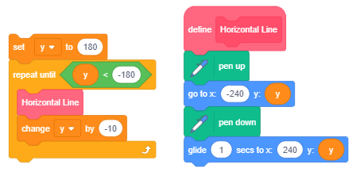

Si të programojmë më shpejt – Proçedurat
===========================================

.. include:: blocks.txt

.. include:: icons.txt

.. infonote::

 |intro8|

Projektet që do të studiojmë kanë një strukturë komplekse.
Për të përballuar këtë kompleksitet, ne do të përdorim një qasje të njohur si programim **i strukturua** i zhvilluar në vitet 1960. Kjo qasje ka thjeshtuar procesin e të shkruarit, të kuptuarit dhe mbajtjen e programeve komplekse. Në vend që të shkruajmë programe komplekse, të cilat është e vështirë të rishkruhen nëse ka nevojë për këtë (kjo quhet mirëmbajtje), dhe ku gabimet janë të vështira për t'u zbuluar, ne mund t'i ndajmë ato në pjesë të vogla, secila prej të cilave zgjidh një pjesë të përgjithshme problem.

Për t'i bërë projektet me strukturë komplekse më të shpejtë dhe më të lehtë, ne do t'i ndajmë skriptet e mëdha në pjesë logjike, secila duke kryer një funksion të vetëm. Ne i quajmë pjesë të tilla **procedurat**. Secila procedurë kryen një funksion specifik, dhe një skenar, programi kryesor, i quan ata dhe i lidh ato së bashku, kështu që ata bëjnë një tërësi.

.. topic:: Realizimi i proçedurave në Scratch

 Në Scratch, një mënyrë e realizimit të procedurave dhe frenimit të algoritmeve të tilla komplekse në disa më të thjeshta është duke përdorur mesazhe, i njëjti mekanizëm që kemi përdorur për sinkronizimin e sjelljes së sprites të ndryshme. Një mënyrë tjetër për të realizuar procedurat është të prezantoni komandat tuaja.

  **Krijimi i blloqeve të reja**

  Për të krijuar një bllok të ri, zgjidhni grupin *My  blocks* (1) dhe më pas klikoni në butonin *Make a block* (2). Do të shfaqet një dritare dialogu, e cila mundëson krijimin e blloqeve të reja. Ju duhet të vendosni emrin e dëshiruar në fushën e hyrjes (3), për shembull, *Draw a triangle* dhe të konfirmoni krijimin duke klikuar në butonin *OK* (4).
 
 .. image:: ../_images/8/fig8_1.png
    :width: 575px   
    :align: center

 Blloku i ri ``Draw a triangle`` (1) do të shfaqet në paletën e bllokut, dhe blloku i ri fillestar ``define`` (2) do të shfaqet në zonën e skriptave, blloqe të tjera që do të përdoren për vizatimin e një trekëndëshi (3) duhet të shtohet në këtë bllok fillestar.
 
 .. image:: ../_images/8/fig8_2.png
    :width: 560px   
    :align: center

 Blloku i ri gjithashtu mund të ketë fushat e hyrjes. Për shkak të kësaj, ne jemi në gjendje të tërheqim trekëndësha me gjatësi të ndryshme të anëve me të njëjtin bllok. Për ta arritur këtë, duhet të zgjedhim opsionin *Redakto* nga menuja e shorcutt, të cilën do ta marrim duke klikuar me të djathtën në bllokun e ri (1). Dritarja e dialogut *Bëni një bllok* do të hapet përsëri. Nga tre opsionet e ofruara për shtimin e fushave të reja në bllok, duhet të zgjidhni *Shtoni një emër hyrje ose tekst* (2) dhe një fushë hyrëse do të shfaqet në bllokun (3); në këtë bllok do të futim *a* - emrin e variablit për gjatësinë e anës së një trekëndëshi.

 .. image:: ../_images/8/fig8_3.png
    :width: 920px   
    :align: center
 
 Nëse do të kishim zgjedhur *Shtoni një boolean të dhënash*, fusha e hyrjes do të kishte një formë gjashtëkëndore dhe do të kishte qenë në gjendje të merrte vetëm blloqe logjike, dhe opsioni *Shto një etiketë * do të mundësonte që teksti të shkruhej pas hyrjes fusha.
 
  *Mos harroni.* Kudo që dëshironi të përdorni variablin *a* në blloqe përkufizimi, duhet të tërhiqni reporterin e kësaj ndryshore nga titulli i përcaktimit të bllokut (4). Prandaj, jo shkronja a, as reporteri *a* nga paleta e bllokut, por reporteri nga titulli i përkufizimit |nije_isto|

 .. |nije_isto| image:: ../_images/8/fig8_4.png  
 
 Emri *a*, të cilin kemi futur në përkufizimin e procedurës *Vizatoni një trekëndësh* quhet një parametër. Procedurat mund të kenë më shumë se një parametër. Për shembull, ne mund të krijojmë një procedurë *Vizatoni një poligon*, i cili tërheq poligone të rregullt me numër të ndryshëm të anëve që kanë gjatësi të ndryshme. Në vend të përcaktimit të blloqeve të veçanta për vizatimin e një trekëndëshi, një shumëkëndëshi katërkëndësh dhe të tjerë, me një gjatësi të caktuar anësh, do të përcaktojmë vetëm një bllok me parametrat *numrin e brinjëve* dhe *gjatësinë e*. Vlerat e brinjëve specifike të parametrave që do t'i vendosim si **argumenti** i komandës së prezantuar rishtazi. Ky argument do të zëvendësojë çdo paraqitje të numrit të parametrit të palëve në procedurë. Mund të themi se parametri është mbajtësi i vendit të caktuar për argumentin.     
 
 
|study| Studioni shembujt e mëposhtëm
----------------------------------------

Shembulli 1 - Projekti "Rrjete me katrorë"
~~~~~~~~~~~~~~~~~~~~~~~~~~~~~~~~~~~~~~~~~~~

.. level:: 3

**Vizatimi i vijave horizontale**

Për të vizatuar një vijë horizontale (paralel me boshtin x) duhet të lidhim të gjitha pikat që kanë të njëjtën vlerë të koordinatës y.
Për shembull, nëse x = 0, atëherë do të tërheqim vetëm boshtin x. Në fillim, ne do ta vendosim stilolapsin në skajin e majtë të ekranit në pikën (-240,0), vendosim lapsin poshtë, kështu që lë një shenjë kur lëviz, dhe pastaj e vendosim të rrëshqasë në pikën ( 240,0).
Aty do të ngremë stilolapsin (pen up block) dhe mund të fillojmë të vizatojmë një vijë tjetër.

Nëse duam të vizatojmë të gjitha vijat horizontale, koordinata y e të cilave është një numër që përfundon me 0 (i pjesshëm me 8), do të përsërisim procedurën e përshkruar më parë për **Vizatimin e vijave horizontale**

Për të vizatuar një vijë horizontale (paralel me boshtin x) duhet të lidhim të gjitha pikat që kanë të njëjtën vlerë të koordinatës y.
Për shembull, nëse x = 0, atëherë do të tërheqim vetëm boshtin x. Në fillim, ne do ta vendosim stilolapsin në skajin e majtë të ekranit në pikën (-240,0), vendosim lapsin poshtë, kështu që lë një shenjë kur lëviz, dhe pastaj e vendosim të rrëshqasë në pikën ( 240,0).
Aty do të ngremë stilolapsin (pen up block) dhe mund të fillojmë të vizatojmë një vijë tjetër.

Nëse duam të vizatojmë të gjitha vaijat horizontale, koordinata y e të cilave është një numër që përfundon me 0 (i pjesshëm me 8), do të përsërisim procedurën e përshkruar më parë për y=180, 170, ...,-180. 

.. image:: ../_images/8/fig8_5.png
    :width: 245px   
    :align: center 
          

Për ta bërë procesin më të qartë, ne do të nxjerrim udhëzimet për vizatimin e një vije horizontale dhe krijimin e një pjese të veçantë - **një procedurë**, të cilën do ta quajmë kur të jetë e nevojshme.

**Vizatimi i vijave vertikale**

Për të ruajtur këtë imazh të rrjetit të shesheve të marra duke vizatuar vija horizontale dhe vertikale në këtë mënyrë, do të na duhet të klikojmë me të djathtën në skenë. Opsioni *Ruajeni imazhin si* do të shfaqet. Ky opsion do të na mundësojë ta ruajmë këtë imazh si sfond. (Tani për tani, kjo veçori mund të përdoret vetëm në redaktorin në internet)

Ruani të gjithë projektin nën emrin *Grid*.

.......

Shembulli 2 - Projekti "Disa Rrjeta"
~~~~~~~~~~~~~~~~~~~~~~~~~~~~~~~~~~~~

.. level:: 3

Ne duam ta bëjmë programin e mëparshëm më të përgjithshëm dhe ta përdorim për të vizatuar një rrjet të përbërë nga sheshe më të vogla dhe më të mëdha, si dhe për të vizatuar një rrjet, i cili nuk ka pse të fillojë në këndin e sipërm të majtë të ekranit dhe të përfundojë në qoshe e poshtme e djathte. Do të prezantojmë variablat *x min*, *x max*, *y min*, *y max* dhe *open*.
Ata do të përcaktojnë pikën e sipërme të majtë të rrjetit (x min, y max), pikën e poshtme të djathtë të rrjetit (x max, y min) dhe madhësinë e shesheve në rrjet.
Vlerat fillestare do të vendosen nga inputi.

Në këtë mënyrë ne mund të ndryshojmë projektin *Grid*, i cili tërheq vetëm një rrjet dhe për të marrë një projekt më të përgjithshëm *Rrjeta të ndryshme*, i cili tërheq rrjete të ndryshme në varësi të të dhënave hyrëse. Përveç variablave që përmendëm më parë, do të prezantojmë ndryvariablinshoren *end*, e cila ka vlerën fillestare 0, dhe e cila ndryshon vetëm nëse përdoruesi dëshiron të ndalojë përdorimin e programit. Answerdo përgjigje përveç "po" e lë vlerën të pandryshuar.

Kur përdoruesi i përgjigjet pyetjes "Done (yes / no)?" me "po", variabli do të ndryshojë vlerën e saj në 1, që është kushti për daljen nga cikli, dhe programi do të ndalojë së funksionuari.

.. image:: ../_images/8/fig8_8.png
    :width: 615px   
    :align: center

.......

Shembulli 3 - Projekti "Ndëresa"
~~~~~~~~~~~~~~~~~~~~~~~~~~~~~~~

.. level:: 3

Në këtë projekt, ne do të vizatojmë imazhe komplekse duke përdorur vetëm një procedurë me parametra. Kjo është procedura *Vizatoni një drejtkëndësh* me parametrat *a* dhe *b* për gjatësinë e anëve. Për ta bërë programin kryesor të lexueshëm, ne gjithashtu e ndamë inicializimin e lapsit në një procedurë të veçantë *PenSetup*, e cila përcakton ngjyrën dhe madhësinë (trashësinë) e lapsit që do të përdoret për vizatim. Shifra e mëposhtme paraqet skriptet që përcaktojnë këto dy procedura. Variabli *unit* përcaktohet në programin kryesor, dhe mundëson vizatimin e drejtkëndëshe proporcionalë me dimensione të ndryshme.

.. image:: ../_images/8/fig8_9.png
    :width: 450px   
    :align: center
    
**Krijimi i projekti **

Ngarkoni sfondin *Xy-grid-20px* nga biblioteka e prapavijës. Kjo është një rrjet i përbërë nga katrorë 24x18, me anët 20x20 pixel. (Ju mund ta keni bërë vetë këtë sfond duke përdorur projektin e mëparshëm). Kjo sfond është e përshtatshme sepse, mbi të, ne mund të shohim qartë proporcionet e imazheve që duam të krijojmë.

Duke përdorur redaktorin e vektorit të integruar, vizatoni një katror 8x8 pixel. Përdorni mjetin |v_rectan|, zgjidhni mënyrën e vizatimit pa mbushur objektin me ngjyra dhe vendosni trashësinë e skicës të jetë 2. Vendosni qendrën e kostumit të jetë në mes të sheshit.

Çdo sprite mund të bëjë vizatimin, por kjo është e dobishme sepse tregon se si formohen vizatimet, dhe ne nuk kemi pse ta fshehim pasi është mjaft i vogël dhe nuk e mbulon vizatimin.

Vizatimi i tërë do të përbëhet nga 4 ndërtesa, 5 sheshe me sfond të gjerë dhe 13 sheshe të larta, d.m.th. 100x260 piksele. Në skenarin tonë, ndryshorja *unit* është e barabartë me gjatësinë e anës së një sheshi të sfondit. Variablat e programit *а* dhe *b* ruajnë koordinatat e pikës nga do të fillojë vizatimi i ndërtesës.

Shënim. Variablat lokalë të procedurës *Vizatoni një Drejtkëndësh* kanë të njëjtat emra, por ato janë të dukshme vetëm brenda procedurës - këto janë **variabla lokale**. Për dallim prej tyre, variablat *a* dhe *b* i programit kryesor janë **variabla globale**, dhe ato mund të shihen në të gjithë projektin.

Në fillim, programi kryesor inicializon variablat dhe më pas thërret procedurën e vizatimit të ndërtesave 4 herë, çdo herë me koordinata të ndryshme të pikës nga e cila fillon vizatimi. Ndërtesat tërhiqen krah për krah pasi x koordinata x e pikës fillestare rritet me gjerësinë e ndërtesës. Shifra e mëposhtme tregon skenarin e programit kryesor dhe imazhin e marrë nga ekzekutimi i tij. 

Procedura *DrawBuilding* së pari e quan procedurën *DrawRectangle* 2 herë, dhe më pas procedurën *DrawWindows*. Në thirrjen e parë, procedura *DrawRectangle* merr parametrat për vizatimin e skajeve të ndërtesës, dhe në të dytën për vizatimin e derës. Figura e mëposhtme tregon skriptet e procedurave *DrawBuilding* dhe *DrawWindows*.

.. image:: ../_images/8/fig8_12.png
    :width: 405px   
    :align: center

Nëse do të kishim vendosur madhësinë në 10 pixel, do të kishim marrë një imazh që është dy herë më i vogël. Figura e mëposhtme tregon rezultatin e programit kur parametrat janë të njëjtë si në shpjegimin (A) dhe kur vlerat e variablave ndryshohen në mënyrën e mëposhtme: njësia = 10, ndryshimi i *a* në programin kryesor *а = а + 10 x unit*, ndryshimi i lartësisë së drejtkëndëshit nga *13 x njësi* në *23 x unit* dhe numrit të përsëritjeve në procedurë * DrawWindows * nga 5 në 10.

.. image:: ../_images/8/fig8_13.png
    :width: 970px   
    :align: center

|ask| Përgjigju pyetje të mëposhtme
-------------------------------------

Pyetja 1
~~~~~~~~~~~

.. level:: 1

.. mchoice:: procedure1
   :answer_a: po
   :answer_b: jo
   :correct: a
   :feedback_a: Saktë. 
   :feedback_b: 
   
   A është programi kryesor superior ndaj procedurave?

Pyetja 2
~~~~~~~~~~~

.. level:: 1

.. mchoice:: procedure2
   :answer_a: po
   :answer_b: jo 
   :correct: b
   :feedback_a:  
   :feedback_b: Saktë.
   
   Në Scratch, a janë realizuar procedurat vetëm në një mënyrë?

Pyetja 3
~~~~~~~~~~~

.. level:: 1

.. mchoice:: procedure3
   :answer_a: po
   :answer_b: jo
   :correct: a
   :feedback_a: Saktë. 
   :feedback_b: 
   
   A mund të ketë blloku i ri fushat e hyrjes?

Pyetja 4
~~~~~~~~~~~

.. level:: 1

.. mchoice:: procedure4
   :answer_a: po
   :answer_b: jo
   :correct: b
   :feedback_a: Jo, ka argumente. 
   :feedback_b: Saktë.

   A është e vërtetë që vlerat e futura në fushat hyrëse të bllokut të ri quhen parametra

Pyetja 5
~~~~~~~~~~~

.. image:: ../_images/8/q8_5.png
   :width: 590px   
   :align: center
      
.. mchoice:: procedure5
   :answer_a: 
   :answer_b: 
   :answer_c: 
   :answer_d: 
   :correct: a, b, d
   :feedback_a:  
   :feedback_b: 
   :feedback_c: 
   :feedback_d: 
   
   Cili bllok i përket grupit * Ngjarjet *? (Zgjidhni të gjitha përgjigjet e sakta)

Pyetja 6
~~~~~~~~~~~

.. image:: ../_images/8/q8_6.png
   :width: 610px   
   :align: center
      
.. mchoice:: procedure6
   :answer_a: 
   :answer_b: 
   :answer_c: 
   :answer_d: 
   :correct: а, b, c
   :feedback_a:  
   :feedback_b: 
   :feedback_c: 
   :feedback_d: 
   
   Cili bllok i përket grupit *Control*? (Zgjidhni të gjitha përgjigjet e sakta)

|try| Provoje!
--------------

Ushtrimi 1
~~~~~~~~~~~

.. level:: 3

.. infonote::

 Krijoni një procedurë *Square1* me parametrat: koordinatat **x** dhe **y** të pikës së sipërme të majtë dhe gjatësinë e brinjës **а**.
  Procedura duhet të vizatojë një katror me brinjët paralele me boshtet x dhe y.
  Pastaj, krijoni një skenar, i cili e quan këtë procedurë shumë herë dhe tërheq katrorë koncentrike siç paraqitet në figurën e mëposhtme.

 .. image:: ../_images/8/ex8_1.png
         :width: 210px   
         :align: center 
        
.......

Ushtrimi 2
~~~~~~~~~~~

.. level:: 2

.. infonote::

 Krijoni procedurën *Square2* me parametrat: koordinatat **x** dhe **y** të pikës së sipërme të majtë, gjatësia e anës **a** dhe drejtimi i brinjës së parë **këndi** , e cila tërhiqet nga procedura. Pastaj, krijoni një skenar, i cili e quan këtë procedurë disa herë dhe vizaton 10 katrorë me këndin e sipërm të majtë të përbashkët, me të njëjtat anët në mënyrë që drejtimi i secilës anë të parë pasuese të rrotullohet 36 gradë nga drejtimi i anës së parë të mëparshme katrore.

 .. image:: ../_images/8/ex8_2.png
         :width: 290px   
         :align: center 

.......

Ushtrimi 3
~~~~~~~~~~~

.. level:: 3

.. infonote::

 Krijoni procedurën **Drejtkëndësh** me parametrat: koordinatat **x** dhe **y** të pikës së sipërme të majtë, dhe gjatësitë e brinjëve **a** dhe **b**.
  Procedura duhet të vizatojë një drejtkëndësh me gjatësinë e brinjës **a** paralel me boshtin x, dhe **b** paralel me boshtin y.
  Pastaj, krijoni një skenar, i cili e quan këtë procedurë dhe vizaton një drejtkëndësh me argumentet që janë vendosur në mënyrë të rastësishme, të ngjashme me figurën më poshtë. 
 
 .. image:: ../_images/8/ex8_3.png
         :width: 235px   
         :align: center 
         

|bug| Debug!
---------------------

Bug 1
~~~~~~~~
.. level:: 1

:Question:
   Studenti dëshironte të bënte një skenar, i cili tërheq kufirin rreth trekëndëshave, siç tregohet në figurën А. Ai bëri skenarin e duhur dhe ndau pjesën që tërheq trekëndëshin (treguar në të majtë, ngjitur me kufirin). Sidoqoftë, rezultati që ai mori ishte ai i paraqitur në figurën B. Ku është faji?

.. image:: ../_images/8/bug8_1.png
   :width: 630px   
   :align: center

.. reveal:: sаkrivаnjе8_1
   :showtitle: Trego përgjigjen
   :hidetitle: Fshih përgjigjen
 
   **Përgjigja:**
     
   Studenti dëshironte të bënte një skenar, i cili tërheq kufirin rreth trekëndëshave, siç tregohet në figurën А. Ai bëri skenarin e duhur dhe ndau pjesën që tërheq trekëndëshin (treguar në të majtë, ngjitur me kufirin). Sidoqoftë, rezultati që ai mori ishte ai i paraqitur në figurën B. Ku është faji?

|book| Përmbledhje
----------------------

Në këtë mësim, ne treguam se si mund t'i realizonim procedurat duke futur komanda të reja në Scratch. Mësuam si të bëjmë blloqe të reja, me ose pa fusha hyrëse. Blloqet e reja që kanë fushat hyrëse mundësojnë argumentet, të futur në ato fusha hyrëse, të përcillen në përcaktimin e bllokut, ku ato mund të vendosen në vend të parametrave përkatës. Në këtë mënyrë, një bllok mund të realizojë veprime të shumta, në varësi të vlerës së argumentit.  

**Shembuj projektesh**: 8Studio_

.. _8Studio: https://scratch.mit.edu/studios/25119482/

**Koncepte të reja**: Procedure, imported commands, parameter.

**Komanda të reja**: |my_blocks| - |custom_block|, |define_block| 

|project| Krijo projekte
-----------------------------------------------

Projekti 1 - "Forma gjeometrike"
~~~~~~~~~~~~~~~~~~~~~~~~~~~~~~~~~~

.. level:: 1

Krijoni një version të projektit "Format gjeometrike" nga mësimi 5, duke përdorur procedurat. Procedurat realizohen me përdorimin e komandave të importuara..

Projekti 2 - "Rruga e qytetit"
~~~~~~~~~~~~~~~~~~~~~~~~~~~~~~~

.. level:: 2

Krijoni procedura për vizatimin e:

- ndërtesa dhe dyer në formën e drejtkëndëshe të madhësive të ndryshme,

- dritare me forma të ndryshme (sheshe, drejtkëndësha, qarqe) dhe madhësi,

- kulmet në formë trapezi me madhësi dhe lartësi të ndryshme bazike.

Lidhni këto procedura në projektin "Rruga e qytetit", i cili tregon një numër ndërtesash të ndryshme.

Projekti 3 - "Aritmetike"
~~~~~~~~~~~~~~~~~~~~~~~~~

.. level:: 3

Krijoni procedura që duhet të lidhen me projektin Aritmetik.
Procedurat duhet të testojnë njohuritë e shtimit, zbritjes, shumëzimit dhe ndarjes. Projekti duhet të ketë ndërfaqen si në figurën e mëposhtme.

.. image:: ../_images/8/aritmetika.png
   :width: 200px   
   :align: center 

Dy vëzhguesit në majë, midis të cilave ndodhet shenja aritmetike, duhet të shfaqin numrat e gjeneruar në mënyrë të rastësishme, dhe në fund të katër duhet të shfaqin numrat që mund të jenë rezultati, por vetëm një duhet të jetë rezultati i saktë. Lojtari zgjedh përgjigjen që ai / ajo mendon se është e saktë, duke përdorur tastin shigjetë përkatëse. Nëse lojtari përgjigjet saktë, ai / ajo do të marrë mesazhin e duhur, dhe rezultati i tij / saj do të rritet me 1. Testi bëhet kur lojtari i përgjigjet 20 pyetjeve dhe merr mesazhin që paraqet përqindjen e pyetjeve të përgjigjura saktë.

Krijoni projektin në mënyrën e mëposhtme:

1) Në procedurën **Mbledhja**, dy numra duhet të gjenerohen në mënyrë të rastësishme, shuma c nga intervali [10,20] dhe mbledhja e parë nga intervali [1,15]. Mbledhja e dytë b = c - a dhe tre rezultatet e pasakta nga intervali [c-3, c + 3] do të vendosen bazuar në këto dy numra.

2) Në procedurën **Zbritja**, dy numra duhet të gjenerohen në mënyrë të rastësishme, Minuend a nga intervali [10,20] dhe subtrahend b nga intervali [1, a-2]. Diferenca c = a - b dhe tre rezultatet e pasakta nga intervali [c-2, c + 2] do të vendosen bazuar në këto dy numra.

3) Në procedurën **Shumëzimi**, dy faktorë nga intervali [2,9] duhet të gjenerohen në mënyrë të rastësishme. Produkti c = a * b dhe tre rezultatet e pasakta nga intervali [c-10, c + 10] do të vendosen bazuar në këta dy faktorë. Sigurohuni që përgjigjet e pasakta janë më të mëdha se të dy faktorët (për shembull, nëse një nga përgjigjet e pasakta të krijuara për faktorët 2 dhe 3 është 2, rezultati duhet të gjenerohet përsëri).

4) Në procedurën **Pjesëtimi**, dy numra duhet të gjenerohen në mënyrë të rastësishme, treguesi c nga intervali [2,9] dhe pjesëtuesi b nga intervali [2,9]. Dividenti a = b * c dhe tre rezultatet e pasakta nga intervali [c-3, c + 3] do të vendosen bazuar në këto dy numra.

5) Në programin kryesor, vlerat fillestare të variablave *points* dhe *attempts* duhet të jenë 0. Pastaj, në cikël që do të përsëris gjithçka, derisa numri i pikëve të arrijë në 20, duhet të gjeneroni operacionin aritmetik, thirrni në procedurën e duhur dhe vendosni operandet e pranuara në monitorët përkatës me operacionin aritmetik dhe shpërndani saktë dhe 3 përgjigje të gabuara rastësisht në monitorët e përgjigjeve. (Marrëveshja e përgjigjeve mund të arrihet edhe me një procedurë të veçantë)

Atëherë programi duhet të pranojë përgjigjen e përdoruesit dhe, varësisht nëse është i saktë apo jo, të shfaq mesazhin e duhur dhe të ndryshojë variablat *points* dhe *attempts*. Pas daljes nga cikli, programi duhet të raportojë për përqindjen e detyrave që përdoruesi i ka zgjidhur saktë.
