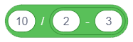
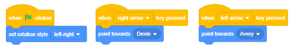

Hapat e sekuencave
===================

.. include:: blocks.txt

.. include:: icons.txt

.. infonote::

 |intro3|

  
Në mësimin e mëparshëm mësuam rreth komandave të lëvizjes dhe tani do të shohim se si mund t'i përdorim komandat nga grupi *Looks* dhe *Events*. Ne do të tregojmë se si i caktojmë një sjellje të veçantë burimit tonë, duke lidhur blloqe për të formuar një skenar. Projektet në këtë mësim përbëhen nga shkrime të bëra nga një seri hapash të njëpasnjëshëm. Mund të themi se ky lloj i shkrimeve ka një strukturë **të thjeshtë lineare**.

.. topic:: Terminologjia dhe gramatika vizuale e gjuhës gërvishtëse

  Sprites mund të ekzekutojnë më shumë se 100 komanda. Blloqet që korrespondojnë me komandat paraqesin fjalorin e gjuhës Scratch, dhe rregullat me të cilat ato lidhen korrespondojnë me gramatikën e saj. Blloqet mbahen në Paleta Blocks, dhe ato ndahen në 10 ngjyra të ndryshme:

 .. hlist::
    :columns: 5

    * |motion_blocks| Motion,
    * |looks_blocks| Looks, 
    * |sound_blocks| Sound, 
    * |events_blocks| Events,
    * |control_blocks| Control, 
    * |sensing_blocks| Sensing,
    * |operator_blocks| Operators,
    * |variables_blocks| Variables, 
    * |my_blocks| My Blocks 
    * |extensions| Extensions.  

Blloqet grupohen së bashku për të bërë më të lehtë për përdoruesit të krijojnë skriptet. Pavarësisht se sa e ndërlikuar është sjellja e një sprite të caktuar, skenari që përshkruan se është i përbërë nga një seri operacionesh të thjeshta të përfshira në këto 10 lloje. Nëse e dini se cili lloj aktiviteti duhet të kryejë sprite, lehtë mund të zgjidhni grupin e duhur dhe të merrni prej tij bllokun përkatës.

  Ka blloqe të pavarura dhe funksionale.

  **Blloqet e pavarura** korrespondojnë me komandat gjuhësore, d.m.th., ato korrespondojnë me hapat e algoritmit. Disa prej tyre kanë fusha të dhëna ku përdoruesi mund të vendosë një vlerë specifike.

  **Funksioni** bllokon vlerat e kthimit. Ata nuk mund të qëndrojnë në mënyrë të pavarur në një skenar, ato duhet të futen në fusha bllok që marrin vlera dhe specifikojnë veprimet e tyre.

  Blloqet janë formuar në mënyrë që të lidhen vetëm ato që formojnë një ndërtim të saktë gjuhësor, domethënë, Scratch ka një gramatikë vizuale e cila nuk lejon të bëjmë gabime sintaksore.

 .. image:: ../_images/3/fig3_1.png
   :width: 300px   
   :align: center

 **Blloqet e Pavarur**

 Në tekst, ne do t'i referohemi blloqeve që korrespondojnë me hapat e përpunimit si blloqe  **rafte**. Blockdo bllok rafte korrespondon me një aktivitet, domethënë, përgjigjet në pyetjen WHFAR should duhet të bëhet. Për shembull, |move_steps| bllokon komandat e sprite për të lëvizur një numër të caktuar hapash në drejtimin e tij aktual. Forma e këtij blloku duket si një tullë Lego, dhe e gjithë skenari duket si një pirg tullash.

 Numri i caktuar i hapave futet në rrethin e bardhë -  **fusha hyrëse** e bllokut.

 Në bllokun |say_sec| një fushë hyrëse ka një formë të ngjashme me një drejtkëndësh të rrumbullakosur, dhe tjetra ka një formë të një rrethi. Fushat e hyrjes drejtkëndësh të rrumbullakosur mund të marrin si vlera teksti ashtu edhe numri, ndërsa ato rrethore mund të marrin vetëm vlera të numrave.

 Blloku |Glide_xy|ka tre fusha hyrëse.

 Disa prej blloqeve kanë fusha hyrjeje gjashtëkëndëshe, për shembull bllok kontrolli |wait_until|. Këto fusha hyrëse mund të marrin vetëm vlera logjike (të vërteta ose false).

 Në grupin *e Kontrollit* të blloqeve ka blloqe në formë C të quajtur **С-blocks**. Pika brenda C-bllok është një lloj specifik i një fushe hyrëse ku mund të futni të gjithë skenarin. Blloku |repeat| dy fusha hyrëse: një për numrin dhe një për skenarin.

 Është gjithashtu një bllok kontrolli i cili është në formë E dhe ka tre fusha hyrëse, një për kushtin (vlera logjike) dhe dy për skriptet. Fusha e parë e hyrjes për skriptet jep urdhrin për atë që duhet të bëhet nëse kushti është përmbushur, dhe tjetra çfarë duhet të bëhet nëse nuk ka.

 **Blloqet e kapelave** korrespondojnë me hapin fillestar të algoritmit. Ata i përgjigjen pyetjes KU do të kandidojë skenari. Këto blloqe kanë maja të rrumbullakosura, ato vendosen në majën e pirgut, dhe ato lidhen me bllokun më poshtë përmes një gungë në fund. Blloqet e kapelave përcaktojnë atë që duhet të bëhet në mënyrë që pirg nën të të fillojë të funksionojë. Për shembull, mund të klikoni në flamurin e gjelbër ose të shtypni një çelës specifik në tastierë.

 **Blloqet e kapakëve** korrespondojnë me hapin përfundimtar të algoritmit. Ata kanë një nivel në majë, por ata nuk kanë një gungë në fund. Meqenëse mund të ketë më shumë se një skenar të lidhur me një objekt të vetëm në Scratch, një bllok kapak mund të ndalojë ekzekutimin e të gjitha skripteteve të aktivizuara.

 **Blloqet e funksionit**

 Blloqet e funksioneve mbajnë informacione për blloqe të tjera. Ata shpesh quhen **reporterë** sepse raportojnë vlerën aktuale të një ndryshoreje. Në kapitullin e mëparshëm kemi prezantuar blloqet e reporterit që mbajnë koordinatat aktuale dhe drejtimin e rrjedhës. Disa blloqe reporterësh gjithashtu kanë fusha hyrje drejtkëndëshe rrethore dhe të rrumbullakosura, për shembull |plus| dhe |join|.

 **Blloqet e leshit** mbajnë vlerat logjike (të vërteta ose false). Ata kanë një formë gjashtëkëndore dhe ato mund të vendosen vetëm në fushat hyrëse të formës përkatëse (gjashtëkëndor ose drejtkëndor). Si për shembull, blloku |equal|. Në Scratch, kushtet komplekse logjike lehtë mund të ndërtohen duke futur blloqe boolean në fushat hyrëse të blloqeve të tjerë boolean.

.. sidebar:: Programimi i drejtuar nga eventet     
    
  Ndonjëherë shikimi i programeve të drejtuara është si të shikosh karikaturat. Këto janë programet që gjithmonë funksionojnë në të njëjtën mënyrë, domethënë, ekzekutimi nuk varet nga përdoruesi. Sidoqoftë, ka programe të cilat varen nga ngjarjet e krijuara nga përdoruesi ose nga objektet e projektit - sprites dhe skena. Përdoruesi, për shembull, mund të klikojë miun ose të shtypë një nga çelësat në tastierë, ndërsa sprites dhe skena mund të dërgojnë dhe marrin mesazhe. Blloqet që aktivizojnë skriptet që lidhen me këto lloje të **veprimeve** dhe **mesazhe** janë të vendosura në grupin *Ngjarjet* të blloqeve.

.. topic:: Funksionet e blloqeve *Looks* dhe *Events*

Blloqet *Motion* që shtjelluam në mësimin e mëparshëm mund të përdoren vetëm për sprites. Për dallim prej tyre, ju mund të përdorni blloqet nga grupi *Looks* për të menaxhuar pamjen e sprite dhe sfond, d.m.th pamjen e skenës. Sidoqoftë, kjo nuk vlen kjo për të gjitha blloqet e këtij grupi. Midis tyre ka nga ato që vlejnë vetëm për sprites, dhe ato që vlejnë vetëm për skenën. Blloqet nga grupi *Events* inicojnë ekzekutimin e shkrimeve.

 Në mësimet e mëparshme ne mësojmë tashmë në lidhje me efektet e disa prej blloqeve *Looks* dhe *Events*, për shembull, ``say`` dhe ``shtypni një çelës``. Në këtë mësim, ne do të prezantojmë, në mënyrë më të detajuar, blloqet që lejojnë animim të lehtë me aplikimin e efekteve grafike të integruara, dhe zgjerimin e fjalorit Scratch duke përdorur komanda të reja.

|Studim| Studioni shembujt e mëposhtëm
------------------------------------

Ne mund të argëtojmë miqtë tanë duke i treguar shaka, dhe gjithashtu duke u treguar atyre mashtrime matematikore. Projekti i mëposhtëm ilustron njërën prej tyre. Ka vetëm një skenar me një strukturë të thjeshtë lineare.

Shembulli 1 - Projekti "Mashtrim matematikor"
~~~~~~~~~~~~~~~~~~~~~~~~~~~~~~~~~~~~~~~~~~~~~~~~~

.. level:: 1

- Hapi 1: Mendoni për një numër të vetëm tre shifror ku të gjithë shifrat janë të njëjta, p.sh. 111, 222.

- Hapi 2: Shtoni ato shifra së bashku.

- Hapi 3: Ndani formularin e numrit tre shifror Hapi 1 me shumën e marrë në Hapi 2.

- Hapi 4: Rezultati është 37.

Skenari i këtij projekti është mjaft i thjeshtë. Sprite përdor "say_sec" bllok për t'i dhënë përdoruesit tre kërkesat e para, dhe "say" bllok për të komunikuar rezultatin.

Ne do të përdorim burimin e një vajze të quajtur Avery nga biblioteka e sprite, kjo sprite ka dy kostume (kliko në butonin *Costums* për t'i parë ato) dhe pas secilës kërkesë do të japim një komandë për ndryshimin e kostumit duke përdorur bllokun|next_costume|.

Për shkak se përdoruesit i duhet kohë për të llogaritur atë që kërkohet prej tij / saj, në dy blloqet e para do të vendosim që sprite duhet ta thotë tekstin e dhënë për 3 sekonda, dhe në të tretën do të vendosim 5 sekonda. Blloku |say| lë tekstin e fundit në ekran derisa të ndalojmë ekzekutimin e programit duke klikuar në shenjën * top* - tetëkëndëshin e kuq sipër qoshes së sipërme të djathtë të skenës.

Skenari i këtij projekti është paraqitur në figurën vijuese.

.. image:: ../_images/3/fig3_2.png
   :width: 435px   
   :align: center

.......

Shembulli 2 - Projekti "Biseda"
~~~~~~~~~~~~~~~~~~~~~~~~~~~~~~~~~~~~

.. level:: 2

Ky projekt paraqet një azhurnim të projektit "Math". Në të, vajza Avery dhe djali Devin paraqesin të njëjtin mashtrim matematikor përmes një bisede në të cilën Devin mendon për një numër 222 dhe kryen llogaritjet e kërkuara, dhe në fund ai pyet "Si e dinit?". Sjellja e të dy spritave përcaktohet nga skriptet, të cilat kanë një strukturë të thjeshtë lineare. Për ta bërë të duket sikur po flasin vërtet, skripti i vajzës duhet të përfshijë blloqe për pritje ndërsa djali mendon, dhe skenari i djalit duhet të përfshijë blloqe për pritje ndërsa vajzat shtrojnë pyetjet.
   

Skenari i këtij projekti është paraqitur në figurën vijuese.
   

.. image:: ../_images/3/fig3_3.png
   :width: 980px   
   :align: center

**Krijimi i projektit**

|1| Hapni projektin *Mathematician*.

|2| Ruani këtë projekt nën emrin e ri *Conversation*.

**Këshilla. Kur jeni duke krijuar një version të ri të një projekti ekzistues, ruajeni atë nën një emër të ri që në fillim. Në këtë mënyrë nuk do ta humbni versionin e vjetër.**
 
|3| Nga libraria e sprite zgjidhni burimin e një djali të quajtur *Devin*.

|4| Vendoseni djalin të sprite pranë buzës së djathtë të skenës dhe ndryshoni drejtimin e tij në dritaren e informacionit të sprite në -90, në mënyrë që ai të përballet me vajzën e sprite.

|5| Shtoni shkrimet e mëposhtme te sprites.

.. image:: ../_images/3/fig3_4.png
   :width: 695px   
   :align: center

Në projektin *Mathematician*, vajza thotë 4 fjali, dhe ajo ndryshon veshjen e saj 3 herë (ajo ka 2 kostume). Kjo do të thotë që nëse e drejtojmë projektin dy herë radhazi, vajza nuk do të shfaqet e veshur me të njëjtën kostum në fillim të të dyja vrapimeve. Për shkak se ne dëshirojmë që vajza të shfaqet në fillim duke veshur të njëjtën veshje të dyja kohët, ne shtojmë komandën e duhur në krye të skenarit.

**Këshilla. Vendosni komanda në fillim të projektit që inicializojnë sprites (specifikoni se ku dhe në cilën kostum duhet të shfaqen), veçanërisht nëse sprites po lëvizin gjatë ekzekutimit të projektit.**

Ne koordinuam sjelljen e sprites duke futur komanda për pritje në skriptet e tyre.

.. image:: ../_images/3/fig3_5.png
   :width: 800px   
   :align: center

|6| Ruani versionin e ndryshuar të projektit.

Nëse doni të dini përgjigjen e pyetjes së djalit "Si e dini?", Klikoni në ikonën *Show the Instruction*.

.. reveal:: instruction
     :showtitle: Shfaq instruksionin
     :hidetitle: Fshih instruksionin
 
     **Instruksion:**

     Vajza i kërkoi që të mendojë për një numër tre shifror me të njëjtat shifra. Le ta quajmë këtë shifër të përsëritur x. Në këtë rast, numri i panjohur mund të paraqitet si 111х, dhe shuma e shifrave të tij si 3х. Rezultati i funksionimit të ndarjes së numrit me shumën e shifrave të tij është 111/3 = 37, pavarësisht nga numri fillestar.

.......

.. sidebar:: Shprehjet aritmetike në gërvishtje

  Grupi *Operatorët* përmban blloqe që mundësojnë kryerjen e operacioneve aritmetike. Për shembull, |plus| bllok mundëson shtesë. Nëse vendosni numrat në fushat hyrëse të këtij blloku, ajo do të llogarisë shumën e tyre. Operatorët nuk mund të qëndrojnë vetëm në skenar, ata duhet të futen në fushën e hyrjes së një blloku të pavarur. Për shembull, nëse i futni ato në fushën hyrëse të bllokut ``say`` ose ``think``, vlera që llogaritin do të shfaqet.

Shembulli 3 - Projekti "Calculation"
~~~~~~~~~~~~~~~~~~~~~~~~~~~~~~~~~~~~

.. level:: 3

Projekti i mëposhtëm është gjithashtu një azhurnim i projektit të mëparshëm. Në të, në vend të numrit fiks 222, djali zgjedh një numër tjetër tre-shifror me të tre shifrat e barabarta, dhe e përdor atë për të kryer operacionet e kërkuara. Kjo mund të jetë programe falë mundësisë së gjenerimit të një numri **të rastit** nga intervali i dhënë.

.. infonote::

**Gjenerimi i numrave të rastit**

 Në mesin e *Operatorëve* bllokon është një komandë |pick_random| Të gjenerosh një numër të rastësishëm do të thotë të zgjedhësh rastësisht një numër nga një interval. Numri më i ulët dhe më i lartë i këtij intervali futen në fushat hyrëse të këtij blloku reporterësh. Pra, nëse ato numra ishin 1 dhe 10, do të zgjidhej ndonjë numër nga intervali [1,10], dhe, për shembull, nëse do të ishte -100 dhe 100, atëherë do të gjenerohej një numër nga intervali [-100,100] .

Në shembullin tonë, në fushën e parë duhet të futni numrin 1, dhe në numrin e dytë 9.

Në këtë projekt kemi përdorur **variabël** të cilat do të prezantohen në mësimin e tetë. Kjo është arsyeja pse është shënuar si e vështirë. Mund ta kaloni dhe t'i riktheheni më vonë.

Nëse nga ana tjetër ju pëlqen një sfidë, le të themi diçka për këtë temë paraprakisht. Kur themi i ndryshueshëm nënkuptojmë fushën e kujtesës kompjuterike ku programi ruan vlerat aktuale të të dhënave me të cilat është duke punuar. Kjo zonë quhet **Emri i variblit**, dhe vlera **e variablit** është ajo që është e ruajtur në të.

**Krijimi i Projektit**

.. sidebar:: Part of the script added to the boy

 |Devin|
 

.. |Devin| image:: ../_images/3/fig3_6.png

|1| Hapni projektin *Conversation* dhe ruajeni atë nën një emër të ri *Llogaritja*.

|2| Krijoni variablin *x* që korrespondon me shifrat e një numri tre shifror dhe vendosni një numër të rastësishëm nga intervali [1,9] si vlera fillestare e tij.

|3| Krijoni ndryshoren *number*, dhe si vlerë fillestare vendosni vlerën e shprehjes 111 * x.

|4| Në bllokun e parë ``think`` të skenarit të djalit futni bllokun e reportazhit të variablës *number* në vend të numrit 222.

|n1| |!=| |n2|

.. |n1| image:: ../_images/3/n1.png

.. |n2| image:: ../_images/3/n2.png

|5| Krijoni variablin *sum* dhe pasi vlera fillestare vendosni vlerën e shprehjes x + x + x. Meqenëse blloku për shtesë ka vetëm dy fusha hyrëse, ne do të futim një bllok për shtesë në fushën hyrëse të një blloku tjetër shtesë. (Sigurisht, ne mund të kishim bërë të njëjtën gjë duke përdorur një bllok shumëzimi, sepse х + х + х = 3 * х)

.. image:: ../_images/3/fig3_7.png
   :width: 350px   
   :align: center

|6| Në bllokun e dytë ``think`` të skenarit të djalit futni raportuesin e ndryshores *sum* në vend të tekstit *2 + 2 + 2*.

|7| Krijoni variablin *result* dhe si vlerë fillestare vendosni vlerën e numrit / shumës së shprehjes.

|8| Në bllokun e tretë të skenarit të djalit futni reporterin e variablit *result* në vend të numrit 37.

|9| Drejtoni projektin disa herë për të parë nëse gjeneron numra të ndryshëm tre-shifrorë.

|10| Ruani versionin e ndryshuar të projektit.

.......

Shembulli 4 - Projekti "Efektet Sprite"
~~~~~~~~~~~~~~~~~~~~~~~~~~~~~~~~~~~~~~~~~~

.. level:: 1

Projekti i mëposhtëm tregon se si |change_effect| komanda nga grupi *Looks* mund të ndikojë në pamjen e sprite. Gjithashtu tregon bllokun e ngjarjes *kur klikohet kjo sprite* mund të fillojë ekzekutimin e skenarit.

**Skenari i projektit**

Janë 7 kopje të së njëjtës sprite në skenë. Duke klikuar në njërën prej tyre ndryshon sprite duke përdorur një nga shtatë efektet grafike. Kjo mundësohet nga komanda |change_effect|. Sprite thotë gjithashtu se cili efekt është përdorur.

.. sidebar:: Graphic Effects
    
    Duke klikuar në trekëndëshin e bardhë në fushën e hyrjes
    ju do të hapni listën rënëse që përmban më poshtë
    7 efekte të ndryshme

    |efekti|

.. |efekti| image:: ../_images/3/fig3_8.png
  
**Creation of the Project**

|1| Nis njö projekt tö ri.

|2|Fshini sprite mace dhe zgjidhni Sprint *Singer1* nga biblioteka e sprite.

|3| Shtoni skriptin e mëposhtëm në sprite.

.. image:: ../_images/3/fig3_9.png
   :width: 240px   
   :align: center 

|4| Klikoni me të djathtën mbi listën e sprite në listën e sprite për të hapur menunë e shkurtoreve dhe zgjidhni opsionin *cpoy*. Sprite *Singer2* do të shfaqet në listën e spriteve dhe do të ketë të njëjtin skenar si sprite e përdorur për krijimin e tij.

 5| Ndryshoni efektin në bllokun |change_effect| të *fisheye*, dhe në |say_sec| bllokoni ndryshimin e tekstit kështu që ai thotë *fisheye*.

|6| Bëni të njëjtën gjë 5 herë më shumë, por çdo herë zgjidhni një efekt tjetër nga lista drop-down dhe ndryshoni mesazhin që sprite thotë kur klikoni mbi të.

|7| Organizoni sprites në skenë në mënyrë të barabartë dhe provoni nëse projekti po bën atë që ishte menduar, duke klikuar në secilën sprite.

|8| Sa herë që klikoni në një nga sprites, do të shfaqet efekti i duhur.

|9| Prandaj, në skenë duhet të shtohet një skenar i cili, kur klikohet në flamurin e gjelbër, do të zhbëjë ndryshimet duke përdorur bllokun |clear_effects|.

Figura e mëposhtme tregon pamjen e sprites pas një ose më shumë aplikimeve të efektit përkatës.

.. image:: ../_images/3/fig3_10.png
   :width: 435px   
   :align: center 

........
 
Example 5 - Project "Stage Effects"
~~~~~~~~~~~~~~~~~~~~~~~~~~~~~~~~~~~~

.. level:: 1

Për dallim nga blloqet *Motion*, blloqet *Looks* gjithashtu mund të aplikohen në skenë. Të gjitha skriptet në këtë projekt do të shtohen në skenë. Qëllimi i këtij projekti është të tregojë se si ndryshimi_efekti | komanda ndikon në pamjen e skenës dhe për t'ju dhënë ide se si mund ta përdorni atë në projektet tuaja të ardhshme. Për të vendosur gjithçka në normale, ne do të shtojmë bllokun për pastrimin e të gjitha efekteve grafike në * kur të klikohet flamuri jeshil * bllok i ngjarjes.

**Skenari i projektit**

Macja është në mes të shkretëtirës. Përdoruesi mund të ndryshojë pamjen e sfondit duke shtypur butonat me numrat nga 1 në 3 në të. Secila prej këtyre ngjarjeve korrespondon me një nga efektet grafike në sfond. Figura e mëposhtme tregon se si duket faza në fillim (0) dhe pasi çelësat u shtypën disa herë: 1 - efekti *color*, 2 - efekti *fisheye*, 3 - efekti *rotation* dhe 4 - efekti *pixelate*.

.. image:: ../_images/3/fig3_11.png
   :width: 735px   
   :align: center 

|ask| E kuptuat?
-------------------------
Pyetja 1
~~~~~~~~~~

.. level:: 1

.. mchoice:: commands_looks
   :multiple_answers:
   :answer_a: 
   :answer_b: 
   :answer_c: 
   :answer_d: 
   :correct: b,d
   :feedback_a: 
   :feedback_b: 
   :feedback_c: 
   :feedback_d: 

   Cilat nga blloqet i përkasin grupit të komandave *Looks*?
    (Zgjidhni të gjitha përgjigjet e sakta)

   .. image:: ../_images/3/q3_1.png
     :width: 410px   
     :align: center

Pyetja 2
~~~~~~~~~~

.. level:: 1

.. mchoice:: commands_events
   :multiple_answers:
   :answer_a: 
   :answer_b: 
   :answer_c: 
   :answer_d:
   :correct: a,b
   :feedback_a: 
   :feedback_b: 
   :feedback_c: 
   :feedback_d:  
  
   Cilin nga blloqet i përkasin grupit *Events* të komandave?
    (Zgjidhni të gjitha përgjigjet e sakta)

   .. image:: ../_images/3/q3_2.png
      :width: 520px   
      :align: center

Pyetja 3
~~~~~~~~~~

.. level:: 1

.. mchoice:: commands_control
   :multiple_answers:
   :answer_a: 
   :answer_b: 
   :answer_c: 
   :answer_d: 
   :correct: a,c
   :feedback_a: 
   :feedback_b: 
   :feedback_c: 
   :feedback_d: 

   Cilin nga blloqet i përkasin grupit *Control* të komandave?
    (Zgjidhni të gjitha përgjigjet e sakta) 

   .. image:: ../_images/3/q3_3.png
      :width: 505px   
      :align: center

Pyetja 4
~~~~~~~~~~

.. level:: 1

.. mchoice:: blocks2
   :answer_a: po
   :answer_b: jo
   :correct: b
   :feedback_a:  
   :feedback_b: Saktë.
   
   A mundet që një skenar të ketë blloqe kapele të shumta?

Pyetja 5
~~~~~~~~~~

.. level:: 1

.. mchoice:: blocks3
   :answer_a: reporter blocks
   :answer_b: stack blocks
   :answer_c: hat blocks
   :answer_d: cap blocks
   :correct: b
   :feedback_a:  
   :feedback_b: Saktë.
   :feedback_c: 
   :feedback_d: 
   
   Si i quajmë blloqet të cilat kanë një shkallë në krye dhe një gungë në fund?
   

Pyetja 6
~~~~~~~~~~

.. level:: 1

.. mchoice:: blocks4
   :answer_a: reporter blocks
   :answer_b: stack blocks
   :answer_c: hat blocks
   :answer_d: C-blocks
   :correct: a
   :feedback_a: Saktë. 
   :feedback_b: 
   :feedback_c: 
   :feedback_d: 
   
   Si i quajmë blloqet që mbajnë vlerat dhe nuk mund të qëndrojnë në mënyrë të pavarur në një skenar, por ato duhet të futen në fushat hyrëse të blloqeve të tjerë?

Pyetja 7
~~~~~~~~~~

.. level:: 1

.. dragndrop:: groups_commands
    :feedback: Provo përsëri
    :match_1: hat|||define WHEN the script will run
    :match_2: reporters|||hold values
    :match_3: C-blocks|||receive the script as input
    :match_4: stack blocks|||define WHAT should be done
            
    Duke tërhequr drejtkëndësat, çiftoni blloqet me rolin e tyre në Scratch.

Pyetja 8
~~~~~~~~~~

.. level:: 1

.. |q3_8a| image:: ../_images/3/q3_8a.png
      
.. |q3_8b| image:: ../_images/3/q3_8b.png

.. mchoice:: аi01
   :answer_a: po
   :answer_b: jo
   :correct: b
   :feedback_a:  
   :feedback_b: Saktë. 
   
   A kanë të njëjtën vlerë shprehjet |q3_8a| dhe |q3_8b|?    
  
Pyetja 9
~~~~~~~~~~

.. level:: 1

.. mchoice:: аi02
   :answer_a: asnjëra
   :answer_b: e para
   :answer_c: e dyta
   :answer_d: të dyja
   :correct: c
   :feedback_a: Gabim. E dyta ka vlerë 10/(-1)=-10 
   :feedback_b: Gabim. E para ka vlerë 5-3=2
   :feedback_c: Saktë.
   :feedback_d: Gabim. E para ka vlerë 2.

   Cila nga shprehejet |q3_9a| dhe |q3_9b|ka vlerë negative?
   
.. |q3_9a| image:: ../_images/3/q3_9a.png

  

Pyetja 10
~~~~~~~~~~~

.. level:: 2

.. |q3_10| image:: ../_images/3/q3_10.png

.. fillintheblank:: ai03

      Cila ëeshtë vlera e shprehjes |q3_10| ? |blank|

      -   :19: Correct.
          :x: False. (7+(8*2))-4 = (7+16)-4 = 23-4 = 19

    

Pyetja 11
~~~~~~~~~~~

.. level:: 2

.. mchoice:: ai04
   :answer_a: 45
   :answer_b: 11
   :answer_c: 15
   :correct: b
   :feedback_a: Gabim. 5+(2*(7-4)) = 5+2*3 = 5+6 = 11 
   :feedback_b: Saktë.
   :feedback_c: Gabim. 5+(2*(7-4)) = 5+2*3 = 5+6 = 11
  
   Cila është vlera e shprehjes |q3_11|?

.. |q3_11| image:: ../_images/3/q3_11.png
      

Pyetja 12
~~~~~~~~~~~

.. level:: 2

.. mchoice:: ai05
   :answer_a: 3
   :answer_b: 11
   :answer_c: 6
   :correct: c
   :feedback_a: Gabim. ((2+1)*(9-5))/2 = 3*4/2 = 6 
   :feedback_b: Gabim. ((2+1)*(9-5))/2 = 3*4/2 = 6
   :feedback_c: Saktë.
   
   Cila është vlera e shprehjes |q3_12|?

.. |q3_12| image:: ../_images/3/q3_12.png
            

|try| Provoje!
-------------

Ushtrimi 1 - Zmadhimi
~~~~~~~~~~~~~~~~~~~~~~~~~~

.. level:: 1

.. infonote::

  Krijoni një projekt në të cilin sprite do të rritet më e madhe dhe më e vogël në skenë. Çelësi *up* duhet ta bëjë atë më të madh, dhe shigjeta *down* duhet ta bëjë atë më të vogël. Bëni atë në mënyrë që kur të klikohet flamuri i gjelbër, sprite kthehet përsëri në madhësinë e saj normale.

.. reveal:: exercise 3_1
   :showtitle: Trego instruksionin
   :hidetitle: Fshih instruksionin
 
   **Instruksion:**

   Shkrimet e mëposhtme duhet të shtohen në sprite:|ex3_1| 

.. |ex3_1| image:: ../_images/3/ex3_1.png

.......

Ushtrimi 2 - Kthimi
~~~~~~~~~~~~~~~~~~~~~

.. level:: 1

.. infonote::

  Në sprite-in e maceve shtoni edhe dy sprites të tjera nga libraria e sprite: vajza *Avery* dhe djali *Devin*. Vendoseni sprite në të majtë dhe djali spërkat djathtas në lidhje me macen. Krijoni një projekt i cili do të lejojë që macja e maces të kthehet majtas në drejtim të vajzës, dhe djathtas në drejtim të djalit. Kthimi në të majtë duhet të kontrollohet me butonin *left arrow*, dhe të kthehet në të djathtë me butonin *right arrow*. Sigurohuni që macja nuk është kokëposhtë kur kthehet në të majtë.

.. reveal:: exercise 3_2
   :showtitle: Trego instruksionin
   :hidetitle: Fshih instruksionin
 
   **Instruksion:**

   Shkrimet e mëposhtme duhet të shtohen në spriten e maces: |ex3_2| 

.......

Ushtrimi 3 - Ndryshimi i ngjyrës së Backdrop
~~~~~~~~~~~~~~~~~~~~~~~~~~~~~~~~~~~~~~~~~~~~~~~~

.. level:: 1

.. infonote::

  Krijoni një projekt i cili lejon që ngjyra e skenës të ndryshojë çdo herë që klikoni mbi të. Përdorni efektin *color* dhe sigurohuni që duke klikuar mbi flamurin e gjelbër heq efektet grafike.

.. reveal:: exercise 3_3
   :showtitle: Trego instruksionin
   :hidetitle: Fshih instruksionin

   **Instruksion:**

   Skenarët e mëposhtëm duhet të shtohen në skenë: |ex3_3| 

.. |ex3_3| image:: ../_images/3/ex3_3.png
  
.......

Ushtrimi 4 - Kodimi i shprehjeve aritmetike me parantezë (1)
~~~~~~~~~~~~~~~~~~~~~~~~~~~~~~~~~~~~~~~~~~~~~~~~~~~~~~~~~~~~~~~~~~~~~

.. level:: 2

.. infonote::

  Krijoni një shprehje aritmetike në Scratch e cila korrespondon me shprehjen e mëposhtme matematikore: (5 * (5 + 4)) - (2 * (2 + 3)). Duke futur bllokun e duhur të reporterit në fushën hyrëse të bllokut ``say``, kontrolloni nëse po merrni vlerën e saktë: (5*(5+4))-(2*(2+3)) = 5*9-2*5 = 45-10 = 35

.. reveal:: exercise 3_4
   :showtitle: Trego përgjigjen
   :hidetitle: Fshih përgjigjen
 
   **Përgjigja:**

   |ex3_4|
   
.. |ex3_4| image:: ../_images/3/ex3_4.png

.......

Ushtrimi 5 - Kodimi i shprehjeve aritmetike me parantezë (2)
~~~~~~~~~~~~~~~~~~~~~~~~~~~~~~~~~~~~~~~~~~~~~~~~~~~~~~~~~~~~~~~~~~~~~

.. level:: 2

.. infonote::

  Create an arithmetic expression in Scratch which corresponds to the following mathematical expression:  (8/(4-2))*(8-(6/2)) By inserting the appropriate reporter block into the input field of the ``say`` block check that you are getting the correct value:  (8/(4-2))*(8-(6/2)) = 8/2*(8-3) = 4*5 = 20.

.. reveal:: exercise 3_5
   :showtitle: Trego përgjigjen
   :hidetitle: Fshih përgjigjen
 
   **Përgjigja:**

   |ex3_5|

.. |ex3_5| image:: ../_images/3/ex3_5.png

|bug| Debug!
---------------

Gabimi 1
~~~~~~~~

.. level:: 1

:Question:
   Kodimi i shprehjeve aritmetike me parantezë

.. image:: ../_images/3/bug3_1.png
   :width: 650px   
   :align: center

.. reveal:: bug3_1
     :showtitle: Trego përgjigjen
     :hidetitle: Fshih përgjigjen

   **Përgjigja:**
     
   Koha nuk është caktuar si duhet. Komandat ``wait`` dhe `` say`` duhet të kenë të njëjtën sasi sekondash në fushat hyrëse për bisedën të sinkronizohet siç duhet.

Gabimi 2
~~~~~~~~

.. level:: 2

:Question:	
   Nxënësit i pëlqen të bëjë gjithçka sipas rregullave dhe për këtë arsye dëshiron të shtojë komandën stop në secilin program. Kështu që ai / ajo shtoi |stop| bllok deri në fund të skenarit në projektin Matematikan. Sidoqoftë, teksti i fundit |say| blloku nuk ishte aspak i dukshëm. Si mund ta rregullojë nxënësin këtë problem, dhe akoma të ketë komandën stop në fund?  
  
.. image:: ../_images/3/bug3_2.png
   :width: 430px   
   :align: center

.. reveal:: bug3_2
   :showtitle: Trego përgjigjen
   :hidetitle: Fshih përgjigjen
 
   **Përgjigje:**
    
    Komanda ``say Rezultati është 37`` ekzekutohet menjëherë dhe komanda ``stop all`` shkon menjëherë pas saj, kjo është arsyeja pse ne praktikisht nuk jemi në gjendje të shohim efektin e bllokut ``say``. Prandaj, ky bllok duhet të zëvendësohet me bllokun ``say__for__seconds`` ku teksti, për shembull, duhet të jetë i dukshëm për 5 sekondë.

Gabimi 3
~~~~~~~~

.. level:: 2

:Question:	
   Nxënësi dëshiron që sprite të rrotullohet kur shtyp çelësin hapësinor. Por kjo nuk po ndodh. Ku është gabimi

.. image:: ../_images/3/bug3_3.png
   :width: 180px   
   :align: center

.. reveal:: bug3_3
   :showtitle: Trego përgjigjen
   :hidetitle: Fshih përgjigjen
 
   **Përgjigje:**
     
    Sprite po rrotullohet, por ndodh shumë shpejt, me shpejtësinë me të cilën kompjuteri ekzekuton komandat, kështu që syri i njeriut nuk është në gjendje të regjistrojë lëvizjen. Nëse dëshironi të shihni kur rrjedha e rrotullimit rrotullohet, duhet të vendosni një komandë pritjeje midis komandave ``kthehuni djathtas``. Ne do të jemi në gjendje ta shohim sprite-in të kthehet.

|book| Përmbledhje
-------------------

Në këtë mësim u njohëm me grupet dhe format e blloqeve nga paleta e bllokut, të cilat përdoren për të dhënë komanda të gjuhës programuese në Scratch. Fjalori vizual i Scratch përmban më shumë se 100 blloqe të ndarë në 10 grupe. Gramatika vizuale e Scratch realizohet përmes formës specifike që kanë blloqet, gjë që nuk i lejon ata të lidhen nëse funksionet e tyre nuk janë të pajtueshme. Blloqet e pavarura janë të lidhura në atë mënyrë që ato formojnë skriptet, të cilat përcaktojnë sjelljen e objekteve përkatëse, dhe blloqet e funksioneve vendosin vlerat e kërkuara.
 
**Projekte Scratch**: 3Studio_

.. _3Studio: https://scratch.mit.edu/studios/25119441/

**Koncepte të reja**:  events, actions, arithmetic operators, random numbers, linear structure of the script.

**Komanda Scratch**: |events_blocks| - |clicked_sprite|, |clicked_stage|; |control_blocks| - |wait_sec|, |stop|; 

|looks_blocks| - |think_sec|, |next_costume|, |change_effect|, |clear_effects|, |set_size|, |change_size|; 

|operator_blocks| - |plus|, |minus|, |multiply|, |divide|, |pick_random|; |variables_blocks| - |*| |set_var|.

Shënim. Blloqet e shënuara me |*| do të diskutohen në mësimet që vijojnë.

|project| Krijoni projekte
---------------------------

Projekti 1 - "Gjeni"
~~~~~~~~~~~~~~~~~~~~~

.. level:: 1

Krijoni këtë projekt bazuar në shembullin *Matematikan*.

Filloni një projekt të ri, të cilin do ta quani *Genius*. Zgjidhni formën kryesore të librarisë, dhe sfondin nga libraria e prapavijës. Sprite duhet të japë detyrat e mëposhtme.

1. "Mendoni për çdo numër tre shifror."

2. "Rregulloni shifrat nga më i larti tek më i ulti - ky do të jetë numri i parë."

3. "Rregulloni shifrat nga më të ultat në më të lartat - ky do të jetë numri i dytë".

4. "Zbrit numrin e dytë nga numri i parë."

5. "Mos harroni rezultatin, dhe sesa rrëzoni shifrat e tij."

6. "Ky numër i ri shton rezultatin që ju kujtuat më parë."

7. "Numri që keni është 1089."

Projekti 2 - "Kek me çokollatë"
~~~~~~~~~~~~~~~~~~~~~~~~~~~~~~

.. level:: 2

Filloni një projekt të ri, të cilin do ta quani *Cake Chocolate*. Kjo duhet të jetë një animacion ku një bukëpjekës shpjegon një recetë (algoritëm) për të bërë tortë me çokollatë.

Për këtë animacion do t'ju duhet sprites e mëposhtme: bukëpjekës, vezë, miell, sheqer, çokollatë, tas, mikser, një furrë, ëmbëlsira. Gjeni imazhet e duhura në kompjuterin tuaj ose në internet dhe përshtatini ato për t'iu përshtatur projektit tuaj (pastroni sfondin, bëni ato më të mëdha ose më të vogla ...).

Siguroni sinkronizimin e shkrimeve duke shtuar komandën ``wait`` për të gjitha objektet dhe caktimin e kohës së duhur. Sprite e vetme që duhet të jetë në skenë gjatë gjithë kohës është sprite e bukës. Ai po lexon recetën (algoritmin) dhe përcakton se kur do të shfaqen ose do të zhduken spritet e tjera.

1. Bukëpjekësi është vetëm në skenë. Ai thotë: "Këtu është ALGORITMI për të bërë një tortë me çokollatë!" (2 sekonda)

2. Bukëpjekësi thotë si vijon: "Merrni vezët, miellin, sheqerin dhe çokollatën". Në atë moment vezët, mielli, sheqeri dhe çokollata duhet të shfaqen në skenë. Kjo skenë duhet të zgjasë 2 sekonda.

3. Bukëpjekësi thotë si vijon: "Vendosni gjithçka në një tas dhe kombinoni me mikserin". Në atë moment vezët, mielli, sheqeri dhe çokollata zhduken nga skena, dhe shfaqet tas dhe mikser. Kjo skenë duhet të zgjasë 2 sekonda.

4. Bukëpjekësi thotë si vijon: "Vendoseni tasin në furrën e ndezur". Në atë moment tas dhe mikser zhduken nga skena, dhe furra shfaqet. Kjo skenë duhet të zgjasë 2 sekonda.

5. Bukëpjekësi thotë si vijon: "Piqeni tortën për 30 minuta". Asgjë nuk ndryshon në skenë. Kjo skenë duhet të zgjasë 2 sekonda.

6. Bukëpjekësi thotë si vijon: "Shërbeni tortën". Në atë moment furra zhduket nga skena, dhe shfaqet torta. Kjo skenë duhet të zgjasë 2 sekonda.
