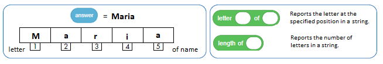
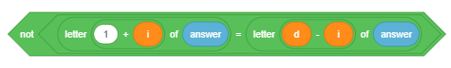
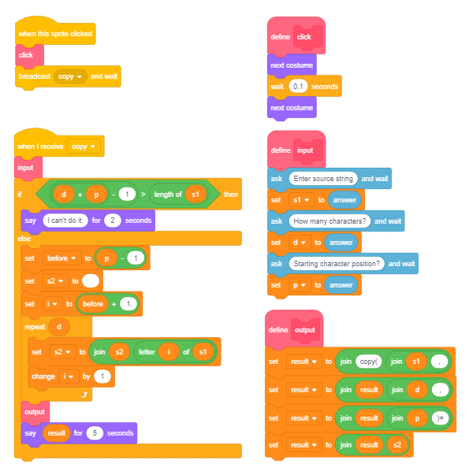

Vargje
=========

.. include:: blocks.txt

.. include:: icons.txt

.. infonote::

 |intro10|

Në këtë mësim, ne do të tregojmë sesi mund të përdoren variablat e vargjeve për të zgjidhur lloje të ndryshme detyrash. Në të njëjtën kohë, ne do të mësojmë se si grindjet e dyqaneve Scratch dhe funksionet e blloqeve të përdorura për të përdorur tela.

Një varg paraqet një seri personazhesh që trajtohen një pjesë të vetme të të dhënave. Strings kanë një aplikim të gjerë në programim. Ne mund të krijojmë programe që kombinojnë, krahasojnë, renditin, kodojnë, dhe ndryshe përpunojnë tekstin. Duhet të keni parasysh që numrat gjithashtu mund të trajtohen si vargje, por në këtë rast, ne nuk kemi të bëjmë me vlerat që ata përfaqësojnë, por me karaktere - shifra që ato përbëhen.

.. topic:: Operimet mbi vargje 

 Për të kuptuar më mirë këto operacione, do të tregojmë rezultatin e secilit operacion të kryer në vargjet s1 = BANANA dhe s2 = ANA.
  
  Në gjuhët e programimit, operacionet që kryhen më shpesh në tela janë këto:

  - përcaktimi i gjatësisë së vargut
      ``gjatëesia e s1`` → 6

- krahasimi i vargjeve
      përcaktimi i cili vjen së pari me alfabet

      `` s1 <s2? `` → false

      kjo është e gabuar sepse "BANANA" vjen pas "ANA" në rend alfabeti,

 - telat lidhës (bashkues)
      ``join s1 and s2`` А BANANААNА,

 - zgjedhjen e një personazhi që zë një pozicion specifik në tekst
      `` letter 3 of s1`` → N,

 - përmban?
      kontrollon nëse vargu s1 përmban vargun s2

      ``s2 in s1?`` → true

      kjo është e vërtetë sepse "BANANA" përmban "ANA",

 - pozicioni
      përcaktimi i pozicionit të parë në varg, i cili përmban vargun e dytë

      pos(s1,s2): ``position s2 in s1`` → 2,

 - kopjimi
      duke krijuar një varg të ri nga një numër i caktuar karaktere d duke filluar nga një pozicion i dhënë p në vargun fillestar

      copy(s, p, d): ``kopje nga karakteret s1 4 duke filluar nga 3`` → NАNA,

 - fshirje
      modifikimi i vargut s1 duke fshirë një numër të caktuar të karaktereve d duke filluar nga pozicioni i dhënë p në vargun fillestar

      dlete(s1, p, d): ``fshini nga shkronjat s1 3 duke filluar nga 4`` → BANA,

 - futja
      duke modifikuar vargun s1 duke futur vargun s2 në vargun s1 duke filluar nga pozicioni i dhënë f

      insert(s1, s2, f): ``futni s2 në s1 duke filluar nga 3`` → BААNАNАNА.

 Katër të fundit nuk janë operacione të ndërtuara në Scratch. Sidoqoftë, në shembullin "Operacionet String" do të tregojmë se si mund t'i zbatojmë ato vetë.
  
|study| Studioni shembujt e mëposhtëm
----------------------------------------

Shembulli 1 - Projekti "Parrot"
~~~~~~~~~~~~~~~~~~~~~~~~~~~~

.. level:: 1

Sprite kryesore në këtë projekt është një papagall. Së pari, papagalli i kërkon përdoruesit emrin e tij / saj dhe pastaj pret që përdoruesi të shkruajë emrin e tij / saj dhe shtypni *Enter* ose klikoni në shenjën e kontrollit të vendosur në këndin e djathtë të fushës së përgjigjeve. Pastaj papagalli përshëndet përdoruesin me emrin e tij / saj dhe thotë se cila është shkronja e parë e emrit dhe sa shkronja ka në emër. Biseda midis sprite dhe përdoruesit është paraqitur në figurën më poshtë.  

.. image:: ../_images/10/fig10_1.png
   :width: 430px   
   :align: center

Për të krijuar këtë projekt, kemi përdorur operacione, të cilat zgjedhin shkronjën e parë nga emri dhe përcaktojmë se sa shkronja janë në emër.

Pas ekzekutimit të komandës |ask_wait|, Scratch ruan serinë e karaktereve të futura nga një përdorues në hapësirën e quajtur |answer|

Figura e mëposhtme tregon se si është ruajtur përgjigjja, cilat operacione përdoren për të nxjerrë informacionin e transmetuar nga sprite si të dhëna dalëse me komandën ``say``.

Operacioni i tretë, i cili u përdor për të përpiluar mesazhin në dalje, është |join|

Skenari i projektit *Parrot* është paraqitur në figurën më poshtë. 

.. image:: ../_images/10/fig10_3.png
   :width: 475px   
   :align: center

Projekti që vijon do t'ju tregojë se si mund të përdorni operacione në varg për të nxjerrë shifra specifike, të cilat formojnë numra.

.......

Shembulli 2 - Projekti "Exchange Digits"
~~~~~~~~~~~~~~~~~~~~~~~~~~~~~~~~~~~~~

.. level:: 2

**Skenari i Projektit**

Pjesa kryesore e këtij projekti është një skenar, i cili shkëmben shifrën e parë dhe shifrën e tretë në një numër natyror tre-shifror *x* të futur përmes hyrjes.

Prezantuesi, i cili është burimi kryesor në këtë projekt, i kërkon përdoruesit të shkruaj një numër tre shifror. Programi kontrollon nëse është futur një numër tre shifror. Nëse jo, kërkesa do të përsëritet derisa të futet një numër tre shifror. Pastaj, nxirret shifra e parë dhe e tretë, dhe e reja
*numri i përmbysur* është formuar ku janë shkëmbyer shifra e parë dhe e tretë. Ky numër i ri është krijuar duke përdorur dy operacione |join|
Në fund, prezantuesi transmeton numrin origjinal dhe numrin e sapoformuar.

Skenari i projektit është paraqitur në figurën vijuese.

.. image:: ../_images/10/fig10_4.png
   :width: 645px   
   :align: center

.......

Projekti i mëposhtëm kontrollon nëse fjala e futur është një palindrome. Një *palindrome* është një fjalë ose një frazë, e cila lexon të njëjtën gjë nga e majta në të djathtë dhe nga e djathta në të majtë. Për shembull, fjala "zonjë" është një palindrome. Një numër që është një palindrom përcaktohet në mënyrë të ngjashme. Për shembull, 12321 është një palindrome.

Shembulli 3 - Projekti "Palindrome"
~~~~~~~~~~~~~~~~~~~~~~~~~~~~~~~~

.. level:: 3

Prezantuesi i kërkon përdoruesit të shkruajë një fjalë. Variabli *d* merr gjatësinë e fjalës si vlerë. Programi krahason të parën me shkronjën e fundit, të dytën me atë të parafundit etj., Deri në mes të fjalës. Variabli *i*, vlera fillestare e së cilës është 0 dhe e cila rritet me 1 brenda lakut, mundëson që këto krahasime të kryhen me kontrollin e mëposhtëm.    

Variabli *p* tregon numrin e kontrolleve. Nëse njëra nga kontrollet përcakton se shkronjat, të cilat janë krahasuar nuk janë të njëjta, fjala nuk është një palindrome, dhe kjo do të regjistrohet duke i caktuar 0 variablit *pal* (e cila është vendosur në 1 në fillim) .
Pasi programi të bëhet duke kontrolluar të gjitha palët e shkronjave, do të shkruajë një mesazh duke thënë nëse fjala është palindrome apo jo (*pal* = 1 yes, else no).

Skenari për projektin *Palindrome* është paraqitur në figurën vijuese.

.. image:: ../_images/10/fig10_6.png
   :width: 495px   
   :align: center

.......

Shembulli 4 - Projekti "String Operations"
~~~~~~~~~~~~~~~~~~~~~~~~~~~~~~~~~~~~~~~

Në këtë projekt, përdoruesit i kërkohet të zgjedhë njërën nga operacionet: *copy* ose *delete*. Kërkohet hyrja në varësi të asaj që është zgjedhur, dhe më pas shkruhet rezultati i operacionit. Operacioni caktohet duke klikuar në butonin e duhur, i cili më pas transmeton operacionin. Kur të merret mesazhi që identifikon operacionin e zgjedhur, skenari që ekzekuton operacionin e dhënë do të funksionojë.
Ka dy sprites që marrin pjesë në projekt: butoni *copy* për të bërë kopje dhe *delete* për fshirje. Skenari që kryen fshirjen është disi më i thjeshtë. Bazuar në vlerat e shkruara për numrin e karaktereve dhe pozicionet nga të cilat merren, vendoset një varg i ri s2. Kjo varg është e zbrazët në fillim, dhe themelohet duke shtuar një karakter në një kohë nga një pjesë e caktuar e vargut fillestar.
 
.. image:: ../_images/10/fig10_7.png
   :width: 330px   
   :align: center
   
Shkrimet e shtuara në marrjen e mesazhit *Copy* paraqiten në figurën vijuese. Futja e të dhënave dhe formimi i mesazhit dalës paraqiten si procedura të ndara. Këto procedura mund të përdoren gjithashtu kur kërkohet opsioni *Delete*.
 

   
Skripti për fshirjen bën të kundërtën - ai formon vargun nga pjesët e vendosura para dhe pas karaktereve të shënuara. Fillon gjithashtu me një varg bosh. Së pari, ajo regjistron karaktere nga pjesa përpara, të cilat pasohen nga personazhe nga pjesa prapa.   
 

|ask| Përgjigju pyetjeve të mëposhtme
-------------------------------------

Pyetja 1
~~~~~~~~~~~

.. level:: 1

.. mchoice:: string1
   :answer_a: po
   :answer_b: jo
   :correct: a
   :feedback_a: Saktë. 
   :feedback_b: 
   
    A mund të përmbajë një varg shenjash për operacionet aritmetike?

Pyetja 2
~~~~~~~~~~~

.. level:: 1

.. mchoice:: string2
   :answer_a: L
   :answer_b: Е
   :answer_c: N
   :answer_d: А
   :correct: b
   :feedback_a: Shkronja 1.
   :feedback_b: Saktë.
   :feedback_c: Shkronja 3.
   :feedback_d: Shkronja 4.
   
   Cili do të jetë rezultati i operacionit ``letter 2 of LENA``?

Question 3
~~~~~~~~~~~

.. level:: 1

.. image:: ../_images/10/q10_3.png
   :width: 680px   
   :align: center

.. mchoice:: string3
   :answer_a: po 
   :answer_b: jo 
   :correct: b
   :feedback_a:  
   :feedback_b: Sktë.
   
     A do të thotë vargu të njëjtën gjë gjatë ekzekutimit të komandave A dhe B?

   
Pyetja 4
~~~~~~~~~~~

.. level:: 1

.. mchoice:: string4
   :answer_a: L
   :answer_b: LENA
   :answer_c: 4
   :answer_d: Gjatëesi LENA
   :correct: c
   :feedback_a: Kjo do të arrihet me letrën e operacionit.
   :feedback_b: 
   :feedback_c: Saktë.
   :feedback_d: Kjo do të arrihet duke u bashkuar me këto dy fjalë.
   
     Cili do të jetë rezultati i operacionit ``length of LENA``?

Pyetje 5
~~~~~~~~~~~

.. level:: 1

.. mchoice:: string5
   :answer_a: BАNА
   :answer_b: BАNАNА
   :answer_c: NАBАNА
   :answer_d: NАNАBА
   :correct: b
   :feedback_a: 
   :feedback_b: Saktë.
   :feedback_c: 
   :feedback_d: 
   
   Cili do të jetë rezultati i operacionit ``join BA and NANA``? 

Pyetje 6
~~~~~~~~~~~

.. image:: ../_images/10/q10_6.png
   :width: 680px   
   :align: center

.. dragndrop:: string6
    :feedback: Provo përsëeri
    :match_1: A|||A
    :match_2: B|||nothing returns
    :match_3: C|||1
    :match_4: D|||7
       
    Duke zvarritur, lidhni komandat me vlerat e kthimit.
   

|try| Provoje!
--------------

Ushtrimi 1 
~~~~~~~~~~~
.. level:: 2

.. infonote::

  Krijoni një program, i cili do të formojë një numër nga të njëjtat shifra si në numrin natyror **n**, por rregulloni atë me rend të kundërt.

.......      

Ushtrimi 2
~~~~~~~~~~~
.. level:: 2

.. infonote::

  Shkruaj një program që përcakton shumën e shifrave dhe numrin e shifrave për numrin natyror **n** (1 <= n <1000). Për shembull:
 
   - n = 12 shuma e shifrave 3, dhe numri i shifrave është 2;

   - n = 102 shuma e shifrave 3, dhe numri i shifrave është 3. 

.......

Ushtrimi 3
~~~~~~~~~~~

.. level:: 3

.. infonote::

  Shkruaj një program që do të bëjë një listë të të gjithë numrave tre shifrorë të Armstrong. Një numër konsiderohet të jetë një numër i Armstrong nëse është i barabartë me shumën e kubeve të shifrave të tij.

    
|book| Përmbledhje
----------------------

 Në këtë mësim, ne prezantuam llojin e të dhënave të quajtur string dhe operacionet më të zakonshme të kryera në këtë lloj të të dhënave. Përmes shembujve të projektit, ne treguam se si mund të përdoren variablat e vargut për zgjidhjen e llojeve të ndryshme të problemeve, dhe si të punojmë me operacionet e vargjeve që janë ndërtuar në Scratch.

**Shembuj projekti**: 10Studio_

.. _10Studio: https://scratch.mit.edu/studios/25119486/

**Koncepte të reja**: string, palindrome.

**Komnda të reja**: |operator_blocks| - |text_contains|, |letter|, |length_text|.

|project| Krijoni projekte
-------------------------------------------

Projekti 1 - "Dekodimi"
~~~~~~~~~~~~~~~~~~~~~~~~~

.. level:: 3

Krijoni një projekt, i cili kodifikon dhe dekodon tekstin hyrës në mënyrën e mëposhtme.

Lista "origjinale" ruan 26 shkronja të alfabetit në rendin e rregullt. Lista "kodi" ruan 26 shkronja në çdo mënyrë që është e ndryshme nga ajo në listën "origjinale". Për ta bërë më të vështirë procesin e deshifrimit, nëse ka një zanore në ndonjë pozicion në një nga listat, duhet të ketë edhe një zanore në të njëjtin pozicion në listën tjetër.
Përdoruesi hyn në tekst, të cilin projekti duhet ta kodojë dhe deshifrojë në varësi të faktit nëse përdoruesi klikoi në butonin "kodifikoj" ose "deshifroj".

Për shembull, nëse shkronjat në listat "origjinale" dhe "kod" janë në urdhërat e mëposhtëm:

= = = = = = = = = = = = = = = = = = = = = = = = = = 

A B C D E F G H I J K L M N O P Q R S T U V W X Y Z

V U B G D Q X Y Z E Ј K L O М N А W P R S Т F H C I

= = = = = = = = = = = = = = = = = = = = = = = = = = 

dhe përdoruesi hyn në tekstin MASK, programi do ta kodojë atë si LVPJ.

Sidoqoftë, nëse teksti hyrës MASK duhet të deshifrohet, programi do ta shndërrojë atë në ОQUL.

Projekti 2 - "Backward"
~~~~~~~~~~~~~~~~~~~~~~

.. level:: 3

Krijoni një projekt ku përdoruesit i kërkohet të shkruajë sa fjalë ai dëshiron të shndërrojë (n), dhe më pas fut një emër në cikël që do të përsëritet n numrin e herëve, emri futet në listën "emrat" , dhe pastaj shndërrohet në vargun e marrë kur emri lexohet nga e djathta në të majtë, pas së cilës do të futet në listë "prapa".

Për shembull, nëse përdoruesi ka futur n = 3 dhe më pas emrat: LENA, MARIO, KATARINA; lista "prapa" duhet të përmbajë:
ANEL, OIRAM dhe ANIRATAK.

Projekti 3 - "Numra"
~~~~~~~~~~~~~~~~~~~~~~

.. level:: 3

Krijoni një projekt, i cili bën një listë të të gjithë numrave tre-shifror, i cili mund të ndahet me numrin e marrë kur nxirret shifra e mesme.

