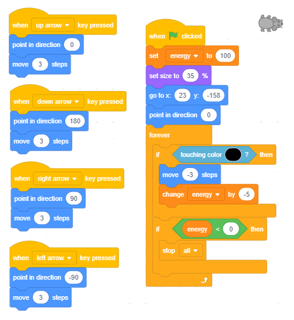
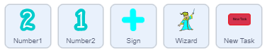

Variablat
==========

.. include:: blocks.txt

.. include:: icons.txt

.. infonote::

 |intro7|

Variablat janë një nga konceptet më të rëndësishëm në programim. Në këtë mësim, do të njihemi me lloje të ndryshme të variablave dhe do të tregojmë se si mund të monitorojmë ndryshimet e vlerave të tyre në skenë. Do të përdorim shembuj të projektit me skriptet, të cilat kanë një strukturë komplekse, për të treguar se si mund të krijojmë lojëra konkurruese, ku duhet të mbajmë rezultatet, si dhe si të formojmë shprehje komplekse që llogaritin vlerën e variablave.

.. infonote::

  **Çfarë është një variabël?**

   Variabël është një zonë e caktuar e memorjes kompjuterike. Mund të themi se një ndryshore është si një kuti e caktuar në të cilën programi ruan përkohësisht të dhënat me të cilat është duke punuar me të.

  .. image:: ../_images/7/fig7_1.png
         :width: 250px   
         :align: center

  Variabli në figurën e mësipërme emërtohet *Х*, dhe vlera e saj aktuale është 15.

   Variabli mund të ruajë një vlerë, për shembull, një numër ose një letër. Këto janë **variabla të thjeshta**.
   Sidoqoftë, ekzistojnë edhe **variabla komplekse**, të cilat ruajnë vlera të shumta, për shembull, një seri shkronjash (*varg*), një seri numrash, fjalësh, ... Në Scratch, kjo varg quhet një *listë*.

Në projektet e mëparshme, kemi përdorur vlera pa emër. Teksti "hello World", dhe të tjerët që kemi shtypur në bllokun *Say* dhe *Think* janë të gjitha vargjet e të dhënave (seri shenjash).

Numrat që kemi futur si argumente në komandat lëvizëse (lëviz, pikë në drejtim, ndryshim nga) janë vlera, të cilat mund të vendosen në variabël.

Kushti për përsëritjen dhe degëzimin mund të ketë dy vlera - të vërteta dhe të rreme; prandaj, kjo është gjithashtu një vlerë, një vlerë **logjike**.

Për programe më komplekse, do të duhet të caktojmë vlera të caktuara, d.m.th. të prezantojmë **variablat**.

.. infonote::

  **Si të krijoni variabla?**

   Në fillim, nuk ka bllok në grupin *Variablat* (imazhi A). Së pari, duhet të krijoni një variabël duke klikuar në opsionin *make a variable*.
 
  .. image:: ../_images/7/fig7_2.png
         :width: 680px   
         :align: center

  Duke klikuar këtë buton, do të hapni një dritare dialogu për krijimin e një variabli të ri (B).

  Variabli mund të jetë **lokal**, i shtuar vetëm objektit aktiv (sprite ose fazë) ose **global**.
 
  Një variabël globale mund të përdoret nga të gjitha objektet në projekt. Kur shkruani emrin e variablit dhe klikoni në butonin *OK*, blloqet për katër komanda dhe një reporter me emrin e variablit në të dhe një kuti kontrolluese pranë saj do të shfaqet në paletën e blloqeve (C).

  Blloqet, të cilat paraqesin variablat, quhen *reporterë* sepse raportojnë për vlerën aktuale të variablës.
  Raportuesit shfaqen në dy forma të ndryshme, dhe ato mund të vendosen vetëm në fushat hyrëse të blloqeve të komandës me forma përkatëse.

  Reporterët me skajet e rrumbullakosura (elipsi) ruajnë numrat ose telat, dhe ato mund të futen në blloqe me fushat e rrumbullakëta të bardha.

  Blloqet e reportazhit gjashtëkëndor përmbajnë të dhëna logjike (të vërteta ose false), dhe ato mund të futen në blloqe me fushat e dhëna të përshtatshme.

  Disa blloqe reporterësh gjithashtu kanë kutitë e kontrollit. Nëse përdoruesi klikon në kutinë e kontrollit, në skenë do të shfaqet një monitor, dhe do të shfaq vlerën aktuale të variablit.
  Monitori mund të shfaq vlerat e variablave në shumë formate të ndryshme të paraqitura në figurën vijuese.
  
  .. image:: ../_images/7/fig7_3.png
         :width: 240px   
         :align: center

   (A) një shfaqje e vogël e vlerës me emrin e variablit,

   (B) shfaqje e madhe e vlerës pa emrin,

   (C) me një rrëshqitës, i cili i mundëson përdoruesit të ndryshojë vlerën e variablës.

   Formati mund të ndryshohet duke klikuar dy herë në monitor. Formati i rrëshqitësit mund të përdoret vetëm për ndryshoret e krijuara nga përdoruesi. Duke klikuar me të djathtën në shiritin, mund të vendosni vlerat minimale dhe maksimale.

|study| Studioni shembujt
------------------------------------

Shembull 1 - Projekti "The Hunt"
~~~~~~~~~~~~~~~~~~~~~~~~~~~~~~~

.. level:: 1

Ky projekt është një lojë e bërë për dy lojtarë. Playerdo lojtar përdor tastierën për të kontrolluar lëvizjen e maceve të tij / saj, e cila po ndjek një miun që shfaqet në pozicione të zgjedhura rastësisht në skenë.
Lojtari, macja e të cilit prek miun, së pari merr një pikë. Kur njëra nga macet prek miun, ajo zhduket dhe shfaqet diku tjetër.
Lojtari i parë kontrollon macen e verdhë me çelësat e shigjetës, dhe lojtari i dytë kontrollon macen gri me çelësat W A S D.

Ne po prezantojmë kushte komplekse dhe operacione logjike.

**Krijimi i sfondit dhe sprites**

Në këtë projekt, ka tre sprites - *Cat 1*, *Cat 2* dhe *Mouse* dhe një sfond. Ne do të krijojmë sfondin duke modifikuar pak nga sfondi *fushën e Hay * nga libraria Scratch.

.. image:: ../_images/7/fig7_4.png
   :width: 480px   
   :align: center

Sprite *Cat 1* u krijua nga sprite *Cat 2* nga libraria e sprites duke shtuar një kostum tjetër, dhe *Cat 2* u krijua duke kopjuar *Cat 1* dhe duke ndryshuar ngjyrën.
Sprite e treta u ngarkua nga Interneti, dhe ajo ka vetëm një kostum pasi nuk ka nevojë të gjallërojë lëvizjen në projekt.  

.. image:: ../_images/7/fig7_5.png
   :width: 230px   
   :align: center

**Sjellja e Sprite Cat 1**

Së pari, ne do t'i shkruajmë dhe testojmë skriptet që do t'i shtojmë në sprite *Cat 1*, dhe pastaj do ta kopjojmë këtë sprite dhe do t'i ndryshojmë skriptet paksa.

.. image:: ../_images/7/fig7_6.png
   :width: 500px   
   :align: center

Në fillim, sprite po tregon miun, dhe luajtësi thjesht mund të përdorë tastin ↑ për të arritur miun dhe për të fituar pikën e parë. Më vonë, në lojë, lojtari do të duhet ta udhëheqë mace drejt miut, duke përdorur çelësat e shigjetave ← dhe →, të cilat përdoren për ta kthyer sprite 15 gradë në të majtë dhe në të djathtë. Ndonjëherë, luajtësi mund të përdorë butonin për të zhvendosur sprite prapa.
Për sprite *Cat 2*, skriptet e lundrimit janë të njëjta, vetëm çelësat e përdorur për lëvizjen e sprite janë të ndryshme. Çelësi W e lëviz sprite përpara dhe A dhe D përdoren për ta kthyer sprite 15 gradë në të majtë dhe në të djathtë. Skenari që fillon programin është gjithashtu pothuajse i njëjtë; ndryshimi i vetëm është se një sprite tjetër dërgohet në këndin e poshtëm të majtë, d.m.th. ai dërgohet në pikën që ka koordinatat (-190, -130).

**Sjellja e Mouse sprite**

Shifra e mëposhtme paraqet skenarin e shtuar në spritein e miut. Në fillim, miu vendoset në një vend të zgjedhur rastësisht.
Pas kësaj, ajo hyn në një përsëritje të pafund (lcikloi forever) të veprimeve të mëposhtme.

1. Programi pret derisa njëra nga macet të prek miun,

2. Miu fshihet dhe rishfaqet në një vend tjetër të zgjedhur rastësisht.

(brenda ciklit, miu mund të shfaqet si pranë skajit të sipërm ashtu edhe në pjesën e poshtme të fazës sepse tani intervali për vlerën e koordinatës *у* është [-150, 150])

.. image:: ../_images/7/fig7_7.png
   :width: 500px   
   :align: center

**Formimi i një gjendje komplekse**

Gjendja në komandë |wait_until| është e përbërë nga dy kushte: Cat 1 prek miun ose Cat 2 prek miun.

Një gjendje komplekse është krijuar si më poshtë.

1. Nga Operatorët e grupit, ne do të zgjedhim operacionin e duhur - në rastin tonë operacionin logjik *ose* |or|.

2. Ne i vendosim kushtet e duhura në gjashtëkëndëshat bosh,

.. image:: ../_images/7/fig7_8.png
   :width: 340px   
   :align: center

3. Më në fund, e vendosim këtë gjendje komplekse në bllokun "wait until".

**Përditësimi i projektit**

Ne do ta përmirësojmë këtë projekt duke prezantuar 2 ndryshore: Player 1 dhe Player 2, të cilat do të ruajnë pikët e lojtarëve. Sa herë që një nga macet prek miun, lojtari që kontrollon atë mace do të fitojë një pikë. Kjo do të ruhet në skenarin e shtuar në spritein e miut.
Pikat e lojtarëve do të shfaqen në ekran.
Ne gjithashtu do të prezantojmë një kohëmatës, i cili do të ndalojë lojën pasi të ketë kaluar koha e caktuar. Fituesi është lojtari që ka më shumë pikë.

Në mënyrë që të mund të gjurmoni pikët e lojtarëve, të dy variablat *Player 1* dhe *Player 2* duhet të kontrollohen, dhe monitorët e tyre duhet të shfaqen në formatin e parë.

.. image:: ../_images/7/fig7_10.png
         :width: 700px   
         :align: center

Në fillim të shkrimit të shtuar te miu, ne duhet të vendosim vlerat e tyre fillestare në 0. Sa herë që një mace prek miun, numri i pikave duhet të rritet.
Prandaj, skripti i miut tani ka pamjen e mëposhtme.

.. image:: ../_images/7/fig7_11.png
         :width: 540px   
         :align: center

Ajo që mbetet është të përcaktoni afatin kohor të lojës. Ne mund ta bëjmë këtë duke vendosur vlerën e variblit *Time*, e vendosur në skenarin e shkaktuar duke klikuar mbi flamurin e gjelbër, në numrin e dëshiruar, për shembull, 120 sekonda. Atëherë do ta vendosim komandën |wait_sec| në cikël, i cili do të përsëritet 120 herë, dhe zvogëloni vlerën e variablës me 1.
Do të shtojmë komandën |stop| mbas ciklit, dhe bashkëngjitni këtë skenar në degën e miut.

.. image:: ../_images/7/fig7_12.png
         :width: 190px   
         :align: center

.......

Shembulli 2 - Loja "Maze"
~~~~~~~~~~~~~~~~~~~~~~~~~~~~~~~~~~

.. level:: 2

Në projektin *Maze*, qëllimi është që të merrni *Mouse 1* sprite përmes një labirint të ndërlikuar. Dalja është e vendosur në krye skenën, kështu që kushti që loja të përfundojë me sukses është që koordinata e sprite të jetë më e madhe se 180. Sprite kontrollohet me çelësat e shigjetave. Nëse sprite prek ndonjë nga muret, të cilat janë të zeza, ajo do të kthehet në pozicionin fillestar.

Në remixhin tonë, lëvizja e miut do të kontrollohet më saktësisht. Duke shtypur një herë tastin shigjetë, sprite do të lëvizë vetëm 3 hapa (dhe jo 10 si në projektin origjinal).
Prekja e murit nuk do të sanksionohet me kthimin në fillim, sprite vetëm do të kërcej nga muri i labirint (lëviz -2 hapa), si në projektin *labirint starter*. Meqenëse miu prekte shpesh muret me bishtin e tij, ne e ndërpresë bishtin e tij (në redaktorin e bojës, së pari zgjedhni bishtin duke përdorur mjetin *riformulimin* dhe pastaj fshini atë duke shtypur tastin *Del*).

Skriptet e modifikuar bashkangjitur spritës së miut janë paraqitur në figurën më poshtë.

Megjithatë, loja nuk do të jetë më e lehtë sepse miu do të duhet të shmangë armiqtë e tij: 2 topa helmues dhe fantazma e labirint.

Topat, si miu, kërcejnë nga muret e labirint, ndërsa fantazma mund të kalojë nëpër mure.

Miu ka 100 njësi energjie në fillim, i cili zvogëlohet me 5 sa herë që godet murin e labirintit,
dhe nëse armiku prek miun, është edhe më i rrezikshëm. Nëse një top e prek atë, ai do të humbasë 10 njësi energjetike, dhe nëse fantazma e prek atë, do të humbasë 50.

Loja përfundon me sukses nëse miu arrin daljen e labirint, dhe nuk arrin nëse ajo harxhon energji brenda labirint.

**Sjellja e topit**

Në fillim të lojës, topi fshihet. Duket pas 1 deri në 5 sekonda nga fillimi i lojës, koordinatat e *Ball 1* janë (-120,0) dhe e *Ball 2* (165,55).

| Derisa prek miun, ajo vazhdon të përsërisë lëvizjen e mëposhtme:
| ajo tregon në një drejtim të rastit dhe lëviz 3 hapa në të njëjtën kohë derisa të prek murin e labirint;
| kur prek murin, lëviz -3 hapa, dhe ndryshon veshjen e tij;
| kur prek miun, ai do të zvogëlojë numrin e njësive të tij të energjisë me 10, do të fshihet, do të presë 3 sekonda dhe pastaj do të përsërisë gjithçka.

.. image:: ../_images/7/fig7_15.png
         :width: 400px   
         :align: center

**Sjellja e fantazmës**

Fantazma gjithashtu fshihet në fillimin e lojës. Duket pas 5 deri në 10 sekonda. Derisa prek miun, rrëshqet për 5 sekonda në një pozicion të zgjedhur rastësisht në gjysmën e sipërme të labirint.
Nëse prek miun, ai do të zvogëlojë numrin e njësive të tij të energjisë me 50 pikë, atëherë do të fshihet, dhe pas 5 deri në 10 sekonda do të përsërisë lëvizjen e përshkruar më parë.

.......

Projekti 3 - "Gjej numrin tim" 
~~~~~~~~~~~~~~~~~~~~~~~~~~~~~~

.. level:: 2

Mbreti në Mbretërinë e Tetëvijave kishte 8 vajza. Kur erdhi koha që vajza e tij e preferuar, princesha më e re, të martohej, ai pyeti se çfarë lloj burri do të dëshironte të ishte burri i saj.

Princesha vendosi që ajo të martohej me një djalë të ri të zgjuar, i cili mund të zgjidhë të gjitha enigmat që vendos para tij.

Misteri i parë ishte të merrte me mend, duke bërë sa më pak pyetje të jetë e mundur, cili është numri nga 1 në 100 për të cilin ajo ishte duke menduar.

Nëse ai do të bënte ndonjë pyetje, ajo do të përgjigjej: *Numri im është më i ulët*, *numri im është më i lartë* ose *Shhumë mië, e keni mësuar*.

.. image:: ../_images/7/fig7_17.png
         :width: 610px   
         :align: center

**Përditësimet në projekt Guess my number2**

Princesha u tha nga mësuesi i saj i matematikës se, duke bërë pyetje të zgjuara, enigma mund të zgjidhej në maksimum 7 përpjekje, kështu që princesha vendosi që vetëm kandidatët që zgjidhnin enigmën në 7 dhe më pak përpjekje të kalonin.

Për të krijuar një projekt ku princesha do të kontrollojë nëse kandidati e ka guxuar me saktësi dhe sa përpjekje i është dashur që ai ta marrë me saktësi, do të na duhet të krijojmë një variabël tjetër të quajtur *përpjekje*. Vlera e këtij variabli do të rritet me 1 pasi përdoruesi të ketë bërë secilën pyetje.
 
Në këtë mënyrë, kur dalim nga cikli në të cilin po kërkojmë përgjigje, do të kemi një rekord të numrit të përpjekjeve.
Princesha do të thotë pas shumë përpjekjeve kandidatja me mend numrin e saj, dhe pastaj nëse do të kishte më pak se 8 përpjekje, ajo do të thotë *Kjo do të thotë që ju keni luajtur me mençuri*, dhe nëse numri i përpjekjeve është i barabartë me ose më i madh se 8, ajo do të thotë *Kjo do të thotë që ju nuk e keni zgjidhur enigmën në mënyrën më të mirë të mundshme*.  

.. image:: ../_images/7/fig7_19.png
         :width: 660px   
         :align: center

Shembulli i mëposhtëm mund të përdoret si një program arsimor për parashkollorët dhe nxënësit e shkollave fillore që po mësojnë të numërojnë duke përdorur lojëra kompjuterike. Shtë i përshtatshëm sepse, duke e përmirësuar dhe programuar atë, studentët pak më të vjetër janë në gjendje të marrin ide se si të zgjidhin probleme me komplekse matematikore enigma në mënyrën më të mirë të mundshme.

.......

Shembulli 4 - Projekti "Young Mathematician"
~~~~~~~~~~~~~~~~~~~~~~~~~~~~~~~~~~~~~~~~~~

.. level:: 3

Në një tokë magjike, ka katër sprites një magjistar i ri *Mathematician*, *Number1*, *Number2* dhe një *Sign* e përdorur për operacionet aritmetike. Secila *Number* ka 3 kostume në formën e numrave të rregulluar në një rend të rreptë: 1, 2, 3. *Sign* ka dy kostume në formën e shenjave të përdorura për operacionet aritmetike: * dhe +.

*Numbers* dhe *Signs* dëshirojnë të luajnë një lojë të quajtur *Example*: sa herë që përdoruesi klikon mbi butonin *Vendosni një detyrë* ata zgjedhin rastësisht kostumin e tyre, si kur dikush rrokullis një monedhë.
Sidoqoftë ndryshimi i *Numbers* dhe *Signs*, *Mathematician* i shton dhe shumon ato pa bërë ndonjë gabim.

Nuk dihet saktësisht se cili magjistar e mësoi atë, por thuhet se *Mathematician* po kërkon një mjeshtër i cili do ta mësonte atë të ndahej dhe të zbriste.
Sekreti i *Mathematician* është se, përveç që kanë një emër dhe një imazh, çdo kostum gjithashtu ka një numër rendi. Është një numër i zakonshëm me të cilin mund të kryhen operacione matematikore. * Matematikani * thjesht duhet të zbulojë se cili numër i sekuencave të kostumeve për secilën *Number* dhe *Sign* u zgjodh në shembull.
Meqenëse kemi parë tashmë që reporterët dinë gjithçka, *Mathematician* thjesht mund të marrë reporterët nga grupi *Sensing*, blloku i degëzimit ``if else`` nga grupi *Control*, operatori logjik për barazi dhe operator matematikor për shumëzimin dhe shtimin e numrave nga grupi "Operatorët *.

Në versionin e parë të projektit, përdoruesi klikon butonin *imagine* për të vendosur detyrën, dhe magjistari i ri e zgjidh atë.

**Krijimi i Sprites**

Ne do të zgjedhim Sprite *Wizard Boy* të jetë burimi ynë kryesor, dhe për *Number 1* ne do të zgjedhim sprite *1-Glow* nga biblioteka e sprites.
Pastaj, në butonin *Kostumet*, ne do të prezantojmë dy kostume të tjera për sprite *Number1*, së pari *2-Glow*, dhe më pas *3-Glow*. Sprite *Number2* do të krijohet duke kopjuar sprite *Number1*. Të dy kostumet për sprite *Sign* janë tërhequr në redaktorin e bojës (një rreth për shumëzim dhe shenja + për shtimin). Ne gjithashtu do të krijojmë butonin *Mendoni për një detyrë* duke përdorur sprite *butonin-3*, dhe në kostumin e saj të parë do të shtojmë tekstin "Mendoni për një detyrë".

.. sidebar:: Matematikani i ri po shton numra
    
   |matematicar2|

 
**Skenari për Skriptet dhe Sprites**

Magjistari i ri ndodhet në anën e majtë të ekranit, dhe në anën e djathtë, ka *Numrin 1*, *Sign* dhe *Numrin2*. Butoni *Mendoni për një detyrë* ndodhet në fund të ekranit.
Programi fillon kur të klikohet butoni *Mendoni për një detyrë*. Duke klikuar butonin transmeton mesazhin "detyrë". Sprdo sprite ka reagimin e saj ndaj mesazhit: matematikan mendon "Hmmm ...", ndërsa numrat dhe psherëtima reagojnë duke u paraqitur në skenë në një kostum të zgjedhur rastësisht. Kur klikohet sprite matematikan, shfaqet një flluskë komike me rezultatin e operacionit të dhënë.
Sprites *Number1*, *Number2* dhe *Sign* kanë vetëm një skenar secila - reagim ndaj ngjarjes *Kur marr mesazhin me detyrën* me vetëm një komandë - *Ndryshimin e kostumit me një numër të rastit nga 1 në 3* (1 deri 2 për Shenjën).
Sprite e butonit reagon vetëm kur klikohet. Pastaj ndryshon kostumin (kështu që ne e dimë se u klikua) transmeton një mesazh, pret gjysmë sekondë dhe shkon përsëri në pamjen origjinale.
Skriptet që lidhen me numrat dhe butonin tregohen në figurën vijuese.

.. image:: ../_images/7/fig7_22.png
         :width: 800px   
         :align: center

Skriptet që përshkruajnë sjelljen e sprite matematikanit kur ai merr mesazhin "detyrë" dhe kur përdoruesi klikon mbi të janë treguar në figurën vijuese.

.. image:: ../_images/7/fig7_23.png
         :width: 600px   
         :align: center

Le të shohim skriptin e dytë që lidhet me degën e matematikanit. Kur klikojmë në sprite, ai mendon për një përgjigje dhe kështu e bën atë. Siç kemi përmendur edhe më parë, *Sign* mund të shfaqet në njërën nga dy kostumet: kostum i parë - kostum që korrespondon me sekuencën numër 1 është për shumëzim, pra, nëse numri i krijuar rastësisht është 1, matematikani do të ketë për të shumëzuar numrat.
Nëse numri 1 nuk u krijua për Sprite Sign, matematikani do të duhet të shtojë numrat. Në mënyrë të ngjashme, numrat e kostumeve për *Numrin 1* dhe *Numri 2* korrespondojnë me numrat që duhet të përdorë sprite matematikani për të kryer operacionin e dhënë. Ne përdorëm operatorin *join* për tekstin që paraqitet në flluskën e librit komik. Komanda e operatorit |join| është një nga komandat e operatorit që mund të kryhet në llojin e të dhënave të quajtur string (seri karaktere).
Kjo komandë merr dy vargje të veçantë të karaktereve dhe bën një varg, i cili përmban të gjitha karakteret nga të dy vargjet, ku shkronjat e vargut të dytë shtohen në fund të vargut të parë. Për shembull, drejtimi i blloqeve në figurën në të majtë do të ketë rezultatin e mëposhtëm. Nëse përgjigja në pyetjen "Cili është emri juaj?" është "Nikolla", Sprite Cat do të thotë "Përshëndetje Nikolla".

.. image:: ../_images/7/fig7_24.png
         :width: 580px   
         :align: center

**Si futen blloqet e funksioneve në blloqe të tjera funksioni?**

Në skriptin tonë, të cilin ia shtuam matematikanit, vendosëm operatorin *join* në bllokun e argumenteve të komandës *think of*. Në fushën e parë hyrëse të bashkimit të operatorit kemi shtypur në tekstin "Përgjigjja është" dhe në të dytën vendosim operatorin * (shumëzimi) ose + (shtesë).
Pastaj kemi futur numrin e kostumit të sprite *Number1* në fushën e parë hyrëse të bllokut që kryen operacionin aritmetik, dhe në fushën e dytë të hyrjes, kemi futur numrin e kostumit të sprite *Number2*. A është mjaft i qartë ky shpjegim?

Nëse nuk jeni akoma të sigurt se si ta bëni këtë, shihni një shpjegim më të hollësishëm.
 
.. reveal:: објашњење
   :showtitle: Trego shpjegimin
   :hidetitle: Fshih shpjegimin
 
   Në kapitullin *Loops* kemi bërë një klasifikim të blloqeve të përdorura në Scratch dhe treguam që të ashtuquajturat  blloqe të funksionit* futen në të ashtuquajturat *Blloqe të Komandës*. Ndërsa fillojmë krijimin e projekteve që janë më komplekse, do të duhet të përdorim blloqe funksionimi më komplekse, të cilat përbëhen nga disa blloqe të tjera funksioni, si në shembullin që po përshkruajmë këtu. Kjo është arsyeja pse ne do të përdorim imazhet për të treguar hap pas hapi se si krijohet blloku i ndërlikuar i argumentit *mendimi i *. Duke bërë këtë, ne do të kthehemi prapa, nga fundi në fillim.
    Ne duhet të marrim:  
  
   Ne duhet të marrim |expr1|

   .. |expr1| image:: ../_images/7/fig7_21.png
 
   1. Si mund të marrim |expr2| and |expr3|?

   .. |expr2| image:: ../_images/7/fig7_26.png

   .. |expr3| image:: ../_images/7/fig7_27.png

   а) Marrim bllokun |expr4| nga grupi *Sensing*. 

   .. |expr4| image:: ../_images/7/fig7_28.png

   b) Nga lista sprite, të cilën e marrim kur klikojmë në trekëndëshin ngjitur me sprite *Mathematician*, do të zgjedhim *Numrin 1* (d.m.th. *Numrin2*)
    c) Nga lista e ndryshoreve të shtuara në këtë sprite, të cilat i marrim kur klikojmë në trekëndëshin pranë ndryshores *vendin x*, do të zgjedhim *numrin e kostumit*

   .. image:: ../_images/7/fig7_29.png
         :width: 615px   
         :align: center

    2. Si mund të marrim |expr6|

   .. |expr6| image:: ../_images/7/fig7_30.png

    а) Ne e marrim bllokun |multiply| nga grupi *Operatorët*

    b) Vendosim argumentin e parë që morëm nga përshkrimi 1 në kutinë e parë |expr7|

   .. |expr7| image:: ../_images/7/fig7_31.png

    c) Vendosim argumentin e dytë që morëm nga përshkrimi 1 në kutinë e dytë

    3. Si mund të marrim |expr8|

   .. |expr8| image:: ../_images/7/fig7_32.png

    а) Ne e marrim bllokun |join| nga grupi *Operatorët*

    b) Ne shkruajmë tekstin "Përgjigja është" në fushën e parë |expr9|

   .. |expr9| image:: ../_images/7/fig7_33.png

    s) Ne e vendosim argumentin që formuam nga përshkrimi 2 në fushën e dytë

    4. Më në fund, argumenti i formuar në këtë mënyrë, ne vendosëm në fushën e bllokut |think|

 
**Përditësimi i parë**

Nëse duam që projekti të përdorë numrat nga 1 në 9, duhet të shtojmë kostumet me numrat nga 4 në 9 tek spritet *Number1* dhe *Number2* (numrat nga *4-Shine* në *9-Shine* në mënyrë të njëpasnjëshme) dhe në skriptet e tyre, në komandën *ndryshoni kostumin* me një numër të rastit duhet të vendosni "1 në 9" në vend të "1 deri 3".

**Përditësimi i dytë**

Ne mund ta përmirësojmë projektin në mënyrë që, pasi të marrim detyrën e mesazhit, magjistarin e ri, t'i drejtojë përdoruesit pyetjen e duhur, dhe pastaj të transmetojë nëse përgjigja është e saktë apo jo. Në këtë version të projektit nuk është e nevojshme të përpunohet ngjarja *klikoni mbi sprite* të shtuar në sprite matematikan.
Duhet të shtohet gjithashtu udhëzimi se si duhet të përdoret programi. Kjo mund të arrihet me futjen e një butoni tjetër mbi të cilin mund të shkruajmë fjalën *Udhëzim*. Kur klikohet ky buton, transmeton një mesazh; si sfondi ashtu edhe sprite matematikan duhet të reagojnë ndaj këtij mesazhi. Sfondi do të shndërrohet në *Backdrop2*, i cili ka udhëzimet e shkruara në të, dhe matematikani zvogëlohet në 30% të madhësisë së tij, në mënyrë që të mos mbulojë udhëzimin.

**Përditësimi i tretë**  

.. level:: 3

Nëse duam që programi të kryejë operacionet aritmetike të zbritjes dhe ndarjes, projekti do të bëhet më kompleks. Për ta bërë këtë azhurnim, duhet të shtojmë edhe dy kostume në burimin *Sign* për ``zbritjen`` dhe ``:`` për pjeëtimin. Ne gjithashtu duhet të ndryshojmë skenarin, i cili përshkruan sjelljen e matematikanit kur përdoruesi klikon mbi të.
 	 	 
.. image:: ../_images/7/fig7_35.png
         :width: 625px   
         :align: center    

Supozohet se përdoruesi është i njohur me konceptin e numrave negativ. Kur bëhet fjalë për ndarjen, duhet të sigurohemi që rezultati të jetë një numër i plotë dhe të shmangim ndarjen në zero.
Për të shmangur problemet e mundshme kur bëhet fjalë për ndarjen, nëse operacioni i zgjedhur, i cili gjenerohet në mënyrë të rastësishme, ndodh të jetë ndarje, ne do të transmetojmë mesazhin *divide *, ndërsa për të gjitha operacionet e tjera do të përdorim të njëjtën zgjidhje të aplikuar në versionet e mëparshme të projektit.

.. image:: ../_images/7/fig7_36.png
         :width: 625px   
         :align: center   

Prandaj, kur të klikohet butoni *Mendoni për një detyrë*, ai transmeton mesazhin "detyrë", të dy *Mathematician* dhe *Sign* reagojnë ndaj këtij mesazhi.
*Mathematician* mendon "Hmmm ...", dhe *Sign* gjeneron një numër të rastit nga 1 në 4 dhe paraqitet në veshjen e duhur (1 - shumëzim, 2 - shtesë, 3 - zbritje, 4 - ndarje).

Për të gjitha operacionet përveç ndarjes, Sprite *Sign* do të transmetojë mesazhin "të rregullt". Nëse zgjidhet ndarja, sprite do të transmetojë mesazhin "ndarje", i cili do të shkaktojë një skenar për llogaritjen e shumëzimit të dy numrave që përfundon me transmetimin e mesazhit "ndarje". Sprites *Number1* dhe *Number2* reagojnë ndaj mesazheve të dërguara nga sprite *Sign*.

Sprites *Number1* dhe *Number2* reagojnë ndaj mesazhit "të rregullt" në të njëjtën mënyrë si reaguan në versionet e mëparshme të projektit, d.m.th ato paraqiten në njërën nga kostumet e zgjedhura rastësisht nga 1 deri në 9.
Sidoqoftë, nëse ndarja zgjidhej rastësisht, detyra do të vendoset në një mënyrë tjetër, programi shkon nga rezultati drejt numrave që e prodhojnë atë.
Në procedurën *Divide*, nga numri i intervalit gjenerohen dy numra të rastit [1,9]. Numri i parë i është caktuar variablës *Divide*, dhe i dyti në variablib *dividend*. Rezultati i shumëzimit të këtyre dy numrave është ndryshorja *dividend*.

Vlera e variablit *dividend* i është caktuar sprite *Number1* dhe vlera e variablit *divisor* te sprite *Number2*.
Në këtë mënyrë, kur dividenti ndahet nga pjesëtuesi, matematikani me siguri do të marrë një vlerë të plotë nga intervali [1,9]. 

.. image:: ../_images/7/fig7_37.png
         :width: 700px   
         :align: center  
         
Ne do të përdorim këtë metodë të gjenerimit të detyrave, nga rezultatet në operandë edhe në projekte të tjera. Në këtë mënyrë, ne mund të sigurojmë që përdoruesit t’i jepet një detyrë që mund ta zgjidhë, për shembull, të mos marrë numra negativ kur zbris numrat, ose të marrë një rezultat më të madh se 50 kur kryen shumëzimin dhe që faktorët mund të jenë numra më të mëdhenj, dhe të ngjashme.

Ajo që del si një problem i ri, kur detyrat zgjidhen në këtë mënyrë, është se dividenti ka të ngjarë të jetë një numër dyshifror, dhe ai gjithashtu mund të përfundojë në zero, i cili nuk u përfshi në kostumet për sprite *Number1* në versionet e mëparshme të projektit.
Kjo mund të zgjidhet duke futur një sprite më shumë, një dublikatë të sprite *Number1*, të cilën do ta quajmë *Dhjetëra*, dhe duke shtuar numrin zero si kostumin e dhjetë në *Number 1*. Sigurisht, sprite *Dhjetëra* është e fshehur dhe shfaqet në skenë vetëm nëse sprite *Sign* transmeton ndarjen e mesazhit, dhe dividenti i llogaritur më parë është një numër dyshifror (i cili do të zbulohet nga numri i ndryshueshëm i shifrave) .
Kjo është kur *Dhjetëra* (shifra në vendin e dhjetëra të dividentit) shfaqet në anën e majtë të sprite *Number *, e cila merr vlerën e njësive shifrore të dividendit.

Për të nxjerrë shifrat nga dividenda, ne përdorim operacionin |letter|, e cila nxjerr karakterin me numrin e sekuencës së duhur nga vargu.

Meqenëse Scratch kryen konvertimin automatik të të dhënave nga numerike në varg dhe anasjelltas, shifrat e numrave shumë shifrorë thjesht ndahen nga ky operacion, dhe nuk është e nevojshme të shpjegohet se çfarë është një ndarje e plotë, e as që operacioni e kthen pjesa tjetër e një ndarje të plotë.
Shifrat e mëposhtme paraqesin skriptet që u shtohen sprites *Number 1*, *Number2* dhe *Sign*.

.. image:: ../_images/7/fig7_38.png
         :width: 550px   
         :align: center  

|ask| E kuptuat?
-------------------------

Pyetja 1
~~~~~~~~~~~
.. level:: 1

.. fillintheblank:: ai11
		    
      .. image:: ../_images/7/q7_1.png
        :width: 150px   
        :align: center 
        
     Cila është vlera e variablit *a* pas ekzekutimit të komandave |blank|

      -   :4: E vërtetë
          :x: Komanda, e cila shton vlerën 5 në variabël, ekzekutohet pavarësisht nëse kushti i degëzimit është përmbushur apo jo.
  

Pyetja 2
~~~~~~~~~~~

.. level:: 1

.. fillintheblank:: ai13
		    
      .. image:: ../_images/7/q7_2.png
        :width: 180px   
        :align: center      

      Cila është vlera e variablit *a* pas ekzekutimit të komandave: |blank|

      -   :0: E vërtetë
          :x: Komanda, e cila shton vlerën 5 në variabël, ekzekutohet pavarësisht nëse kushti i degëzimit është përmbushur apo jo.

Pyetja 3
~~~~~~~~~~~

.. level:: 1

.. fillintheblank:: ai14
		
      .. image:: ../_images/7/q7_3.png
        :width: 190px   
        :align: center   
        
      Cila është vlera e variablit y pas ekzekutimit të komandave: |blank|

      -   :-2: E vërtetë
          :x:  Komanda, e cila shton vlerën 5 në variabël, ekzekutohet pavarësisht nëse kushti i degëzimit është përmbushur apo jo.

Pyetja 4
~~~~~~~~~~~

.. level:: 1

.. fillintheblank:: ai15
		            
      .. image:: ../_images/7/q7_4.png
         :width: 190px   
         :align: center      

      Cila është vlera e variablit y pas ekzekutimit të komandave: |blank|

      -   :180: E vërtetë
          :x:  Komanda, e cila shton vlerën 5 në variabël, ekzekutohet pavarësisht nëse kushti i degëzimit është përmbushur apo jo.

Pyetja 5
~~~~~~~~~~~

.. level:: 2

.. mchoice:: ai16
   :multiple_answers:
   :answer_a: 
   :answer_b: 
   :answer_c:
   :correct: a
   :feedback_a: с është një varibël ndihmës.
   :feedback_b: а është një varibël ndihmës, b dhe C shkëmbejnë vlerat.
   :feedback_c: Nëse b=0, tndarja nuk është e përcaktuar..
   

   Cila nga seritë e komandave të mëposhtme shkëmben vlerat e variablave a dhe b? (Zgjidhni të gjitha përgjigjet e sakta)
   
   .. image:: ../_images/7/q7_5.png
         :width: 500px   
         :align: center      
   
Pyetja 6
~~~~~~~~~~~

.. level:: 2

.. mchoice:: for10a
   :answer_a: 6 dhe 6
   :answer_b: 3 dhe 3
   :answer_c: 6 dhe 3
   :answer_d: 3 dhe 6
   :correct: c
   :feedback_a:  
   :feedback_b: Kushti i degëzimit është përmbushur; prandaj, vlera fillestare e variablit është rritur.
   :feedback_c: 
   :feedback_d: 

   Çfarë do të thotë sprite pas ekzekutimit të pirgut të komandës a) dhe çfarë pas pjesës b)?

   .. image:: ../_images/7/q7_6.png
     :width: 450px   
     :align: center

Pyetja 7
~~~~~~~~~~~

.. level:: 2

.. image:: ../_images/7/q7_7.png
   :width: 200px   
   :align: center
   
.. mchoice:: if08a
   :multiple_answers:
   :answer_a: a=5
   :answer_b: a=0
   :answer_c: a=10
   :answer_d: a=4
   :correct: b, d
   :feedback_a: Është e gabuar që 5 <5, gjendja e degëzimit nuk plotësohet.
   :feedback_b: 0<5.
   :feedback_c: Është e gabuar që 10 <5, gjendja e degëzimit nuk përmbushet
   :feedback_d: 4<5.

   Për cilat vlera të variablit *a* do të marrë ndryshorja *b* vlerën 1? (Zgjidhni të gjitha përgjigjet e sakta).

Pyetja 8
~~~~~~~~~~~

.. level:: 2

.. mchoice:: if09a
   :multiple_answers:
   :answer_a: a=5 b=10
   :answer_b: a=0 b=-1
   :answer_c: a=10 b=5
   :answer_d: a=4 b=4
   :correct: a
   :feedback_a: 5<10.  
   :feedback_b: Meqë 0>-1, kushti i degëzimit nuk përmbushet. 
   :feedback_c: Meqë 10>5, kushti i degëzimit nuk përmbushet.
   :feedback_d: Meqë 4=4, kushti i degëzimit nuk përmbushet.

   Për cilat vlera të variablave *a* dhe *b* a do të marrë variabli *min* vlerën e variablit *a*? (Zgjidhni të gjitha përgjigjet e sakta).

   .. image:: ../_images/7/q7_8.png
      :width: 200px   
      :align: center

Pyetja 9
~~~~~~~~~~~

.. level:: 2
   
.. fillintheblank:: if11a

      .. image:: ../_images/7/q7_9.png
        :width: 200px   
        :align: center
          
     Cila do të jetë vlera e ndryshores *a* pas ekzekutimit të komandës kusht, nëse më parë ishin vlerat e variablit *a* dhe *b*: a = 4 dhe b = 2? |blank|

      -   :да: E vërtetë
          :x: Komanda, e cila shton vlerën 5 në variabël, ekzekutohet pavarësisht nëse kushti i degëzimit është përmbushur apo jo.

Pyetja 10
~~~~~~~~~~~

.. level:: 2

.. mchoice:: if12
   :answer_a: po
   :answer_b: jo
   :correct: b
   :feedback_a: Për а=0 komanda e parë i jep vlerën 5 variablit b, dhe komandës së dytë vlerën 2. 
   :feedback_b:
        
   A kryejnë gjithmonë  të njëjtën punë këto dy komanda të degëzimit me kusht?
   
   .. image:: ../_images/7/q7_10.png
      :width: 500px   
      :align: center
   
Pyetja 11
~~~~~~~~~~~

.. level:: 2

.. image:: ../_images/7/q7_11.png
  :width: 200px   
  :align: center

.. mchoice:: if13a
   :answer_a: b=5
   :answer_b: b=2
   :answer_c: b=6
   :answer_d: b=3
   :correct: a
   :feedback_a:  
   :feedback_b: Kushti i degëzimit është përmbushur; rritet vlera fillestare e variablit.
   :feedback_c: 
   :feedback_d: 

   Cila do të jetë vlera e variablit *b* pas ekzekutimit të komandës kusht nëse vlera e variablit *b* ishte më parë b = 2?

.. mchoice:: if13b
   :answer_a: b=5
   :answer_b: b=2
   :answer_c: b=6
   :answer_d: b=3
   :correct: d
   :feedback_a:  
   :feedback_b: 
   :feedback_c: Kushti i degëzimit nuk përmbushet; prandaj, vlera fillestare e variablit nuk ndryshon.
   :feedback_d: 

   Cila do të jetë vlera e ndryshores *b* pas ekzekutimit të komandës kusht nëse vlera e variablit *b* ishte më parë b = 3?  

Pyetja 12
~~~~~~~~~~~

.. level:: 3

.. image:: ../_images/7/q7_12.png
   :width: 300px   
   :align: center

.. dragndrop:: if16
    :feedback: Provo përsëri
    :match_1: a=2 b=1|||a=2 b=5
    :match_2: a=2 b=-2|||a=-5 b=-2
    :match_3: a=-2 b=1|||a=-2 b=5
    :match_4: a=-2 b=-1|||a=-5 b=-1
        
    Duke tërhequr drejtkëndësat, përputheni me vlerat fillestare të variablave me vlerat e marra pas ekzekutimit të komandës së kushtëzuar.

|try| Provoje!
-------------

Ushtrimi 1
~~~~~~~~~~

.. level:: 1

.. infonote::

  Shkruaj një seri komandash që:

   1. shkëmben vlerat e dy variablit;

   2. përcakton se cili numër është më i madh midis dy numrave të futur nga inputi;

   3. përcakton minimumin e tre numrave të futur nga inputi.

.......
  
Ushtrimi 2
~~~~~~~~~~

.. level:: 1

.. infonote::

  Kontrolloni në Scratch nëse shkallët e komandave të mëposhtme shkëmbejnë vlerat e variablave **х** dhe **у** pavarësisht nga vlerat fillestare të tyre.

  .. image:: ../_images/7/ex7_2.png
         :width: 400px   
         :align: center 

  Çfarë ndodh nëse х=0 ose у=0?

.......

Ushtrimi 3
~~~~~~~~~~

.. level:: 2

.. infonote::

  Shkruaj një program, i cili përsërit sekuencën e mëposhtme të hapave:
  
   - sprite i kërkon përdoruesit të shkruaj një numër natyror dhe më pas thotë
   - cili numër vjen më parë,
   - cili numër vjen pas,
   - cili numër është dyfish i vlerës dhe
   - cili numër është gjysma e vlerës së numrit të futur.

   Përsëritja duhet të ndalet kur përdoruesi hyn në numrin 0.
   
.......

Ushtrimi 4
~~~~~~~~~~

.. level:: 2

.. infonote::

  Shkruaj një program, i cili përsërit sekuencën e mëposhtme të hapave:
  
   - sprite i kërkon përdoruesit të fusë dy numra të tërë **х** dhe **у** që nuk janë zero dhe pastaj thotë
   - shuma e numrave "х" dhe "у" është "х + у",
   - ndryshimi i numrave "х" dhe "у" është "х-у",
   - produkti i numrave "х" dhe "у" është "х * у" dhe
   - pjesëtori i numrave "х" dhe "у" është "х / у".

   me ç'rast në vend të variablave të listuara nën thonjëza, ai duhet të vendosë vlerat e tyre.

   Përsëritja duhet të ndalet kur përdoruesi hyn në numrin 0 ose si vlera e **х** ose **y**.
   
.......

Ushtrimi 5
~~~~~~~~~~

.. level:: 3

.. infonote::

  1. Shprehja **16: 8: 4: 2** është dhënë. Cila është vlera e kësaj shprehje? Shkruani atë në Scratch dhe kontrolloni.

   2. Nëse shtojmë dy palë kllapa në pozicione të ndryshme, do të marrim shprehje që kanë rezultate të ndryshme. Përcaktoni të gjitha vlerat e mundshme që mund të merren në këtë mënyrë.
  
   3. Shkruajini secilën mundësi në Scratch dhe kontrolloni rezultatet tuaja.

   **Ndihmë.** Shtimi i kllapave do t'ju japë shprehjet e mëposhtme::  ``((16 : 8) : 4) : 2``

  ``(16 : (8 : 4)) : 2``  ``(16 : 8) : (4 : 2)``  ``16 :((8 : 4) : 2)``  ``16 : (8 : (4 : 2))``
 

|bug| Debug!
---------------
   
Bug 1
~~~~~~~~

.. level:: 1

:Question:
   Studenti dëshironte të ndryshonte sjelljen e maceve në projektin "The Hunt". Ai / ajo dëshironte që macja të shëtiste nëpër qarqe sa herë që prek miun (lëviz 1 hap dhe kthen 1 shkallë 360 herë).
    Studenti shtoi shkrimet e mëposhtme në sprajën e maceve, por kur projekti u testua, macja nuk u kthye kur preku miun. Ku është faji?
   
.. image:: ../_images/7/bug7_1.png
   :width: 500px   
   :align: center

.. reveal:: сакривање15
   :showtitle: Shih përgjigjen
   :hidetitle: Fshih përgjigjen
 
   **Përgjigje:**
     
   Gjendja kontrollohet vetëm pasi të keni klikuar flamurin e gjelbër. Duhet të kontrollohet vazhdimisht, dhe kjo do të thotë që komanda e kushtëzuar duhet të vendoset në një cikël të pafund.
   

Bug 2
~~~~~~~~
.. level:: 2

:Question:
   Studenti dëshironte të bënte një version më të thjeshtë të projektit Maze pa ndryshore, kështu që ai / ajo rregulloi që sprite e mouse të ktheheshin në pozicionin fillestar (23, -158) kur prek murin e labirint (prek ngjyrën zi). Sidoqoftë, miu preku muret e labirintit edhe kur studenti nuk priste që të ndodhte. Ku gaboi studenti?
     
.. image:: ../_images/7/bug7_2.png
   :width: 300px   
   :align: center

.. reveal:: сакривање1
   :showtitle: Shih përgjigjen
   :hidetitle: Fshih përgjigjen
 
   **Përgjigje:**

   Sprite lëviz përpara se të tregohet në drejtimin specifik, kështu që shkon në drejtimin e përcaktuar nga komanda e ekzekutuar më parë.  

Bug 3
~~~~~~~~
.. level:: 2

:Question:
   Programi i tij gjithashtu ishte dashur të merrte sprite përsëri në pozicionin fillestar sa herë që prekte murin e labirint. Sidoqoftë, ndonjëherë kjo ndodhte, dhe herë të tjera jo. Çfarë shkoi keq?
   
.. image:: ../_images/7/bug7_3.png
   :width: 300px   
   :align: center

.. reveal:: сакривање2

   :showtitle: Shih përgjigjen
   :hidetitle: Fshih përgjigjen
 
   **Përgjigje:**

   Blloku *if else*, i cili kontrollon nëse njolla preku murin, vendoset brenda një blloku që kontrollon nëse shtypet tasti i majtë i shigjetës, dhe duhet të jetë pas tij. Në këtë mënyrë, gjendja e bashkangjitur me sprite që prek murin kontrollohet vetëm nëse sprite shkon në të majtë. 
  

|book| Përmbledhje
--------------

Në këtë mësim, mësuam si të krijojmë dhe përdorim variablat. Ne gjithashtu prezantuam blloqet nga grupi *Operatorët* dhe treguam se si mund të krijonim blloqe funksionesh komplekse. Projektet që kemi përdorur si shembuj kanë një strukturë më komplekse - ato përbëhen nga elementë themelorë të logjikës së programit. Gjetja e gabimeve logjike në këtë lloj projekti nuk është e lehtë. Kjo është arsyeja pse ne do të përdorim mësimet e mëposhtme për të treguar mënyrat se zhvillimi dhe testimi i projektit mund të bëhen më të lehtë duke i ndarë skriptet e mëdha në procedura - pjesë logjike që secili kryen një funksion të vetëm.

**Koncepte të reja**: variable - simple, complex, local, global.

**Komanda Scratch**: |variables_blocks| - |set_var|, |change_var|, |show_var| , |hide_var|; |sensing_blocks| - |touching_color|, |parameter_of|; |operator_blocks| - |or|, |mod|, |join|, |function|

|project| Krijo projekte
---------------------------
Projekti 1 - "Calculator"
~~~~~~~~~~~~~~~~~~~~~~~~~

.. level:: 1

Filloni një projekt të ri të quajtur *Calculator* në të cilin do të bëni një kalkulator që kryen operacionet themelore aritmetike - shtesë, zbritje, shumëzim dhe ndarje. Për këtë ushtrim, do t'ju duhen sprites e mëposhtme: butoni me shenjë +, butoni me shenjë -, butoni me shenjën \*\ , dhe butonin me shenjën /.
 
Përveç sprites, do t'ju nevojiten edhe variablat e mëposhtëm: vlerat e hyrjes *x* dhe *y* dhe *Resul*.

Krijoni projektin në mënyrën e mëposhtme:

1) Si sfond, vizatoni një drejtkëndësh me "CALCULATOR" i shkruar në këndin e sipërm të majtë.
2) Krijoni të gjitha ndryshoret e nevojshme dhe rregulloni ato në kalkulator.
3) Ngarko 4 sprit, të cilat do të përdorësh për të kryer operacionet aritmetike dhe për t'i rregulluar ato në kalkulator.
4) Për secilën buton krijoni skenarin e mëposhtëm: kur klikoni në buton, kryhet operacioni i duhur aritmetik.
5) Testoni rezultatin.

Llogaritësi ndoshta funksionon mirë, por nuk është e qartë se cili operacion u krye për herë të fundit.

Prandaj, ndryshoni kalkulatorin në mënyrë që butoni, i cili është shtypur i fundit, të ndryshojë ngjyrën në të kuqe (kjo do të thotë se rezultati i parë në skenë është rezultat i këtij operacioni specifik).

Udhëzim: Ju duhet të krijoni një kostum të dytë për secilin buton. Butoni në kostumin e ri duhet të jetë i kuq. Kur klikoni në butonin, skenari duhet të transmetojë mesazhin "Operacion i ri", dhe pastaj të ndryshojë në kostumin e kuq.
Përveç kësaj, çdo buton duhet të ketë një skenar që "dëgjon" mesazhet, dhe kur merr mesazhin "Operacioni i ri", duhet të kthehet përsëri në kostumin origjinal.

Projekti 2 - Programi i bazuar në Diagrama të Bllokut
~~~~~~~~~~~~~~~~~~~~~~~~~~~~~~~~~~~~~~~~~~~~~

.. level:: 1

Krijoni një program në Scratch që i përshtatet algoritmit të mëposhtëm.

.. image:: ../_images/7/algoritam.png
         :width: 490px   
         :align: center      

Përcaktoni rezultatin e ekzekutimit të këtij programi për a = 157; а = 342; а = 529.

Sa shifra do të jenë në rezultatin e marrë nga ekzekutimi i programit të dhënë?

A varet numri i shifrave nga vlera e hyrjes së numrit tre shifror a?

Ndryshoni programin në mënyrë që rezultati të jetë gjithnjë një numër dyshifror.

Projekti 3 - "Gara e makinave"
~~~~~~~~~~~~~~~~~~~~~~~~

.. level:: 2

Filloni një projekt të ri, i cili do të quhet "Gara e makinave". Në këtë projekt, ju do të bëni një lojë për dy lojtarë.
Në skenë duhet të jenë 3 sprit: 2 makina dhe një portë me fjalët "Linja e mbarimit" të shkruara në të.
Të dy makinat mund të lëvizin përpara dhe prapa dhe të rrotullohen në drejtim të akrepave të orës dhe në të kundërt.

Çelësat e kontrollit për makinën e parë janë:

- Kyçi i shigjetës lart - Makina shkon përpara
- Shigjeta poshtë shigjetës - Makina shkon prapa
- keyelësi i majtë i shigjetës - Makina rrotullohet në të kundërt
- Kyçi i duhur i shigjetës - Makina rrotullohet në drejtim të akrepave të orës

Keyselësat e kontrollit për makinën e dytë janë:

- W Makina shkon përpara
- S Makina shkon prapa
- А Makina rrotullohet në të djathtë
- D Makina rrotullohet në drejtim të akrepave të orës

Kur të përfundoni duke bërë skenarin për makinën e parë, kopjoni atë dhe bëni ndryshimet e nevojshme siç janë emrat e çelësave të kontrollit dhe pamjen e makinës së dytë.
Linja e përfundimit duhet të shfaqet në një pozicion të zgjedhur rastësisht në skenë. Makinat, të kontrolluara nga çelësat e duhur, drejtojnë drejt vijës së mbarimit.
Kush prek në vijën e finishit i pari, shënon një pikë. Kur një makinë prek portën e vijës së mbarimit, ajo zhduket nga skena dhe shfaqet në një pozicion të ri të zgjedhur rastësisht (merrni parasysh dimensionet e fazës dhe koordinatat e pikave të poshtme të majtë dhe të djathtë të sipërm).
Tani veturat po udhëtojnë drejt një destinacioni të ri. Kush prek portën i pari merr 1 pikë. Porta zhduket përsëri dhe shfaqet në një vend të ri ... dhe e njëjta gjë përsëritet.
Makina e parë që shënon 30 pikë është fituesi. Gara ka mbaruar dhe mesazhi "Player 1 është fituesi" ose "Player 2 është fituesi" duhet të dalë në skenë.
Për të mbajtur rezultatin për secilën makinë, duhet të prezantoni variablat *Player1* dhe *Player2*. Për të ndjekur koordinatat e portës së linjës së përfundimit, duhet të prezantoni ndryshoret *gx* dhe *gy*.
